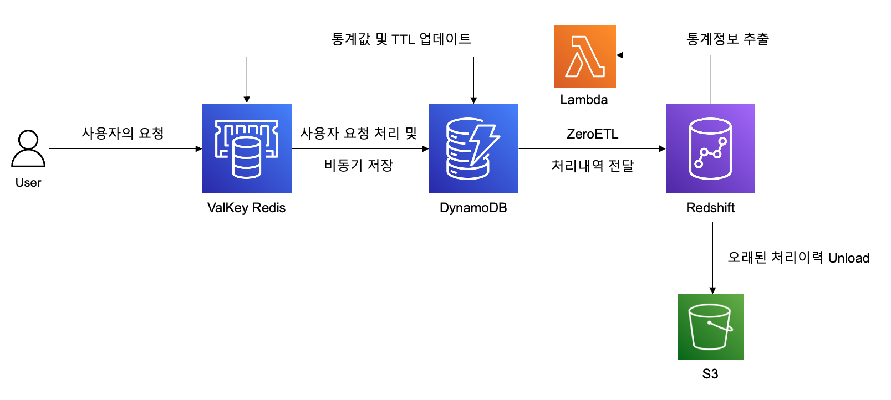

# Smart Agentic AI 구축을 위한 데이터베이스 설계

이 프로젝트는 에이전트 서비스의 실행 이력을 저장하고 분석하여 최적의 프로세스를 제안하는 데이터베이스 설계를 실제로 구현한 예시입니다. MCP 서버와 같은 새로운 에이전트 아키텍처에서 반복되는 프로세스의 최적화와 Human-in-the-Loop 지원을 통한 안정적인 에이전트 서비스 구축을 목표로 합니다.

## 프로젝트 개요

현재 MCP 서버가 새로운 메인 트렌드로 부상하는 시대에, 에이전트 서비스들의 근간에 흐르는 데이터에 초점을 맞춘 데이터베이스 설계입니다. 단순히 에이전트를 실행하는 것에서 나아가, 실행 이력을 분석하여 최적의 프로세스를 제안하고 반복적인 실패를 방지하는 스마트한 에이전트 서비스를 구축합니다.

### 핵심 기능
- **에이전트 실행 이력 저장**: 모든 프로세스와 툴 실행 이력을 체계적으로 저장
- **사용자별 최적화**: 개인맞춤형 프로세스 매핑 및 추천
- **스코어 기반 에이전트 추천**: 성공률과 최신성을 고려한 지능형 에이전트 선택
- **Human-in-the-Loop 지원**: 사전/사후 리뷰를 통한 안정적인 에이전트 운영
- **비용 최적화**: 반복적인 요청에 대한 토큰 절약 및 성능 향상

## 아키텍처



```
사용자 요청 → Valkey (캐시) → DynamoDB (저장) → Redshift (분석) → 최적화된 프로세스 제안
```

### 스코어 계산 공식
```
스코어 = 총실행건수 × exp{-0.1 ×(오늘일시-최근실행일시)} × (성공건수/실행건수)²
```

### 데이터 플로우
1. **Valkey**: 사용자 세션 및 에이전트 실행이력 1차 처리
2. **DynamoDB**: Valkey에서 처리한 내역을 비동기로 저장
3. **Redshift**: Zero ETL로 DynamoDB 데이터를 준실시간 분석
4. **Lambda**: Redshift 분석 결과를 DynamoDB와 Valkey에 업데이트
5. **TTL 관리**: 스코어 기반 차등 TTL 적용 (고스코어: 60일, 저스코어: 30일)

### 데이터베이스 역할
- **DynamoDB**: 에이전트 실행 이력 및 메타데이터 저장 (키-밸류 구조로 Langgraph 노드 상태값 저장에 최적)
- **Redshift**: 실행 이력 분석 및 스코어 계산 (Zero ETL로 준실시간 분석)
- **Valkey**: 자주 사용되는 프로세스 캐싱 (고성능 메모리 기반 처리)

## 📁 파일 구성

### 1. `create_agent_table.py`
- DynamoDB 테이블 생성 (단일 테이블 설계)
- 샘플 데이터 입력 (도메인, 에이전트, 툴, 사용자 세션 등)
- 데이터 입력 확인 및 검증

### 2. `query_examples.py`
- DynamoDB 테이블의 8가지 핵심 액세스 패턴을 Python으로 구현
- 스코어 기반 에이전트 조회
- 사용자별 툴 매핑 정보 조회
- 종합적인 쿼리 플로우 예시

### 3. `redshift_complete_setup.sql`
- Redshift 테이블 생성 
- Zero ETL 데이터 변환 로직
- 에이전트 스코어 계산 및 패턴 분석
- 사용자별 추천 프로세스등 분석쿼리

### 4. `requirements.txt`
- Python 의존성 패키지 목록

## 실행 방법

### 사전 준비

1. **AWS CLI 설정**
```bash
aws configure
```

2. **Python 라이브러리 설치**
```bash
pip install -r requirements.txt
```

### 단계별 실행

#### 1단계: 테이블 생성 및 데이터 입력
```bash
python create_agent_table.py
```

#### 2단계: 쿼리 예시 실행
```bash
python query_examples.py
```

#### 3단계: AWS CLI 쿼리 실행
```bash
chmod +x aws_cli_examples.sh
./aws_cli_examples.sh
```

## 코드 예시
자세한 내용은 create_agent_table.py와 query_examples.py를 참조해주세요.

### `create_agent_table.py` 주요 코드

```python
def create_dynamodb_table():
    """DynamoDB 테이블 생성"""
    dynamodb = boto3.client("dynamodb")

    table_name = "AgentTable"

    try:
        # 테이블 생성
        response = dynamodb.create_table(
            TableName=table_name,
            KeySchema=[
                {"AttributeName": "PK", "KeyType": "HASH"},
                {"AttributeName": "SK", "KeyType": "RANGE"},
            ],
            AttributeDefinitions=[
                {"AttributeName": "PK", "AttributeType": "S"},
                {"AttributeName": "SK", "AttributeType": "S"},
                {"AttributeName": "GSI1_PK", "AttributeType": "S"},
                {"AttributeName": "GSI1_SK", "AttributeType": "S"},
            ],
            GlobalSecondaryIndexes=[
                {
                    "IndexName": "GSI1",
                    "KeySchema": [
                        {"AttributeName": "GSI1_PK", "KeyType": "HASH"},
                        {"AttributeName": "GSI1_SK", "KeyType": "RANGE"},
                    ],
                    "Projection": {"ProjectionType": "ALL"},
                }
            ],
            BillingMode="PAY_PER_REQUEST",
        )

        print(f"테이블 '{table_name}' 생성 중...")

        # 테이블 생성 완료 대기
        waiter = dynamodb.get_waiter("table_exists")
        waiter.wait(TableName=table_name)

        print(f"테이블 '{table_name}' 생성 완료!")
        return True

    except ClientError as e:
        if e.response["Error"]["Code"] == "ResourceInUseException":
            print(f"테이블 '{table_name}'이 이미 존재합니다.")
            return True
        else:
            print(f"테이블 생성 실패: {e}")
            return False
```

샘플 데이터 입력 예시:

```python
def insert_sample_data():
    """샘플 데이터 입력"""
    dynamodb = boto3.resource("dynamodb")
    table = dynamodb.Table("AgentTable")

    # 샘플 데이터 정의
    sample_items = [
        # 도메인 데이터
        {
            "PK": "DMN001",
            "SK": "METADATA",
            "EntityType": "Domain",
            "GSI1_PK": "Domain",
            "GSI1_SK": "매장검색서비스",
            "DomainNM": "매장검색서비스",
            "Description": "지역 기반의 매장 검색 서비스로 사용자가 요청한 지역의 카페, 레스토랑을 다양한 카테고리별로 검색하여 찾아주는 서비스",
        },
        # 에이전트 데이터
        {
            "PK": "AGT001",
            "SK": "METADATA",
            "EntityType": "Agent",
            "GSI1_PK": "DMN001",
            "GSI1_SK": "AGTSCORE#60",
            "AgentNM": "매장 검색 에이전트",
            "Score": "60",
            "Description": "지역기반 매장 검색서비스로 최근매장 리스트업이 잘되있음",
        }
    ]

    # 배치로 데이터 입력
    try:
        with table.batch_writer() as batch:
            for item in sample_items:
                batch.put_item(Item=item)

        print(f"총 {len(sample_items)}개의 샘플 데이터를 성공적으로 입력했습니다.")
        return True

    except Exception as e:
        print(f"데이터 입력 실패: {e}")
        return False
```

### `query_examples.py` 주요 코드

```python
def query_domains():
    """도메인 조회 예시"""
    table = setup_dynamodb()

    print("=== 1. 도메인 조회 ===")
    response = table.query(
        IndexName="GSI1", KeyConditionExpression=Key("GSI1_PK").eq("Domain")
    )

    print(f"조회된 도메인 수: {response['Count']}")
    for item in response["Items"]:
        print(f"- 도메인ID: {item['PK']}")
        print(f"  이름: {item['DomainNM']}")
        print(f"  설명: {item['Description']}")
        print()


def query_agents_by_score(domain_id="DMN001", limit=5):
    """스코어가 높은 에이전트 조회"""
    table = setup_dynamodb()

    print(f"=== 2. {domain_id} 도메인의 상위 에이전트 조회 (스코어순) ===")
    response = table.query(
        IndexName="GSI1",
        KeyConditionExpression=Key("GSI1_PK").eq(domain_id)
        & Key("GSI1_SK").begins_with("AGTSCORE"),
        ScanIndexForward=False,  # 내림차순 정렬
        Limit=limit,
    )

    print(f"조회된 에이전트 수: {response['Count']}")
    for item in response["Items"]:
        print(f"- 에이전트: {item.get('AgentNM', 'N/A')}")
        print(f"  스코어: {item.get('Score', 'N/A')}")
        print(f"  설명: {item.get('Description', 'N/A')}")
        print()
```

## 테이블 구조

### DynamoDB 단일 테이블 설계
- **PK (Partition Key)**: 엔터티의 주 식별자
- **SK (Sort Key)**: 엔터티의 정렬 키
- **EntityType**: 엔터티 타입 구분자

### Global Secondary Index (GSI1)
- **GSI1_PK**: 도메인 또는 엔터티 타입별 조회
- **GSI1_SK**: 스코어 기반 정렬 또는 이름 기반 정렬
- **용도**: 도메인별 에이전트 조회, 스코어 랭킹, 전체 사용자 툴 매핑 조회

## DynamoDB 엔터티 타입및 Partition Key(PK)와 Sort Key(SK) 정의 

| 엔터티 | 설명 | PK 예시 | SK 예시 |
|--------|------|---------|---------|
| **Domain** | 에이전트 도메인 정보 | DMN001 | METADATA |
| **Agent** | 에이전트 정보 | AGT001 | METADATA |
| **Tool** | 에이전트의 툴 정보 | AGT001 | TL001 |
| **User** | 사용자 정보 | USR001 | METADATA |
| **UserSession** | 사용자 세션 정보 | USR001 | SESS20250614001 |
| **UserSessionProcess** | 세션 프로세스 정보 | USR001#SESS20250614001 | PRC001 |
| **UserSessPrcToolMappHist** | 프로세스-툴 매핑 이력 | USR001#SESS20250614001 | PRC001#AGT001#TL001 |
| **UserPrcToolMapp** | 최적화된 툴 매핑 정보 | USR001 | UserPrcToolMapp#매장검색 |

## 액세스 패턴 상세

### 1. 도메인 조회 (사용자 요청 분류)
```python
# GSI1을 사용하여 모든 도메인 조회
response = table.query(
    IndexName='GSI1',
    KeyConditionExpression=Key('GSI1_PK').eq('Domain')
)
# 사용자 요청 → 생성형AI → 적합한 도메인 선택
```

```bash
aws dynamodb query \
    --table-name AgentTable \
    --index-name GSI1 \
    --key-condition-expression "GSI1_PK = :pk" \
    --expression-attribute-values '{":pk":{"S":"Domain"}}' \
    --no-scan-index-forward
```

### 2. 스코어 기반 에이전트 조회
```python
# 스코어가 높은 에이전트 조회 (GSI1 사용)
response = table.query(
    IndexName='GSI1',
    KeyConditionExpression=Key('GSI1_PK').eq('DMN001') & Key('GSI1_SK').begins_with('AGTSCORE'),
    ScanIndexForward=False,  # 내림차순
    Limit=5
)
```

```bash
aws dynamodb query \
    --table-name AgentTable \
    --index-name GSI1 \
    --key-condition-expression "GSI1_PK = :pk AND begins_with(GSI1_SK, :sk)" \
    --expression-attribute-values '{":pk":{"S":"DMN001"},":sk":{"S":"AGTSCORE"}}' \
    --no-scan-index-forward \
    --limit 5
```

### 3. 도메인별 툴 조회
```python
# 특정 도메인의 모든 툴 조회
response = table.query(
    IndexName='GSI1',
    KeyConditionExpression=Key('GSI1_PK').eq('DMN001') & Key('GSI1_SK').begins_with('TL')
)
```

```bash
aws dynamodb query \
    --table-name AgentTable \
    --index-name GSI1 \
    --key-condition-expression "GSI1_PK = :pk AND begins_with(GSI1_SK, :sk)" \
    --expression-attribute-values '{":pk":{"S":"DMN001"},":sk":{"S":"TL"}}'
```

### 4. 하나의 에이전트의 툴 정보 조회
```python
# 하나의 에이전트에 어떤 툴정보가 있는지 모두 조회
response = table.query(
    KeyConditionExpression=Key('PK').eq('AGT001') & Key('SK').begins_with('TL')
)
```

```bash
aws dynamodb query \
    --table-name AgentTable \
    --key-condition-expression "PK = :pk AND begins_with(SK, :sk)" \
    --expression-attribute-values '{":pk":{"S":"AGT001"},":sk":{"S":"TL"}}'
```

### 5. 사용자 세션 조회
```python
# 특정 사용자의 최신 세션 조회
response = table.query(
    KeyConditionExpression=Key('PK').eq('USR001') & Key('SK').begins_with('SESS'),
    ScanIndexForward=False,  # 최신순
    Limit=10
)
```

```bash
aws dynamodb query \
    --table-name AgentTable \
    --key-condition-expression "PK = :pk AND begins_with(SK, :sk)" \
    --expression-attribute-values '{":pk":{"S":"USR001"},":sk":{"S":"SESS"}}' \
    --no-scan-index-forward \
    --limit 10
```

### 6. 사용자 세션 프로세스 조회
```python
# 특정 사용자의 특정 세션의 프로세스 이력을 조회
pk = "USR001#SESS20250614001"
response = table.query(
    KeyConditionExpression=Key('PK').eq(pk) & Key('SK').begins_with('PRC')
)
```

```bash
# query-params.json 파일에 먼저 파라미터 값을 저장합니다. 
{
  ":pk": {"S": "USR001#SESS20250614001"},
  ":sk": {"S": "PRC"}
}

aws dynamodb query \
    --table-name AgentTable \
    --key-condition-expression "PK = :pk AND begins_with(SK, :sk)" \
    --expression-attribute-values file://query-params.json
```

### 7. 사용자 툴 매핑 조회
```python
# 특정 사용자의 최적화된 툴 매핑 조회
response = table.query(
    KeyConditionExpression=Key('PK').eq('USR001') & Key('SK').begins_with('UserPrcToolMapp')
)
```

### 8. 전체 사용자 툴 매핑 조회
```python
# 전체 사용자의 툴 매핑 정보 조회
response = table.query(
    IndexName='GSI1',
    KeyConditionExpression=Key('GSI1_PK').eq('UserPrcToolMapp')
)
```

```bash
# query-params2.json 파일에 먼저 파라미터 값을 저장합니다. 
{
  ":pk": {"S": "UserPrcToolMapp"},
  ":sk": {"S": "매장검색"}
}

aws dynamodb query \
    --table-name AgentTable \
    --index-name GSI1 \
    --key-condition-expression "GSI1_PK = :pk AND begins_with(GSI1_SK, :sk)" \
    --expression-attribute-values file://query-params2.json
```

위 내용들을 표로 정리하면 아래와 같습니다.  DynamoDB 키디자인은 이러한 형식으로 만들고 액세스 패턴들을 계속해서 리뷰를 반복해야합니다. 가능하면 관련된 모든 사람들과 놓친 액세스 패턴은 없는지, 설계한 파티션키와 소트키에는 문제가 없는지를 충분히 검토해야 합니다. 그래야 서비스가 런칭된 이후 키디자인 변경이나 추가 GSI를 만드는 비용을 최소화할수 있습니다.  

| 액세스패턴 | Table/GSI | Key Condition |
|--------|------|---------|
| 사용자의 요청에 따른 적절한 도메인을 찾을수 있습니다. | GSI | GSI1_PK = 'Domain' (optional) GSI1_SK begins_with(SK, '지역기반') |
| 하나의 도메인에 속한 여러 에이전트 중에서 스코어가 높은 에이전트를 불러올수 있습니다. | GSI | GSI1_PK = 'DMN001', GSI1_SK begins_with(SK, 'AGTSCORE')인덱스 스캔방식 : no-scan-index-forward |
| 하나의 도메인에 속한 여러 에이전트 중에서 사용자의 요청에 가장 적합한 툴을 가진 에이전트를 불러올수 있습니다. | GSI | GSI1_PK = 'DMN001', GSI1_SK begins_with(SK, 'TL') |
| 하나의 에이전트의 툴 정보를 전부 불러옵니다. | Table | PK = 'AGT001'
SK begins_with(SK, 'TL') |
| 사용자의 세션을 최신일자로 가져옵니다 | Table | PK = 'USR001', SK begins_with(SK, "SESS") 인덱스 스캔방식 : no-scan-index-forward |
| 특정 사용자의 특정 세션의 모든 상세 정보를 조회하면서 가장 최근에 처리한 프로세스 및 툴정보를 가져옵니다. | TABLE | PK = 'USR001#SESS20250614001'
SK begins_with(SK, 'PRC')인덱스 스캔방식 : no-scan-index-forward |
| 특정 사용자 자신의 유사한 요청에 최적화된 툴 매핑정보를 가져옵니다. | TABLE | PK = 'User001'
(optional) SK begins_with(SK, 'UserPrcToolMapp#매장검색') |
| 전체 사용자 중에서 비슷하거나 동일한 요청에 최적화된 툴 매핑정보를 가져옵니다. | GSI | GSI1_PK = 'UserPrcToolMapp'
(optional) GSI1_SK begins_with(SK, '매장검색') |

## Redshift 스키마

### 테이블 생성 스크립트

```sql
-- 도메인 테이블
CREATE TABLE Domain (
    DomainID varchar(30),
    DomainNM varchar(100),
    Description varchar(500),
    load_timestamp TIMESTAMP DEFAULT GETDATE()
);

-- 에이전트 테이블
CREATE TABLE Agent (
    DomainID varchar(30),
    AgentID varchar(30),
    AgentNM varchar(100),
    Score DECIMAL(10,2),
    Description varchar(500),
    load_timestamp TIMESTAMP DEFAULT GETDATE()
);

-- 툴 테이블
CREATE TABLE Tool (
    DomainID VARCHAR(30),
    AgentID VARCHAR(30), 
    ToolID VARCHAR(30),
    ToolNM VARCHAR(100),
    ToolSpec TEXT,
    Description VARCHAR(500),
    load_timestamp TIMESTAMP DEFAULT GETDATE()
)
DISTKEY(DomainID)
SORTKEY(AgentID);

-- 사용자 정보 테이블
CREATE TABLE UserInfo(
    UserID VARCHAR(30),
    UserNM VARCHAR(100),
    UserProfile VARCHAR(500),
    LastLoginDT VARCHAR(14),
    CreationDT VARCHAR(14),
    load_timestamp TIMESTAMP DEFAULT GETDATE()
)
DISTKEY (UserID)
SORTKEY (LastLoginDT);

-- 사용자 툴 매핑 이력 테이블
CREATE TABLE user_tool_mapping_hist (
    UserID VARCHAR(30),
    SessionID VARCHAR(30),
    ProcessID VARCHAR(30),
    AgentID VARCHAR(30),
    ToolID VARCHAR(30),
    ToolNM VARCHAR(100),
    ToolValues TEXT,
    TransactDT VARCHAR(20),
    SuccYN VARCHAR(1),
    ResultMsg TEXT,
    load_timestamp TIMESTAMP DEFAULT GETDATE()
)
DISTKEY (UserID)
SORTKEY (SessionID, ProcessID, AgentID, ToolID);
```

### ETL 프로세스 예시

```sql
-- DynamoDB에서 Redshift로 데이터 로드
INSERT INTO user_tool_mapping_hist
SELECT  SPLIT_PART("value"."PK"."S"::VARCHAR,'#',1) as UserID,
        SPLIT_PART("value"."PK"."S"::VARCHAR,'#',2) as SessionID,
        SPLIT_PART("value"."SK"."S"::VARCHAR,'#',1) as ProcessID,
        SPLIT_PART("value"."SK"."S"::VARCHAR,'#',2) as AgentID,
        SPLIT_PART("value"."SK"."S"::VARCHAR,'#',3) as ToolID,
        "value"."ToolNM"."S"::VARCHAR as ToolNM,
        "value"."ToolValues"."S"::VARCHAR as ToolValues,
        "value"."TransactDT"."S"::VARCHAR as TransactDT,
        "value"."SuccYN"."S"::VARCHAR as SuccYN,
        "value"."ResultMsg"."S"::VARCHAR as ResultMsg,
        GETDATE() as load_timestamp 
FROM dbagent.public."AgentTable"
WHERE "value"."EntityType"."S" = 'UserSessPrcToolMappHist';

-- 원본 데이터를 스테이징 테이블로 변환
INSERT INTO agent_tool_analysis_staging (
    UserID, SessionID, ProcessID, DomainID, AgentID, ToolID, ToolNM,
    execution_date, execution_datetime, success_flag, tool_values, result_message
)
SELECT 
    h.UserID,
    h.SessionID,
    h.ProcessID, 
    a.DomainID,
    h.AgentID,
    h.ToolID,
    h.ToolNM,
    TO_DATE(LEFT(TransactDT, 8), 'YYYYMMDD') as execution_date,
    TO_TIMESTAMP(TransactDT, 'YYYYMMDDHH24MISS') as execution_datetime,
    CASE WHEN SuccYN = 'Y' THEN TRUE ELSE FALSE END as success_flag,
    h.ToolValues,
    h.ResultMsg as result_message
FROM user_tool_mapping_hist h,
     agent a 
WHERE h.AgentID = a.AgentID;
```

## Redshift 스키마 설계

에이전트와 사용자 세션등 데이터 저장 스키마 설계를  DynamoDB로 했다면, 유저세션 상세의 툴 매핑 이력정보를 Redshift에서 분석합니다.  DynamoDB의 데이터는 ZeroETL기능을 연동해서 Redshift로  준 실시간으로 보낼수 있습니다. 툴 매핑이력 엔터티를 통해서 유저의 어떤 요청에 에이전트가 어떤 프로세스와 툴을 몇번 실행했고 몇번 성공했는지 정보등이 필요합니다. 또한 가장 최근 실행한 일시는 언제인지도 확인이 필요합니다. 이것은 앙서 Redshift를 에이전트에 대한 스코어를 매길때  어떤 값들을 통계로 처리하고 스코어에 반영할지 이미 언급했던 내용입니다. 

* 스코어 = 총실행건수 × exp{-0.1 ×(오늘일시-최근실행일시) } × (성공건수/실행건수)²

 ETL로 가져온 원본 데이터를 1차 가공하여 위 스코어를 부여하기 쉽운 형태인 스테이징 테이블로 만드는 과정이 필요합니다.  위에서 설계한 DynamoDB의 UserSessPrcToolMappHist(유저세션프로세스 툴 매핑이력)는 아래와 같은 형태로 PK, SK 외에는 Value안에 저장됩니다.

```sql
SELECT "PK","SK","value"
FROM  dbagent.public."AgentTable"
WHERE "value"."EntityType"."S" = 'UserSessPrcToolMappHist'
```

| PK | SK | Value |
|--------|------|---------|
| USR001#SESS20250614001 | PRC001#AGT001#TL001 | {"PK":{"S":"USR001#SESS20250614001"},"SK":{"S":"PRC001#AGT001#TL001"},"TransactDT":{"S":"20250614140605"},"ResultMsg":{"S":"사용자의 요청, 잠실종합운동장 위치"},"ToolNM":{"S":"FIND_LOC"},"ToolValues":{"S":"잠실종합운동장 근처에 있는 N매장 근처의 최근에 생긴 카페를 찾아줘"},"EntityType":{"S":"UserSessPrcToolMappHist"},"SuccYN":{"S":"Y"}} |
| USR001#SESS20250614001 | PRC002#AGT001#TL002 | {"PK":{"S":"USR001#SESS20250614001"},"SK":{"S":"PRC002#AGT001#TL002"},"TransactDT":{"S":"20250614140606"},"ResultMsg":{"S":"카페리스트"},"ToolNM":{"S":"USE_SEARCH_ENGINE_API"},"ToolValues":{"S":"위 밸류값, 잠실종합운동장 위치, 네이버, 구글검색API"},"EntityType":{"S":"UserSessPrcToolMappHist"},"SuccYN":{"S":"Y"}} |
| USR001#SESS20250614001 | PRC003#AGT001#TL003 | {"PK":{"S":"USR001#SESS20250614001"},"SK":{"S":"PRC003#AGT001#TL003"},"TransactDT":{"S":"20250614140607"},"ResultMsg":{"S":"포맷된 카페리스트"},"ToolNM":{"S":"FORMAT_RESULTS"},"ToolValues":{"S":"맛집명단리스트, 포맷팅 템플릿 스크립트"},"EntityType":{"S":"UserSessPrcToolMappHist"},"SuccYN":{"S":"Y"}} |

ZeroETL을 통해 가져온 Value 어트리뷰트에 Super Type 데이터타입으로 들어가 있기때문에,  아래와 같은 쿼리로 컴럼을 분리하는 과정이 필요합니다.  아래와 같이 분석하기 편하도록 새로운 테이블에 각각의 컴럼에 맞게 데이터를 분리해서 입력합니다.  

```sql
INSERT INTO user_tool_mapping_hist
SELECT  SPLIT_PART("value"."PK"."S"::VARCHAR,'#',1) as UserID,
        SPLIT_PART("value"."PK"."S"::VARCHAR,'#',2) as SessionID,
        SPLIT_PART("value"."SK"."S"::VARCHAR,'#',1) as ProcessID,
        SPLIT_PART("value"."SK"."S"::VARCHAR,'#',2) as ToolID,
        "value"."ToolNM"."S"::VARCHAR as ToolNM,
        "value"."ToolValues"."S"::VARCHAR as ToolValues,
        "value"."TransactDT"."S"::VARCHAR as TransactDT,
        "value"."SuccYN"."S"::VARCHAR as SuccYN,
        "value"."ResultMsg"."S"::VARCHAR as ResultMsg,
        GETDATE() as load_timestamp 
FROM dbagent.public."AgentTable"
WHERE "value"."EntityType"."S" = 'UserSessPrcToolMappHist';
```

위와 같은 과정을 거치면서, 분석을 위한 테이블들을 만들고, 이제 다양한 형태로 에이전트의 성능에 대한 평가(=스코어 계산)와 사용자 요청에 가장 최적화된 툴 조합(=워크플로우)를 제공해줄수 있게 됩니다. 반대로 에러가 자주 발생하는 툴의 에이전트는 사용하지 말도록 지시할 수도 있습니다. 이러한 부분이 모두 생성형AI 서비스에게 전달해줄 컨텍스트가 됩니다.  자세한 내용은 현재 폴더에 있는 redshift_complete_setup.sql 파일을 참조해주세요. 

```sql
--1. 에이전트 스코어 랭킹
SELECT 
    '=== 에이전트 스코어 랭킹 ===' as title,
    '' as DomainID, '' as AgentID, '' as agent_name, 
    NULL as total_executions, NULL as success_rate, NULL as calculated_score, NULL as score_rank
UNION ALL
SELECT 
    '' as title,
    DomainID,
    AgentID,
    AgentNM,
    total_executions,
    success_rate,
    calculated_score,
    RANK() OVER (PARTITION BY DomainID ORDER BY calculated_score DESC) as score_rank
FROM agent_score_summary
ORDER BY title DESC, calculated_score DESC;

--2. 사용자별 추천 에이전트 패턴
SELECT 
    '=== 사용자별 추천 에이전트 패턴 ===' as title,
    '' as UserID, '' as agent_sequence, 0 as pattern_score, '' as recommendation_status
UNION ALL
SELECT 
    '' as title,
    UserID,
    agent_sequence,
    pattern_score,
    CASE WHEN is_recommended THEN '추천' ELSE '일반' END as recommendation_status
FROM user_process_patterns
ORDER BY title DESC, pattern_score DESC;

--3.에이전트별 툴 에러 집계 
WITH agent_totals AS (
    SELECT AgentID, COUNT(*) as total_executions
    FROM agent_tool_analysis_staging
    GROUP BY AgentID
),
agent_errors AS (
    SELECT AgentID, COUNT(*) as total_errors,
           LISTAGG(DISTINCT ToolNM, ', ') WITHIN GROUP (ORDER BY ToolNM) as failed_tools
    FROM agent_tool_analysis_staging
    WHERE success_flag = FALSE
    GROUP BY AgentID
)
```

이러한 분석들을 통해 다음과 같은 인사이트를 얻을 수 있습니다:

* 최고 성능 에이전트 식별
* 사용자별 맞춤 프로세스 추천
* 실패 위험이 높은 툴/패턴 사전 감지


## 참고 자료

- [DynamoDB 단일 테이블 설계 가이드](https://docs.aws.amazon.com/amazondynamodb/latest/developerguide/bp-general-nosql-design.html)
- [DynamoDB 액세스 패턴](https://docs.aws.amazon.com/amazondynamodb/latest/developerguide/bp-query-scan.html)
- [DynamoDB GSI 설계](https://docs.aws.amazon.com/amazondynamodb/latest/developerguide/GSI.html)
- [DynamoDB Zero ETL](https://docs.aws.amazon.com/amazondynamodb/latest/developerguide/zero-etl-integration.html)


