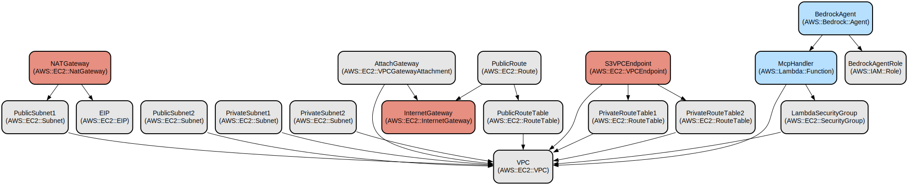

# AWS Bedrock Agent CDK Infrastructure for MCP Integration

## 개요

Amazon Bedrock은 단일 API를 통해 주요 AI 기업들의 고성능 기반 모델(FM)에 접근할 수 있게 해주는 완전 관리형 서비스입니다. 이를 통해 엔터프라이즈급 보안 및 개인정보 보호 기능을 갖춘 생성형 AI 애플리케이션을 구축할 수 있습니다.

Bedrock Agent는 비즈니스 컨텍스트를 이해하고 기업 시스템과 데이터를 활용하여 작업을 수행할 수 있도록 사용자 정의 가능한 AI 기반 어시스턴트입니다. 이들은 기반 모델의 성능과 귀사의 비즈니스 지식 및 시스템을 결합하여 다음과 같은 기능을 갖춘 지능형 어시스턴트를 생성합니다:
- 자연어 요청을 이해하고 처리
- 회사의 데이터 및 시스템에 안전하게 접근
- 맞춤 통합을 통한 특정 작업 실행
- 대화 전반에 걸친 컨텍스트 유지

Action Group은 Bedrock Agent의 핵심 구성 요소로, 에이전트가 수행할 수 있는 특정 기능과 작업을 정의합니다. 이들은:
- 관련 작업과 API 엔드포인트를 그룹화
- 에이전트와 비즈니스 시스템 간의 인터페이스 정의
- 매개변수 유효성 검사 및 타입 변환 처리
- Lambda 함수 또는 API 엔드포인트를 통한 작업 실행

이 프로젝트는 특히 Bedrock Agent와 Model Context Protocol(MCP)의 통합에 중점을 두어, 표준화된 인터페이스를 통해 에이전트와 다양한 AI 모델 서비스 간의 원활한 통신을 가능하게 합니다.

## 프로젝트 설명

이 프로젝트는 Model Context Protocol(MCP) 통합을 갖춘 Bedrock Agent를 배포하기 위한 AWS CDK 인프라 구현을 제공합니다. AWS Bedrock을 통해 VPC 네트워킹과 Lambda 함수를 활용하여 사용자 지정 액션을 갖춘 AI 에이전트를 원활하게 배포할 수 있게 해줍니다.

이 인프라는 MCP 기능을 갖춘 Bedrock Agent를 실행하기 위한 안전하고 확장 가능한 환경을 제공합니다. 공용 및 사설 서브넷, NAT Gateway, VPC 엔드포인트가 포함된 기본 VPC 템플릿을 제공하지만, 자체 CloudFormation 템플릿이나 기존 VPC 인프라를 사용할 수도 있습니다. 이 솔루션은 MCP 액션 그룹을 처리하는 Lambda 함수를 사용하여 Bedrock Agent가 Model Context Protocol을 통해 사용자 지정 액션을 실행할 수 있도록 합니다. 또한, 지속적인 운영이 필요한 MCP 서버를 배포해야 하는 경우, 동일한 VPC 내에 이러한 서버를 배포하고 Lambda 함수와 이러한 서버 간의 사설 네트워크 연결을 설정할 수 있습니다.

주요 기능:
- 공용/사설 서브넷이 있는 자동화된 VPC 인프라 설정
- 안전한 Lambda 함수 실행 환경
- 동적 MCP 서버 구성 및 OpenAPI 스키마 생성
- 안전한 접근을 위한 IAM 역할 및 보안 그룹 관리
- 사용자 지정 액션 그룹을 갖춘 Bedrock Agent 배포

## 제한 사항

현재 구현에는 다음과 같은 제한 사항이 있습니다:

- 통신에 STDIO를 사용하는 Node.js 기반 MCP 서버만 지원
- MCP 서버는 AWS Lambda Node.js 런타임 환경과 호환되어야 함
- Lambda 환경에서 실행할 수 있는 Node.js 모듈만 사용 가능
- Lambda와 MCP 서버 간 STDIO 기반 통신 프로토콜로 제한됨
- **마지막으로, 이 프로젝트는 MCP와 Bedrock Agent의 통합을 위한 개념 증명(POC)이므로, 프로덕션 환경에서 활용하기 전에 개선이 필요합니다.**

## 저장소 구조
```
.
├── base-infra-example/             # 기본 인프라 템플릿
│   └── base-vpc.yaml              # 네트워킹 구성 요소가 포함된 VPC CloudFormation 템플릿
├── bin/                           # CDK 애플리케이션 진입점
│   ├── bedrock-mcp-agent-cdk.ts   # 메인 CDK 애플리케이션 설정
│   └── schema-conversion-tool.ts   # OpenAPI 스키마 변환 유틸리티
├── conf/                          # 구성 파일
│   ├── mcp.json                   # MCP 서버 구성
│   └── vpc-info                   # VPC 구성
├── client-example/              # 배포 테스트를 위한 클라이언트 예제 코드
├── lambda/                        # Lambda 함수 구현
│   └── mcp_action_group_handler/  # MCP 액션 그룹 핸들러 구현
│       ├── index.mjs              # 핸들러 구현
│       └── package.json           # Lambda 종속성
├── lib/                           # CDK 스택 정의
│   └── bedrock-agent-stack.ts     # 메인 Bedrock Agent 스택 구현
├── deploy.sh                      # 배포 스크립트
├── destroy.sh                     # 정리 스크립트
├── synth.sh                      # CDK 합성 스크립트
├── tsconfig.json                 # TypeScript 구성
├── README.ko.md                  # 한글 버전 README 파일
└── README.md                     # 메인 README 파일
```

## 사용 방법
### 사전 요구 사항
- Node.js v20.x 이상
- npm 10.x 이상
- AWS CLI v2.x 이상
- AWS CDK v2.x 이상
- git v2.x dltkd
- VPC, EC2, Bedrock Agent, Bedrock, Lambda 등 리소스 생성, 사용 권한
- 최소 두 개의 사설 서브넷이 있는 VPC
- 인터넷 접근이 필요한 MCP Server를 구동하기 위해서는 public subnet 및 이에 접근하기 위한 NAT Gateway가 필요합니다.

### NPM 스크립트
다음과 같은 npm 스크립트를 사용할 수 있습니다:
```bash
npm run build          # TypeScript 코드 컴파일 및 프로젝트 빌드
npm run cdk           # AWS CDK CLI 명령 실행
npm run clean        # 빌드 아티팩트 및 임시 파일 제거
npm run lambda:build # Lambda 함수 코드 빌드
npm run lambda:clean # Lambda 함수 빌드 아티팩트 정리
npm run synth          # CDK 코드를 이용해 Cloudformation template 합성
npm run deploy         # CDK 코드기반 AWS 인프라스트럭쳐 배포
```

### 빠른 시작

1. 리포지토리 복제 및 작업 디렉터리 변경:
```bash
git clone https://github.com/junhwan0/bedrock-mcp-agent-cdk.git
cd bedrock-mcp-agent-cdk
```

2. VPC를 배포하세요. 아래 스크립트를 이용하면 간단하게 public 및 private subnet을 포함하는 VPC를 배포하고 배포 결과를 설정파일인 conf/vpc-info에 업데이트까지 자동으로 해 줍니다. 하지만 해당 스크립트 이용이 필수는 아닙니다. 기존에 존재하던 VPC에 대한 정보를 conf/vpc-info 에 업데이트하는 방식으로 이용 가능합니다.:
```bash
cd base-infra-example/
./deploy.sh
```

3. conf/mcp.json에서 MCP 서버를 구성하세요:
```bash
cd ..
cp conf/mcp.json.example conf/mcp.json
```
위에서 복사한 mcp.json을 열어보면 아래와 같이 smithery에서 제공하는 MCP Server 설정의 예시자 smithery의 API key를 제외하고 설정 돼 있습니다. smithery에 로그인 하셔서 API key를 제공받아 설정파일에 적용해야 MCP Server에 대한 접근이 정상적으로 이루어 집니다.
```json
{
  "mcpServers": {
    "time-mcp": {
      "command": "npx",
      "args": [
        "-y",
        "@smithery/cli@latest",
        "run",
        "@yokingma/time-mcp",
        "--key",
        "<your-smithery-key>"
      ],
      "bundling": {
        "nodeModules": ["npm", "@smithery/cli"]
      }
    },
    ...
```

위 설정의 bundling부분은 필수는 아닙니다. 하지만 이 설정을 통해 Lambda 배포에 번들링 구성을 지정할 경우 npx 명령에 필요한 모듈을 미리 배포하여, npx 명령 실행시 모듈을 다운로드 받는 시간을 단축시킬 수 있습니다:
```json
{
  "mcpServers": {
    "your-mcp-server": {
      "command": "npx",
      "args": ["your-mcp-server-args"],
      "bundling": {
        "nodeModules": ["module1", "module2"]  // Modules to include with Lambda
      }
    }
  }
}
```

> **중요**: bundling.nodeModules 구성을 사용할 때는 프로젝트 루트 및 Lambda 함수 디렉토리 모두에 지정된 모듈을 설치해야 합니다:
```bash
npm install module1 module2  # 프로젝트 루트에서
cd lambda/mcp_action_group_handler && npm install module1 module2  # Lambda 디렉토리에서
```

4. 프로젝트 빌드(빌드 과정에는 npm run build:schema 가 포함됩니다. 이때 MCP와 Bedrock Agent 통합에 필요한 open api schema를 생성합니다. 이를 위해 build과정에 MCP Server가 구동되며, 인터넷 접근이 필요한 MCP Server의 경우 인터넷 접근도 필요합니다.)
```bash
npm run build
```

5. CloudFormation 템플릿을 합성하세요:
```bash
./synth.sh
```

6. 스택을 배포하세요. 배포 완료 후 출력되는 BedrockAgentsId 를 기록해 두어야 테스트 과정에서 활용 가능합니다.:
```bash
./deploy.sh
```

### 배포 테스트

인프라를 배포한 후, client-example 디렉토리에 제공된 Jupyter 노트북파일을 Sagemaker AI Jupyter notebook 인스턴스로 배포하여 테스트할 수 있습니다. 배포가 완료되면 웹브라우저로 접근할 수 있는 URL이 제공됩니다. 노트북을 열면 가장 상단의 Cell에서 agent_id 를 앞서 메모 해 두었던 BedrockAgentsId의 값으로 교체해야 정상적으로 테스트할 수 있습니다.:

```bash
cd client-example/
./generate_template.sh
./deploy.sh
```

### 더 자세한 MCP 서버 구성 예제

1. Time MCP 서버 구성:

Bundling 미포함:
```json
{
  "mcpServers": {
    "time-mcp": {
      "command": "npx",
      "args": [
        "-y",
        "@smithery/cli@latest",
        "run",
        "@yokingma/time-mcp",
        "--key",
        "your-key-here"
      ]
    }
  }
}
```
Bundling 포함:
```json
{
  "mcpServers": {
    "time-mcp": {
      "command": "npx",
      "args": [
        "-y",
        "@smithery/cli",
        "run",
        "@yokingma/time-mcp",
        "--key",
        "your-key-here"
      ],
      "bundling": {
        "nodeModules": ["npm", "@smithery/cli"]
      }
    }
  }
}
```

2. DuckDuckGo 검색 MCP 서버 구성:

Bundling 미포함:
```json
{
  "mcpServers": {
    "duckduckgo-mcp-server": {
      "command": "npx",
      "args": [
        "-y",
        "@smithery/cli@latest",
        "run",
        "@nickclyde/duckduckgo-mcp-server",
        "--key",
        "<your-smithery-key>"
      ]
    }
  }
}
```
With bundling:
```json
{
  "mcpServers": {
    "duckduckgo-mcp-server": {
      "command": "npx",
      "args": [
        "-y",
        "@smithery/cli@latest",
        "run",
        "@nickclyde/duckduckgo-mcp-server",
        "--key",
        "<your-smithery-key>"
      ],
      "bundling": {
        "nodeModules": ["npm", "@smithery/cli"]
      }
    }
  }
}
```

### 문제 해결

1. VPC 구성 문제
- 문제: VPC 유효성 검사 오류로 CDK 배포 실패
- 해결책: vpc-info 파일에서 VPC ID 및 서브넷 ID 확인
```bash
cat conf/vpc-info
# 다음 내용이 포함되어야 합니다:
# export AWS_REGION=us-west-2
# export VPC_ID=vpc-xxxxxx
# export SUBNET_IDS=subnet-xxx,subnet-yyy
```

2. MCP 서버 연결 문제
- 문제: MCP 서버 시작 실패
- 해결책: MCP 서버 구성 및 자격 증명 확인
```bash
# MCP 서버 구성 확인
cat conf/mcp.json
# 형식 및 자격 증명 확인
```

### 할당량 제한

Bedrock Agent에는 액션 그룹에 대한 기본 할당량 제한이 있습니다:
- 에이전트당 최대 5개의 액션 그룹 함수(변경될 수 있음)
- 액션 그룹당 최대 5개의 매개변수(변경될 수 있음)

이러한 제한을 늘려야 하는 경우, AWS 콘솔의 Service Quotas > Amazon Bedrock > Action Group Functions per Agent 또는 Parameters per Action Group에서 할당량 증가를 요청할 수 있습니다.

## 데이터 흐름
이 인프라는 Lambda 함수를 통해 Bedrock Agent와 MCP 서버 간의 안전한 통신을 가능하게 합니다.

```ascii
[Bedrock Agent] --> [Lambda Function] --> [MCP Server]
     |                     |                   |
     |                     |                   |
     +---------------------+-------------------+
              보안 그룹 & VPC
```

구성 요소 상호 작용:
1. Bedrock Agent가 사용자 요청을 수신하고 적절한 액션 그룹으로 라우팅
2. Lambda 함수가 임시 스토리지를 사용하여 VPC에서 실행
3. MCP 서버가 표준화된 프로토콜을 통해 특정 기능 처리
4. 보안 그룹이 구성 요소 간 네트워크 액세스 제어
5. VPC가 네트워크 격리 및 보안 제공

## 인프라

 

인프라는 다음과 같은 AWS 리소스로 구성됩니다:

Lambda:
- McpHandler: Bedrock Agent 요청에 응답하여 MCP 액션 실행

VPC:
*(base-vpc.yaml CloudFormation 템플릿에 의해 생성되며, 자체 템플릿으로 대체할 수 있습니다)*
- CIDR 블록 10.0.0.0/16의 VPC
- 2개의 공용 서브넷(10.0.0.0/20, 10.0.16.0/20)
- 2개의 사설 서브넷(10.0.128.0/20, 10.0.144.0/20)
- 공용 서브넷 액세스를 위한 인터넷 게이트웨이
- 사설 서브넷 인터넷 액세스를 위한 NAT 게이트웨이
- 사설 S3 액세스를 위한 S3 VPC 엔드포인트

보안 & IAM:
*(CDK 스택에 의해 생성됨)*
- LambdaSecurityGroup: Lambda 함수 네트워크 액세스 제어
- BedrockAgentRole: Bedrock Agent 권한을 위한 IAM 역할