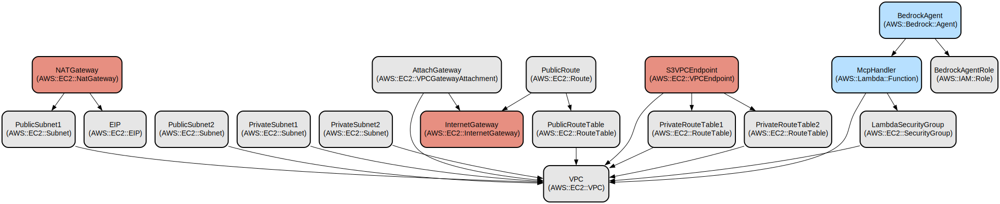

# AWS Bedrock Agent CDK Infrastructure for MCP Integration

## Overview

Amazon Bedrock is a fully managed service that provides access to high-performing foundation models (FMs) from leading AI companies through a single API. It enables you to build generative AI applications with enterprise-grade security and privacy.

Bedrock Agents are AI-powered assistants that can be customized to understand your business context and take actions using your enterprise systems and data. They combine the power of foundation models with your business knowledge and systems to create intelligent assistants that can:
- Understand and process natural language requests
- Access your company's data and systems securely
- Execute specific actions through custom integrations
- Maintain context across conversations

Action Groups are a key component of Bedrock Agents that define the specific capabilities and operations an agent can perform. They:
- Group related actions and API endpoints together
- Define the interface between the agent and your business systems
- Handle parameter validation and type conversion
- Execute operations through Lambda functions or API endpoints

This project specifically focuses on integrating Bedrock Agents with the Model Context Protocol (MCP), enabling seamless communication between agents and various AI model services through standardized interfaces.

## Project Description

This project provides an AWS CDK infrastructure implementation for deploying Bedrock Agents with Model Context Protocol (MCP) integration. It enables seamless deployment of AI agents with custom actions through AWS Bedrock, leveraging VPC networking and Lambda functions.

The infrastructure creates a secure and scalable environment for running Bedrock Agents with MCP capabilities. While it includes a base VPC template with public and private subnets, NAT Gateway, and VPC endpoints, you can also use your own CloudFormation template or an existing VPC infrastructure. The solution uses Lambda functions to handle MCP action groups, allowing the Bedrock Agent to execute custom actions through the Model Context Protocol. Additionally, if you need to deploy MCP servers that require continuous operation, you can deploy them within the same VPC and establish private network connectivity between the Lambda functions and these servers.

Key features include:
- Automated VPC infrastructure setup with public/private subnets
- Secure Lambda function execution environment
- Dynamic MCP server configuration and OpenAPI schema generation
- IAM role and security group management for secure access
- Bedrock Agent deployment with custom action groups

## Limitations

The current implementation has the following limitations:

- Only supports Node.js-based MCP servers that use STDIO for communication
- MCP servers must be compatible with AWS Lambda Node.js runtime environment
- Only Node.js modules that can run in the Lambda environment can be used
- Limited to STDIO-based communication protocol between Lambda and MCP servers
- **Finally, this project is a proof-of-concept for the integration of MCP with Bedrock Agent, so it needs to be refined before it can be utilized in production.**

## Repository Structure
```
.
├── base-infra-example/             # Base infrastructure templates
│   └── base-vpc.yaml              # VPC CloudFormation template with networking components
├── bin/                           # CDK application entry points
│   ├── bedrock-mcp-agent-cdk.ts   # Main CDK application setup
│   └── schema-conversion-tool.ts   # OpenAPI schema conversion utilities
├── conf/                          # Configuration files
│   ├── mcp.json                   # MCP server configuration
│   └── vpc-info                   # VPC configuration
├── client-example/              # Client example code for testing deployment
├── lambda/                        # Lambda function implementations
│   └── mcp_action_group_handler/  # MCP action group handler implementation
│       ├── index.mjs              # Handler implementation
│       └── package.json           # Lambda dependencies
├── lib/                           # CDK stack definitions
│   └── bedrock-agent-stack.ts     # Main Bedrock Agent stack implementation
├── deploy.sh                      # Deployment script
├── destroy.sh                     # Cleanup script
├── synth.sh                      # CDK synthesis script
├── tsconfig.json                 # TypeScript configuration
├── README.ko.md                  # Korean version README file
└── README.md                     # Main README file
```

## Usage Instructions
### Prerequisites
- Node.js v20.x or later
- npm 10.x or later
- AWS CLI v2.x or later
- AWS CDK v2.x or later
- git v2.x dltkd
- Resource creation, permissions, including VPC, EC2, Bedrock Agent, Bedrock, Lambda, etc.
- VPC with at least two private subnets
- To run MCP Server, which requires internet access, you need a public subnet and a NAT Gateway to access it.

### NPM Scripts
The following npm scripts are available:
```bash
npm run build          # Compiles TypeScript code and builds the project
npm run cdk           # Runs AWS CDK CLI commands
npm run clean        # Removes build artifacts and temporary files
npm run lambda:build # Builds Lambda function code
npm run lambda:clean # Cleans Lambda function build artifacts
npm run synth        # Synthesizing Cloudformation templates using CDK code
npm run deploy       # Deploying CDK Code-Based AWS Infrastructure
```

### Quick Start

1. Clone the repository and change working directory:
```bash
git clone https://github.com/junhwan0/bedrock-mcp-agent-cdk.git
cd bedrock-mcp-agent-cdk
```

2. Deploy a VPC. The script below makes it easy to deploy a VPC with public and private subnets and automatically updates the configuration file conf/vpc-info with the deployment results. However, you don't need to use this script, you can use it to update conf/vpc-info with information about your existing VPCs:
```bash
cd base-infra-example/
./deploy.sh
```

3. Configure MCP servers in conf/mcp.json:
```bash
cd ..
cp conf/mcp.json.example conf/mcp.json
```
If you open the mcp.json copied above, you can see the example MCP Server configuration provided by smithery as shown below, except for smithery's API key. You need to log in to smithery, get the API key, and apply it to the configuration file to access MCP Server normally.
```json
{
  "mcpServers": {
    "time-mcp": {
      "command": "npx",
      "args": [
        "-y",
        "@smithery/cli@latest",
        "run",
        "@yokingma/time-mcp",
        "--key",
        "<your-smithery-key>"
      ],
      "bundling": {
        "nodeModules": ["npm", "@smithery/cli"]
      }
    },
    ...
```

The bundling part of the above setting is not required, but if you specify a bundling configuration for your Lambda deployment, this setting allows you to pre-deploy the modules required by the npx command, reducing the time it takes to download the modules when the npx command is run:
```json
{
  "mcpServers": {
    "your-mcp-server": {
      "command": "npx",
      "args": ["your-mcp-server-args"],
      "bundling": {
        "nodeModules": ["module1", "module2"]  // Modules to include with Lambda
      }
    }
  }
}
```

> **Important**: When using the bundling.nodeModules configuration, you must install the specified modules in both the project root and Lambda function directory:
```bash
npm install module1 module2  # In project root
cd lambda/mcp_action_group_handler && npm install module1 module2  # In Lambda directory
```

4. Build project(The build process includes npm run build:schema. This generates the open api schema needed to integrate MCP with Bedrock Agent. To do this, the build process will start the MCP Server, which requires internet access.)
```bash
npm run build
```

5. Synthesize the CloudFormation template:
```bash
./synth.sh
```

6. Deploy the stack. Make sure to note the BedrockAgentsId that is output after the deployment is complete so you can utilize it during testing.:
```bash
./deploy.sh
```

### Testing the Deployment

After deploying the infrastructure, you can test it by deploying the Jupyter notebook files provided in the client-example directory to your Sagemaker AI Jupyter notebook instance. Once deployed, you will be provided with a URL that you can access with a web browser. Once you open the notebook, in the topmost cell, you will need to replace the agent_id with the value of BedrockAgentsId that you noted earlier in order to test it properly.:

Translated with www.DeepL.com/Translator (free version)

```bash
cd client-example/
./generate_template.sh
./deploy.sh
```

### More Detailed MCP Sever configuration examples

1. Configuring a Time MCP Server:

Without bundling:
```json
{
  "mcpServers": {
    "time-mcp": {
      "command": "npx",
      "args": [
        "-y",
        "@smithery/cli@latest",
        "run",
        "@yokingma/time-mcp",
        "--key",
        "your-key-here"
      ]
    }
  }
}
```
With bundling:
```json
{
  "mcpServers": {
    "time-mcp": {
      "command": "npx",
      "args": [
        "-y",
        "@smithery/cli",
        "run",
        "@yokingma/time-mcp",
        "--key",
        "your-key-here"
      ],
      "bundling": {
        "nodeModules": ["npm", "@smithery/cli"]
      }
    }
  }
}
```

2. Configuring a DuckDuckGo Search MCP Server:

Without bundling:
```json
{
  "mcpServers": {
    "duckduckgo-mcp-server": {
      "command": "npx",
      "args": [
        "-y",
        "@smithery/cli@latest",
        "run",
        "@nickclyde/duckduckgo-mcp-server",
        "--key",
        "<your-smithery-key>"
      ]
    }
  }
}
```
With bundling:
```json
{
  "mcpServers": {
    "duckduckgo-mcp-server": {
      "command": "npx",
      "args": [
        "-y",
        "@smithery/cli@latest",
        "run",
        "@nickclyde/duckduckgo-mcp-server",
        "--key",
        "<your-smithery-key>"
      ],
      "bundling": {
        "nodeModules": ["npm", "@smithery/cli"]
      }
    }
  }
}
```

### Troubleshooting

1. VPC Configuration Issues
- Problem: CDK deployment fails with VPC validation errors
- Solution: Verify VPC ID and subnet IDs in vpc-info file
```bash
cat conf/vpc-info
# Should contain:
# export AWS_REGION=us-west-2
# export VPC_ID=vpc-xxxxxx
# export SUBNET_IDS=subnet-xxx,subnet-yyy
```

2. MCP Server Connection Issues
- Problem: MCP server fails to start
- Solution: Verify MCP server configuration and credentials
```bash
# Check MCP server configuration
cat conf/mcp.json
# Verify format and credentials
```

### Quota Limitations

Bedrock Agent has default quota limitations for action groups:
- Maximum of 5 action group functions per agent (subject to change)
- Maximum of 5 parameters per action group (subject to change)

If you need to increase these limits, you can request a quota increase through the AWS Console under Service Quotas > Amazon Bedrock > Action Group Functions per Agent or Parameters per Action Group.

## Data Flow
The infrastructure enables secure communication between Bedrock Agents and MCP servers through Lambda functions.

```ascii
[Bedrock Agent] --> [Lambda Function] --> [MCP Server]
     |                     |                   |
     |                     |                   |
     +---------------------+-------------------+
              Security Groups & VPC
```

Component interactions:
1. Bedrock Agent receives user requests and routes them to appropriate action groups
2. Lambda functions execute in VPC with temporary storage
3. MCP servers handle specific capabilities through standardized protocol
4. Security groups control network access between components
5. VPC provides network isolation and security

## Infrastructure

 

The infrastructure consists of the following AWS resources:

Lambda:
- McpHandler: Executes MCP actions in response to Bedrock Agent requests

VPC:
*(Created by base-vpc.yaml CloudFormation template, you can replace this to your own)*
- VPC with CIDR block 10.0.0.0/16
- 2 Public Subnets (10.0.0.0/20, 10.0.16.0/20)
- 2 Private Subnets (10.0.128.0/20, 10.0.144.0/20)
- Internet Gateway for public subnet access
- NAT Gateway for private subnet internet access
- S3 VPC Endpoint for private S3 access

Security & IAM:
*(Created by CDK stack)*
- LambdaSecurityGroup: Controls Lambda function network access
- BedrockAgentRole: IAM role for Bedrock Agent permissions