# AWS Bedrock Usage Analytics System

---

## 목차
- [애플리케이션에 Request Metadata를 넣는 방법](#-애플리케이션에-request-metadata를-넣는-방법)
- [애플리케이션별 Bedrock 사용량 추적](#-애플리케이션별-bedrock-사용량-추적)
  - [왜 필요한가?](#왜-필요한가)
  - [왜 이 방법인가?](#왜-이-방법인가)
  - [전제조건: IAM Role 기반 애플리케이션 구분](#전제조건-iam-role-기반-애플리케이션-구분)
- [Amazon Q Developer (QCli) 리밋 모니터링](#-amazon-q-developer-qcli-리밋-모니터링)
  - [왜 필요한가?](#qcli-왜-필요한가)
  - [리밋 추적 기능](#리밋-추적-기능)
  - [사용 방법](#qcli-사용-방법)
- [애플리케이션 개요](#애플리케이션-개요)
- [핵심 기능](#핵심-기능)
- [시스템 아키텍처](#시스템-아키텍처)
- [환경 요구사항](#환경-요구사항)
- [설치 방법](#설치-방법)
- [사용 방법](#사용-방법)
- [소스코드 상세 설명](#소스코드-상세-설명)
- [시스템 플로우](#시스템-플로우)
- [데모](#데모)
- [문제 해결](#문제-해결)

---

## 📝 애플리케이션에 Request Metadata를 넣는 방법

**Bedrock API 호출 시 애플리케이션 정보를 추가하는 방법을 알고 싶으신가요?**

AWS Bedrock의 **requestMetadata** 파라미터를 사용하면 코드 레벨에서 간단하게 애플리케이션 정보를 추가하고 추적할 수 있습니다.

- Bedrock Converse API에 requestMetadata 파라미터 추가
- CloudWatch Logs를 통해 애플리케이션별 사용량 조회
- IAM Role 설정 없이 코드만으로 구현 가능

자세한 구현 방법과 4가지 실전 예제는 **[basic 폴더의 README.md](./basic/README.md)** 를 참조하세요.

---

## 🎯 애플리케이션별 Bedrock 사용량 추적

### 왜 필요한가?

여러 애플리케이션이 동일한 AWS 계정에서 Bedrock을 사용하는 경우, **어떤 애플리케이션이 얼마나 사용하는지** 파악하는 것이 중요합니다:

- **비용 배분**: 각 팀/프로젝트별로 정확한 비용 청구
- **최적화**: 비용이 많이 드는 애플리케이션 식별 및 최적화
- **예산 관리**: 애플리케이션별 예산 할당 및 모니터링
- **거버넌스**: 사용 패턴 분석 및 정책 수립

### 왜 이 방법인가?

Bedrock 사용량을 추적하는 방법에는 여러 가지가 있지만, 각각 한계가 있습니다:

| 방법 | 장점 | 단점 | 정확도 |
|------|------|------|--------|
| **애플리케이션 코드 직접 로깅** | 커스터마이징 가능 | 모든 앱 수정 필요, 유지보수 부담 | ⭐⭐⭐ |
| **CloudWatch Metrics만 사용** | 설정 간단 | 애플리케이션별 구분 불가 | ⭐⭐ |
| **CloudTrail 수동 분석** | 상세한 정보 | 실시간 분석 어려움, 쿼리 복잡 | ⭐⭐⭐⭐ |
| **Model Invocation Logging + Athena** ✅ | 코드 수정 불필요, 자동화, 확장성 | 초기 설정 필요 | ⭐⭐⭐⭐⭐ |

* CloudTrail 안에는 Bedrock api 기록이 있어 호출한 횟수, 모델명을 알수 있지만, 토큰사용량은 나와있지 않습니다. 
  CloudTrail과 Cloudwatch metric을 조합하는 방식으로 계산해도 명확하게 둘 간의 연결고리를 찾기 어렵기 때문에, CloudTrail에서 
  호출한 횟수와, Cloudwatch metrci의 전체 토큰사용량을 호출횟수 비율로 나눠보기도 했는데, 실제 토큰 사용량과는 괴리가 있어 
  정확한 사용량을 추정하기 어렵습니다. 

**이 시스템의 접근 방법**:
- ✅ **애플리케이션 코드 수정 불필요** - Bedrock API 호출만으로 자동 추적
- ✅ **100% 정확한 토큰 및 비용 계산** - Model Invocation Logging에서 실제 데이터 추출
- ✅ **실시간 SQL 분석** - Athena로 복잡한 분석 쿼리 실행 가능
- ✅ **확장 가능** - 새 애플리케이션 추가 시 IAM Role만 생성하면 자동 추적

### 전제조건: IAM Role 기반 애플리케이션 구분

애플리케이션별로 사용량을 추적하려면, **각 애플리케이션에 전용 IAM Role을 부여**해야 합니다.

#### IAM Role 네이밍 규칙
```
{ApplicationName}-BedrockRole
```

예시:
- `CustomerServiceApp-BedrockRole`
- `DataAnalysisApp-BedrockRole`
- `ChatbotApp-BedrockRole`

#### IAM Role 생성 예시 (Terraform)

```hcl
# Application별 IAM Role 생성
resource "aws_iam_role" "customer_service_bedrock_role" {
  name = "CustomerServiceApp-BedrockRole"

  assume_role_policy = jsonencode({
    Version = "2012-10-17"
    Statement = [
      {
        Action = "sts:AssumeRole"
        Effect = "Allow"
        Principal = {
          Service = "ec2.amazonaws.com"  # 또는 실제 서비스
        }
      }
    ]
  })
}

# Bedrock 권한 부여
resource "aws_iam_role_policy" "customer_service_bedrock_policy" {
  name = "bedrock-invoke-policy"
  role = aws_iam_role.customer_service_bedrock_role.id

  policy = jsonencode({
    Version = "2012-10-17"
    Statement = [
      {
        Effect = "Allow"
        Action = [
          "bedrock:InvokeModel",
          "bedrock:InvokeModelWithResponseStream"
        ]
        Resource = [
          "arn:aws:bedrock:*::foundation-model/anthropic.claude-*"
        ]
      }
    ]
  })
}
```

#### 애플리케이션에서 IAM Role 사용

```python
# Application 코드에서 Role Assume
import boto3

# STS로 Role Assume
sts_client = boto3.client('sts')
assumed_role = sts_client.assume_role(
    RoleArn='arn:aws:iam::123456789012:role/CustomerServiceApp-BedrockRole',
    RoleSessionName='customer-service-session'
)

# Assumed Role로 Bedrock 호출
bedrock_client = boto3.client(
    'bedrock-runtime',
    aws_access_key_id=assumed_role['Credentials']['AccessKeyId'],
    aws_secret_access_key=assumed_role['Credentials']['SecretAccessKey'],
    aws_session_token=assumed_role['Credentials']['SessionToken']
)

# Bedrock API 호출 - 자동으로 추적됨!
response = bedrock_client.invoke_model(
    modelId='anthropic.claude-3-5-sonnet-20241022-v2:0',
    body=json.dumps({...})
)
```

#### 추적 원리

1. **애플리케이션이 IAM Role로 Bedrock 호출**
2. **Model Invocation Logging이 S3에 로그 저장**
   - IAM Role ARN이 로그에 포함됨
   - 실제 토큰 사용량이 기록됨
3. **Athena가 로그에서 Role ARN 파싱**
   - `assumed-role/CustomerServiceApp-BedrockRole/session` → `CustomerServiceApp`
4. **애플리케이션별 사용량 및 비용 자동 집계**

#### 대안: UserAgent 기반 구분 (코드 수정 필요)

IAM Role을 사용할 수 없는 경우, UserAgent로도 구분 가능:

```python
from botocore.config import Config

# UserAgent에 Application 식별 정보 추가
config = Config(user_agent_extra='CustomerServiceApp/1.0')

bedrock_client = boto3.client(
    'bedrock-runtime',
    config=config
)
```

하지만 **IAM Role 방식이 더 권장됩니다**:
- 보안: 명확한 권한 분리
- 신뢰성: 조작 불가능
- 관리: 중앙 집중식 관리

#### ARN 패턴 필터링이란?

`identity.arn` 필드에 특정 키워드가 포함된 사용자만 필터링하여 사용량을 확인하는 기능입니다.

**예시:**
- DataAnalysisApp Role: `arn:aws:iam::123456789012:role/assumed-role/DataAnalysisApp-BedrockRole`
- 패턴: `DataAnalysisApp-BedrockRole` 또는 `DataAnalysis`

#### 대시보드에서 사용

1. Streamlit 대시보드 실행:
   ```bash
   streamlit run bedrock_tracker.py
   ```

2. 왼쪽 사이드바의 **"ARN 패턴 필터"** 입력 필드에 키워드 입력:
   ```
   DataAnalysis
   ```

3. **"데이터 분석"** 버튼 클릭

4. 해당 패턴을 포함하는 사용자의 사용량만 필터링되어 표시됩니다.

#### CLI에서 사용

```bash
#    DataAnalysis 사용량만 조회
python bedrock_tracker_cli.py --days 7 --arn-pattern "DataAnalysis"

# 특정 기간 + ARN 패턴
python bedrock_tracker_cli.py \
  --start-date 2025-10-11 \
  --end-date 2025-10-18 \
  --arn-pattern "DataAnalysis" \
  --analysis all

# CSV 파일로 저장
python bedrock_tracker_cli.py \
  --arn-pattern "DataAnalysis" \
  --format csv
```

#### 활용 예시

**1. DataAnalysis application 비용 분석:**
```bash
python bedrock_tracker_cli.py --arn-pattern "DataAnalysis" --analysis user
```

**2. 특정 팀의 Bedrock 사용량:**
```bash
python bedrock_tracker_cli.py --arn-pattern "DataTeam" --analysis all
```

**3. 여러 애플리케이션 비교:**
```bash
# App1 사용량
python bedrock_tracker_cli.py --arn-pattern "App1" > app1_usage.txt

# App2 사용량
python bedrock_tracker_cli.py --arn-pattern "App2" > app2_usage.txt
```

#### 주의사항

- ARN 패턴은 대소문자를 구분합니다
- 빈 문자열을 입력하면 전체 사용량이 표시됩니다
- 패턴은 `LIKE '%패턴%'` 형식으로 검색됩니다

---

## 🚨 Amazon Q Developer (QCli) 사용량 추적 및 리밋 모니터링

### QCli 왜 필요한가?

Amazon Q Developer Pro는 **$19/월 정액제**이지만, **사용량 추적과 숨겨진 리밋**에 대한 과제가 있습니다:

#### 1. Context Window 사용량 추적
- ✅ **/usage 명령어**: 200,000 토큰 Context Window 제한 표시
- ❌ **사용량 확인**: 현재 얼마나 사용했는지 확인 불가
- ❌ **토큰 계산**: 실제 토큰 사용량 측정 방법 없음

#### 2. 숨겨진 사용량 리밋
- ❌ **채팅/인라인 제안**: AWS가 정확한 리밋을 공개하지 않음
- ✅ **/dev 명령어**: 30회/월 (공식 문서)
- ✅ **Code Transformation**: 4,000줄/월 (공식 문서)

사용자들이 예고 없이 "Monthly limit reached" 메시지를 받는 문제가 발생하고 있으며, AWS는:
- 현재 사용량을 확인할 방법을 제공하지 않음
- 몇 % 사용했는지 알 수 없음
- 리밋 도달 시점을 예측할 수 없음

**이 시스템의 접근 방법**:
- ✅ **실제 토큰 사용량 추적** - S3 프롬프트 로그 분석으로 정확한 토큰 계산
- ✅ **Context Window 모니터링** - 200,000 토큰 제한 대비 사용률 추적
- ✅ **공식 리밋 추적** - 문서화된 /dev, Code Transformation 리밋 모니터링
- ✅ **이상 감지** - 급격한 사용량 증가 패턴 감지
- ✅ **경고 시스템** - 리밋 80% 도달 시 사전 경고

### 데이터 소스: S3 프롬프트 로그 vs Athena CSV

이 시스템은 **두 가지 데이터 소스**를 지원합니다:

#### 1. S3 프롬프트 로그 (권장) ⭐⭐⭐⭐⭐

**정확도**: 매우 높음 (실제 토큰 계산)

**장점**:
- ✅ 실제 프롬프트 텍스트 포함
- ✅ tiktoken으로 정확한 토큰 계산
- ✅ Context Window 사용량 정확히 추적
- ✅ 입력/출력 토큰 분리 측정
- ✅ 시간대별/날짜별 상세 분석

**단점**:
- ⚠️ 프롬프트 로깅 활성화 필요
- ⚠️ S3 로그 파일 다운로드 및 파싱 필요 (약간 느림)

**데이터 구조**:
```
s3://amazonq-developer-reports-{account_id}/
  └── prompt_logging/AWSLogs/{account_id}/QDeveloperLogs/
      ├── GenerateAssistantResponse/  # Chat 로그
      │   └── us-east-1/2025/11/12/*.json.gz
      └── GenerateCompletions/         # Inline 제안 로그
          └── us-east-1/2025/11/12/*.json.gz
```

각 로그 파일에는 실제 프롬프트와 응답 텍스트가 포함되어 있어, tiktoken 라이브러리로 정확한 토큰 수를 계산할 수 있습니다.

#### 2. Athena CSV 리포트 (빠른 분석용) ⭐⭐⭐

**정확도**: 낮음 (하드코딩된 추정치 사용)

**장점**:
- ✅ 빠른 분석 (CSV 직접 읽기)
- ✅ 설정 간단
- ✅ 공식 리밋 추적 가능

**단점**:
- ❌ 토큰 정보 없음 (추정치만 가능)
- ❌ 하드코딩된 평균값 사용
- ❌ Context Window 정확도 낮음

**데이터 구조**:
```
s3://amazonq-developer-reports-{account-id}/user-activity-reports/
  └── AWSLogs/{account-id}/QDeveloperLogs/by_user_analytic/{region}/
      └── *.csv
```

CSV에는 요청 횟수만 있고 토큰 수는 없으므로, 하드코딩된 평균값으로 추정합니다.

### 토큰 계산 방법 비교

| 방법 | 데이터 소스 | 토큰 계산 | Context Window | 정확도 |
|------|------------|----------|---------------|--------|
| **S3 로그** | 프롬프트 로그 | tiktoken (실제) | ✅ 정확 | ⭐⭐⭐⭐⭐ |
| **Athena CSV** | 사용자 활동 리포트 | 하드코딩 추정 | ⚠️ 추정 | ⭐⭐⭐ |

**실제 비교 예시** (최근 3일):
```
S3 로그 분석:
- 총 요청: 42회
- 실제 토큰: 62,057 (tiktoken 계산)
- Chat 평균: 556 토큰/요청
- Inline 평균: 2,492 토큰/요청

Athena CSV 분석:
- 총 요청: 77회
- 추정 토큰: 17,720 (하드코딩)
- Chat 평균: 650 토큰/요청 (고정값)
- Inline 평균: 250 토큰/요청 (고정값)

차이: S3 로그가 3.5배 더 많은 토큰 계산
→ 실제 프롬프트 길이를 반영하기 때문
```

### 리밋 추적 기능

#### 1. 공식 리밋 모니터링

```
⚠️ 공식 리밋 모니터링
================================================================================
🔧 /dev 명령어:
   현재 사용량:    0 /  30회
   월간 예상:      0회 (0.0%)
   ✅ 정상: 월간 리밋의 0.0%

🔄 Code Transformation:
   현재 사용량:      0 / 4,000줄
   월간 예상:        0줄 (0.0%)
   ✅ 정상: 월간 리밋의 0.0%
```

#### 2. 사용 패턴 분석

```
📈 사용 패턴 분석
================================================================================
  일일 평균 활동:        40.1건
  최대 활동일:          191건
  최소 활동일:            0건

  🚨 사용량 급증 감지: 1일 동안 일평균(40.1)의
     3배(120.3)를 초과했습니다!
     리밋 도달 가능성이 높습니다!
```

#### 3. 추세 기반 예측

시스템은 현재 사용 속도를 기반으로 월말 사용량을 예측합니다:
- 현재 15일간 601개 채팅 메시지 사용
- 일평균: 40.1개
- **월말 예상**: 약 1,200개 (실제 리밋 불명)

### QCli 프롬프트 로깅 설정 (S3 로그 분석용)

S3 로그 분석을 사용하려면 먼저 Amazon Q Developer의 프롬프트 로깅을 활성화해야 합니다.

#### 1. AWS 콘솔에서 설정

**Amazon Q Developer 콘솔 접속**:
1. AWS Management Console → Amazon Q Developer
2. 왼쪽 메뉴에서 **"Settings"** 선택
3. **"Prompt logging"** 섹션 찾기

**프롬프트 로깅 활성화**:
1. **"Enable prompt logging"** 토글 ON
2. S3 버킷 자동 생성됨: `amazonq-developer-reports-{account-id}`
3. 로그 저장 경로: `prompt_logging/AWSLogs/`

#### 2. AWS CLI로 확인

프롬프트 로깅 설정 상태 확인:
```bash
aws q-developer get-user-activity-report-configuration --region us-east-1
```

출력 예시:
```json
{
  "userActivityReportConfiguration": {
    "enabled": true,
    "s3BucketName": "amazonq-developer-reports-181136804328",
    "promptLoggingEnabled": true
  }
}
```

#### 3. S3 버킷 확인

로그 파일이 저장되는지 확인:
```bash
aws s3 ls s3://amazonq-developer-reports-{account-id}/prompt_logging/ --recursive
```

출력 예시:
```
2025-11-12 11:23:45     12345 prompt_logging/AWSLogs/123456789012/QDeveloperLogs/GenerateAssistantResponse/us-east-1/2025/11/12/...json.gz
2025-11-12 11:24:10      8901 prompt_logging/AWSLogs/123456789012/QDeveloperLogs/GenerateCompletions/us-east-1/2025/11/12/...json.gz
```

#### 4. IAM 권한 설정

분석 도구를 실행하는 IAM User/Role에 다음 권한이 필요합니다:

```json
{
  "Version": "2012-10-17",
  "Statement": [
    {
      "Effect": "Allow",
      "Action": [
        "s3:GetObject",
        "s3:ListBucket"
      ],
      "Resource": [
        "arn:aws:s3:::amazonq-developer-reports-*",
        "arn:aws:s3:::amazonq-developer-reports-*/*"
      ]
    },
    {
      "Effect": "Allow",
      "Action": [
        "q-developer:GetUserActivityReportConfiguration"
      ],
      "Resource": "*"
    },
    {
      "Effect": "Allow",
      "Action": [
        "sts:GetCallerIdentity"
      ],
      "Resource": "*"
    }
  ]
}
```

#### 5. Python 패키지 설치

S3 로그 분석에는 `tiktoken` 라이브러리가 필요합니다:

```bash
pip install tiktoken
```

`requirements.txt`에 추가되어 있으면 자동으로 설치됩니다:
```txt
boto3>=1.34.0
streamlit>=1.31.0
pandas>=2.0.0
plotly>=5.18.0
tiktoken>=0.5.0  # S3 로그 토큰 계산용
```

#### 6. 로깅 작동 확인

IDE에서 Amazon Q를 사용한 후 (Chat 또는 Inline 제안), 5-10분 후에 로그 파일이 생성됩니다:

```bash
# 최근 1시간 이내 생성된 로그 확인
aws s3 ls s3://amazonq-developer-reports-{account-id}/prompt_logging/ \
  --recursive | tail -10
```

로그 파일이 보이면 설정 완료!

#### 7. 문제 해결

**로그 파일이 생성되지 않는 경우**:

1. **프롬프트 로깅 활성화 확인**:
   ```bash
   aws q-developer get-user-activity-report-configuration --region us-east-1
   ```
   `promptLoggingEnabled: true` 확인

2. **S3 버킷 존재 확인**:
   ```bash
   aws s3 ls | grep amazonq-developer-reports
   ```

3. **IAM 권한 확인**:
   ```bash
   aws s3 ls s3://amazonq-developer-reports-{account-id}/
   ```
   AccessDenied 오류 발생 시 IAM 권한 추가 필요

4. **Amazon Q 사용 확인**:
   - IDE에서 실제로 Chat 또는 Inline 제안을 사용했는지 확인
   - 로그는 5-10분 지연될 수 있음

#### 8. 비용 정보

프롬프트 로깅의 S3 저장 비용은 **매우 낮습니다**:

```
실제 사용 예시 (11일간):
- 로그 파일: 339개
- 총 크기: ~3.4 MB
- S3 저장 비용: ~$0.0001/월
- PUT 요청 비용: ~$0.0047/월
━━━━━━━━━━━━━━━━━━━━━━━━━━━━━
총 비용: ~$0.005/월 (약 7원)

Amazon Q Pro 구독료 ($19/월)의 0.026%
```

**결론**: 프롬프트 로깅 비용은 사실상 무료!

---

### QCli 사용 방법

이제 프롬프트 로깅이 활성화되었으므로, Streamlit 대시보드 또는 CLI로 분석할 수 있습니다.

#### Streamlit 대시보드

1. 대시보드 실행:
```bash
streamlit run bedrock_tracker.py
```

2. **Amazon Q CLI** 탭 선택

3. **데이터 소스 선택** (왼쪽 사이드바):
   - **"S3 로그 (실제 토큰)"** ← 권장
   - "Athena CSV (추정)"

4. 날짜 범위 선택 (기본: 최근 30일)

5. (선택) 사용자 ID 패턴 필터 입력

6. **"🔍 데이터 분석"** 버튼 클릭

7. 결과 확인:

**S3 로그 분석 결과**:
   - 📊 **전체 요약**: 총 요청, Chat/Inline 요청 분포
   - 🔢 **실제 토큰 사용량**: Input/Output 토큰 (tiktoken 계산)
   - 📈 **Context Window 분석**: 200,000 토큰 대비 사용률
   - 💬 **Chat 분석**: 평균 입력/출력 토큰
   - ⚡ **Inline 제안 분석**: 평균 컨텍스트 크기
   - 👥 **사용자별 분석**: 사용자별 토큰 사용량
   - 📅 **일별 사용 패턴**: 날짜별 토큰 추이 차트
   - ⏰ **시간대별 패턴**: 시간대별 요청 분포 (UTC/KST)
   - 💰 **가상 비용 분석**: Claude API 사용 시 비용 비교

**Athena CSV 분석 결과**:
   - ⚠️ **공식 리밋 모니터링**: /dev, Code Transformation 사용량
   - 📈 **사용 패턴 분석**: 일일 평균, 최대/최소, 이상 감지
   - 📊 **전체 요약**: 채팅, 인라인, 코드 라인 통계
   - 🔢 **토큰 추정** (참고용): ROI 분석용

#### CLI 도구

```bash
# S3 로그 분석 (기본값, 권장)
python bedrock_tracker_cli.py --service qcli --days 7

# 특정 기간 S3 로그 분석
python bedrock_tracker_cli.py \
  --service qcli \
  --start-date 2025-11-01 \
  --end-date 2025-11-12 \
  --data-source s3

# Athena CSV 분석 (빠른 분석용)
python bedrock_tracker_cli.py \
  --service qcli \
  --days 30 \
  --data-source athena

# 사용자 필터링 + S3 로그
python bedrock_tracker_cli.py \
  --service qcli \
  --days 7 \
  --user-pattern "user@example.com"

# JSON 리포트 저장 (S3 로그)
python bedrock_tracker_cli.py \
  --service qcli \
  --days 30 \
  --data-source s3 \
  --format json
```

**CLI 옵션**:
- `--service qcli`: Amazon Q CLI 분석 모드
- `--data-source {s3|athena}`: 데이터 소스 선택 (기본: s3)
- `--days N`: 최근 N일 분석
- `--start-date / --end-date`: 날짜 범위 지정
- `--user-pattern`: 사용자 ID 필터
- `--format {terminal|csv|json}`: 출력 형식
- `--analysis {all|summary}`: 분석 유형 (S3는 summary만 지원)

**출력 예시**:
```
📊 Amazon Q CLI 전체 요약
================================================================================
  활성 사용자:                       1
  활동 일수:                        15
  채팅 메시지:                     601
  인라인 제안:                     536
  인라인 수락:                     201
  /dev 이벤트:                       0
  /test 이벤트:                      0
================================================================================

⚠️ 공식 리밋 모니터링
================================================================================

🔧 /dev 명령어:
   현재 사용량:    0 /  30회
   월간 예상:      0회 (0.0%)
   ✅ 정상: 월간 리밋의 0.0%

🔄 Code Transformation:
   현재 사용량:      0 / 4,000줄
   월간 예상:        0줄 (0.0%)
   ✅ 정상: 월간 리밋의 0.0%

💡 참고:
   - 채팅/인라인 제안: AWS가 공식 리밋을 공개하지 않음 (추적 불가)
   - 실제 리밋 도달 시 AWS 콘솔에서 'Monthly limit reached' 메시지 표시
================================================================================

📈 사용 패턴 분석
================================================================================
  일일 평균 활동:        40.1건
  최대 활동일:          191.0건
  최소 활동일:            0.0건

  ✅ 정상 패턴: 이상 활동 없음
================================================================================
```

### CSV 데이터 소스

Amazon Q Developer는 매일 사용자 활동 리포트를 S3에 CSV 형식으로 저장합니다:

**S3 경로**:
```
s3://amazonq-developer-reports-{account-id}/user-activity-reports/
  AWSLogs/{account-id}/QDeveloperLogs/by_user_analytic/{region}/
```

**CSV 컬럼 (46개)**:
- `Chat_MessagesSent`: 채팅 메시지 수
- `Chat_AICodeLines`: 채팅으로 생성된 코드 라인
- `Inline_SuggestionsCount`: 인라인 제안 수
- `Inline_AcceptanceCount`: 수락된 인라인 제안
- `Dev_GenerationEventCount`: /dev 명령어 사용 횟수
- `TestGeneration_EventCount`: /test 명령어 사용 횟수
- `Transformation_LinesGenerated`: Code Transformation 생성 라인

**중요**: CSV에는 **토큰 수나 리밋 정보가 없습니다**. 이 시스템은 사용 패턴을 분석하여 간접적으로 추정합니다.

### 주요 제약사항

#### CSV로 가능한 것
✅ 공식 리밋 추적 (문서화된 항목만)
✅ 일일/주간 사용량 추세
✅ 급격한 사용량 증가 감지
✅ 월간 누적 사용량 계산

#### CSV로 불가능한 것
❌ 정확한 토큰 수 측정
❌ 실제 리밋까지 남은 양
❌ Throttling 발생 여부
❌ 채팅/인라인 제안 리밋 (AWS 미공개)

### 권장 사용 전략

1. **주간 모니터링**: 매주 대시보드에서 사용량 확인
2. **이상 감지 주의**: 일평균의 3배 초과 시 사용량 조절
3. **공식 리밋 80% 도달 시**: /dev, Code Transformation 사용 자제
4. **월말 근처**: 사용량 급증 피하기

### 토큰 추정치의 계산 근거

#### 기본 가정
- 영어 단어: **1.4 토큰**
- 4글자당: **5 토큰**
- 코드 1줄 평균: 60-80문자 = **75-100 토큰**

#### 평균 추정 상수 (bedrock_tracker.py:521-533)

| 항목 | 토큰 수 | 근거 |
|------|---------|------|
| **chat_message_input** | 150 | 채팅 질문 평균 (~20-30 단어) |
| **chat_message_output** | 500 | 채팅 응답 평균 (~70-80 단어) |
| **chat_code_line** | 75 | 코드 1줄 = 60-80문자 |
| **inline_suggestion** | 60 | 인라인 제안 (~10 단어) |
| **inline_code_line** | 75 | 인라인 코드 1줄 |
| **/dev_event_input** | 600 | /dev 요청 (~80 단어 + 컨텍스트) |
| **/dev_event_output** | 1000 | /dev 응답 (~130 단어 + 코드) |
| **/test_event** | 450/750 | 테스트 생성 요청/응답 |
| **/doc_event** | 350/600 | 문서 생성 요청/응답 |

#### 실제 계산 예시 (15일 사용량 기준)

**실제 사용량**:
- 채팅 메시지: 601개
- 인라인 제안: 536개
- 채팅 코드 라인: 2,573줄
- 인라인 코드 라인: 201줄

**토큰 계산**:
```
Input 토큰  = (601 × 150) + (536 × 60)
            = 90,150 + 32,160
            = 122,310 토큰

Output 토큰 = (601 × 500) + (2,573 × 75) + (201 × 75) + (201 × 60)
            = 300,500 + 192,975 + 15,075 + 12,060
            = 520,610 토큰

총 토큰    = 642,920 토큰
```

#### ⚠️ 추정치의 한계

**실제 검증 결과** (AWS Cost Explorer):
- 실제 비용: **$18.49** (30일)
- 추정 비용 (토큰 기반): **$8.18**
- **차이**: 2.26배 낮게 추정됨

**왜 차이가 날까?**

1. **정액제 구독료 포함**
   - $19/월 구독료가 실제 비용의 대부분
   - 토큰 사용량 기반 청구 아님

2. **숨겨진 토큰 사용**
   - 프로젝트 컨텍스트 로딩
   - 코드베이스 인덱싱
   - 캐시 관리, 메타데이터 처리

3. **CSV에 토큰 정보 없음**
   - AWS가 정확한 토큰 수를 제공하지 않음
   - 모든 값이 패턴 기반 추정

**결론**:
- ✅ **상대적 사용량 파악**에 유용
- ✅ **ROI 분석** (얼마나 사용하는가)에 유용
- ❌ **실제 청구 비용 예측**에 부정확
- ❌ **정확한 토큰 수 측정** 불가능

**💡 권장**: 이 추정치는 "구독료 대비 얼마나 많이 쓰는가" 판단하는 **참고용**으로만 사용하세요!

---

## 애플리케이션 개요

### 목적
AWS Bedrock 모델 사용량을 **다중 리전**에서 추적하고 **애플리케이션별/사용자별** 비용을 분석하는 통합 분석 시스템입니다. AWS Model Invocation Logging과 Amazon Athena를 활용하여 **코드 수정 없이** 100% 정확한 사용량 추적이 가능합니다.

### 주요 용도
- **비용 모니터링**: 사용자/애플리케이션별 실시간 비용 분석
- **사용 패턴 분석**: 시간대별/일별 사용 패턴 파악
- **리전별 분석**: 다중 리전(US, Asia, Europe)에서 사용량 통합 관리
- **모델 최적화**: 모델별 사용 통계를 통한 비용 최적화

---

## 핵심 기능

### 자동 로깅 및 추적
- AWS Model Invocation Logging을 통한 자동 로그 수집
- S3에 JSON 형식으로 저장된 로그 자동 파티셔닝
- 애플리케이션 코드 수정 완전히 불필요

### 다차원 분석
- **사용자별 분석**: IAM User/Role별 호출 수, 토큰 사용량, 비용
- **애플리케이션별 분석**: Role 기반 앱별 상세 비용 분석
- **모델별 분석**: Claude 모델별 평균/총 사용량 통계
- **시간 패턴 분석**: 시간별/일별 사용 패턴 시각화

### 실시간 대시보드
- Streamlit 기반 인터랙티브 웹 UI
- Plotly를 활용한 동적 차트 및 그래프
- 날짜 범위 선택 및 리전별 필터링
- CSV 데이터 다운로드 지원

### 비용 계산
- 모델별 정확한 토큰 단가 적용
- Input/Output 토큰 분리 계산
- USD 기준 실시간 비용 집계

---

## 시스템 아키텍처

```mermaid
graph TB
    subgraph "애플리케이션"
        A1[Customer Service App]
        A2[Data Analysis App]
        A3[Chatbot App]
        A4[Document Processor]
    end

    subgraph "AWS Bedrock"
        B1[Claude 3 Haiku]
        B2[Claude 3.5 Sonnet]
        B3[Claude 4 Sonnet]
    end

    subgraph "Model Invocation Logging"
        C1[CloudWatch Logs]
        C2[S3 Logs Bucket]
    end

    subgraph "Analytics Layer"
        D1[AWS Glue Catalog]
        D2[Athena Query Engine]
        D3[S3 Analytics Bucket]
    end

    subgraph "Visualization"
        E1[Streamlit Dashboard]
        E2[Cost Reports]
        E3[Usage Charts]
    end

    A1 --> B1
    A2 --> B2
    A3 --> B1
    A4 --> B3

    B1 --> C1
    B2 --> C1
    B3 --> C1

    C1 --> C2
    C2 --> D1
    D1 --> D2
    D2 --> D3

    D2 --> E1
    E1 --> E2
    E1 --> E3

    style A1 fill:#FFE5B4
    style A2 fill:#FFE5B4
    style A3 fill:#FFE5B4
    style A4 fill:#FFE5B4
    style B1 fill:#B4D7FF
    style B2 fill:#B4D7FF
    style B3 fill:#B4D7FF
    style C2 fill:#C8E6C9
    style D2 fill:#FFF59D
    style E1 fill:#F8BBD0
```



---

## 환경 요구사항

### AWS 권한
다음 AWS 서비스에 대한 권한이 필요합니다:

```json
{
  "Version": "2012-10-17",
  "Statement": [
    {
      "Effect": "Allow",
      "Action": [
        "bedrock:InvokeModel",
        "bedrock:GetModelInvocationLoggingConfiguration",
        "bedrock:PutModelInvocationLoggingConfiguration",
        "bedrock:ListFoundationModels"
      ],
      "Resource": "*"
    },
    {
      "Effect": "Allow",
      "Action": [
        "s3:GetObject",
        "s3:ListBucket",
        "s3:PutObject",
        "s3:CreateBucket"
      ],
      "Resource": [
        "arn:aws:s3:::bedrock-analytics-*",
        "arn:aws:s3:::bedrock-analytics-*/*"
      ]
    },
    {
      "Effect": "Allow",
      "Action": [
        "athena:StartQueryExecution",
        "athena:GetQueryExecution",
        "athena:GetQueryResults"
      ],
      "Resource": "*"
    },
    {
      "Effect": "Allow",
      "Action": [
        "glue:CreateDatabase",
        "glue:CreateTable",
        "glue:GetDatabase",
        "glue:GetTable"
      ],
      "Resource": "*"
    }
  ]
}
```

### Python 환경
- **Python**: 3.8 이상
- **AWS CLI**: 2.0 이상 (선택사항)

### Python 패키지
```
boto3>=1.34.0
streamlit>=1.31.0
pandas>=2.0.0
plotly>=5.18.0
```

---

## 설치 방법

### 1. 저장소 클론
```bash
git clone <repository-url>
cd bedrock_usage
```

### 2. 가상환경 생성 (권장)
```bash
python -m venv venv
source venv/bin/activate  # Linux/Mac
# 또는
venv\Scripts\activate     # Windows
```

### 3. 패키지 설치
```bash
pip install -r requirements.txt
```

### 4. AWS 자격증명 설정
```bash
aws configure
# 또는 환경변수 설정
export AWS_ACCESS_KEY_ID=your_key
export AWS_SECRET_ACCESS_KEY=your_secret
export AWS_DEFAULT_REGION=us-east-1
```

---

## 사용 방법

### 전체 설정 플로우

#### Step 1: Athena 분석 환경 구축
```bash
python setup_athena_bucket.py
```
이 스크립트는 다음을 자동으로 수행합니다:
- 리전별 S3 Analytics 버킷 생성
- Glue 데이터베이스 및 테이블 생성
- 오늘 날짜 파티션 자동 추가
- 데이터 연결 테스트

#### Step 2: Bedrock 로깅 설정
```bash
python check_bedrock_logging.py
```
현재 Model Invocation Logging 설정 상태를 확인합니다.

```bash
python setup_bedrock_logging.py
```
Bedrock Invocation Logging을 설정합니다.

#### Step 3: IAM Role 권한 검증
```bash
python verify_bedrock_permissions.py
```
모든 리전에서 IAM Role의 Bedrock 접근 권한을 검증합니다.

#### Step 4: 테스트 데이터 생성
```bash
python generate_test_data.py
```
다양한 애플리케이션과 리전에서 샘플 Bedrock API 호출을 생성합니다.

#### Step 5: 분석 도구 실행

**옵션 A: Streamlit 대시보드 (웹 UI)**
```bash
streamlit run bedrock_tracker.py
```
웹 브라우저가 자동으로 열리며 인터랙티브 대시보드에 접속됩니다.

**옵션 B: CLI 도구 (터미널)**
```bash
# 기본 사용 (최근 7일, us-east-1, 터미널 출력)
python bedrock_tracker_cli.py

# 특정 리전 및 기간 지정
python bedrock_tracker_cli.py --region ap-northeast-2 --days 30

# 날짜 범위 직접 지정
python bedrock_tracker_cli.py --start-date 2025-10-01 --end-date 2025-10-18

# 특정 분석만 실행
python bedrock_tracker_cli.py --analysis user        # 사용자별 분석만
python bedrock_tracker_cli.py --analysis model       # 모델별 분석만
python bedrock_tracker_cli.py --analysis daily       # 일별 패턴만

# CSV 파일로 저장
python bedrock_tracker_cli.py --format csv --region us-east-1

# JSON 파일로 저장
python bedrock_tracker_cli.py --format json
```

### Streamlit 대시보드 사용법

1. **리전 선택**
   - 사이드바에서 분석할 AWS 리전 선택

2. **날짜 범위 설정**
   - 시작 날짜와 종료 날짜 선택

3. **데이터 분석 실행**
   - "🔍 데이터 분석" 버튼 클릭

4. **결과 확인**
   - 전체 요약: 총 API 호출, 토큰, 비용
   - 사용자별 분석: 상위 사용자 및 비용
   - 애플리케이션별 상세 분석: Role 기반 앱별 통계
   - 모델별 사용 통계: 모델 호출 비율
   - 시간 패턴 분석: 일별/시간별 차트

### CLI 도구 사용법

**기본 옵션**:
```bash
--days N              # 분석할 일수 (기본값: 7일)
--region REGION       # AWS 리전 (기본값: us-east-1)
--start-date DATE     # 시작 날짜 (YYYY-MM-DD)
--end-date DATE       # 종료 날짜 (YYYY-MM-DD)
--analysis TYPE       # 분석 유형 (all, summary, user, user-app, model, daily, hourly)
--format FORMAT       # 출력 형식 (terminal, csv, json)
--max-rows N          # 테이블 최대 행 수 (기본값: 20)
```

**사용 예시**:

1. **전체 분석 (기본)**
```bash
python bedrock_tracker_cli.py
```
출력: 터미널에 전체 분석 결과 테이블 형식으로 표시

2. **특정 리전 및 기간 분석 (리전별 가격 자동 적용)**
```bash
python bedrock_tracker_cli.py --region ap-northeast-2 --days 30
```
출력: Seoul 리전의 최근 30일 데이터 분석 (Seoul 리전 가격 적용)

3. **날짜 범위 직접 지정**
```bash
python bedrock_tracker_cli.py --start-date 2025-10-01 --end-date 2025-10-18
```
출력: 지정된 기간의 데이터 분석

4. **ARN 패턴 필터링으로 특정 애플리케이션만 분석**
```bash
# DataAnalysis 애플리케이션만 분석
python bedrock_tracker_cli.py --arn-pattern "DataAnalysis" --days 7

# 특정 사용자만 분석
python bedrock_tracker_cli.py --arn-pattern "user/john" --analysis user

# 복합 필터: Tokyo 리전 + 특정 앱 + 최근 14일
python bedrock_tracker_cli.py --region ap-northeast-1 --arn-pattern "ChatbotApp" --days 14
```

5. **특정 분석만 실행**
```bash
# 요약만
python bedrock_tracker_cli.py --analysis summary

# 사용자별 분석만
python bedrock_tracker_cli.py --analysis user

# 유저별 애플리케이션별 상세 분석
python bedrock_tracker_cli.py --analysis user-app

# 모델별 분석만
python bedrock_tracker_cli.py --analysis model

# 일별 패턴만
python bedrock_tracker_cli.py --analysis daily

# 시간별 패턴만
python bedrock_tracker_cli.py --analysis hourly
```

6. **CSV 파일로 저장**
```bash
python bedrock_tracker_cli.py --format csv
```
출력: `./report/` 디렉토리에 CSV 파일 저장

7. **JSON 파일로 저장**
```bash
python bedrock_tracker_cli.py --format json
```
출력: `./report/` 디렉토리에 JSON 파일 저장

8. **복합 옵션 사용**
```bash
# Tokyo 리전, 최근 14일, 사용자별 분석, CSV 저장
python bedrock_tracker_cli.py --region ap-northeast-1 --days 14 --analysis user --format csv

# 특정 기간, 모델별 분석, 최대 50개 행 표시
python bedrock_tracker_cli.py --start-date 2025-10-01 --end-date 2025-10-18 --analysis model --max-rows 50

# 특정 앱만 필터링 + 리전별 가격 적용 + JSON 저장
python bedrock_tracker_cli.py --region us-east-1 --arn-pattern "CustomerService" --format json
```

**출력 예시 (터미널)**:
```
🚀 Bedrock Analytics CLI (Athena 기반)
================================================================================
📅 분석 기간: 2025-10-11 ~ 2025-10-18
🌍 리전: ap-northeast-2 (Asia Pacific (Seoul))
📋 분석 유형: all
📄 출력 형식: terminal

🔍 Model Invocation Logging 설정 확인 중...
✅ Model Invocation Logging이 활성화되어 있습니다!
   S3 버킷: bedrock-logs-181136804328-ap-northeast-2
   프리픽스: bedrock-logs/

📊 데이터 분석 중...

================================================================================
                            📊 전체 요약
================================================================================
  총 API 호출:                      12
  총 Input 토큰:                   566
  총 Output 토큰:                1,210
  총 비용 (USD):              $0.0016
================================================================================

================================================================================
                    👥 사용자/애플리케이션별 분석
================================================================================
user_or_app            call_count  total_input_tokens  total_output_tokens  estimated_cost_usd
CustomerServiceApp             5                 230                  510              0.0007
DataAnalysisApp                4                 200                  450              0.0006
user/heungsu                   3                 136                  250              0.0003
================================================================================

✅ 분석 완료!
```

**ARN 패턴 필터링 예시**:
```bash
# DataAnalysis 앱만 분석
python bedrock_tracker_cli.py --arn-pattern "DataAnalysis" --days 7
```
```
🚀 Bedrock Analytics CLI (Athena 기반)
================================================================================
📅 분석 기간: 2025-10-11 ~ 2025-10-18
🌍 리전: us-east-1 (US East (N. Virginia))
📋 분석 유형: all
📄 출력 형식: terminal
🔍 ARN 패턴 필터: 'DataAnalysis'

📊 데이터 분석 중...

================================================================================
                            📊 전체 요약
================================================================================
  총 API 호출:                       4
  총 Input 토큰:                   200
  총 Output 토큰:                  450
  총 비용 (USD):              $0.0006
================================================================================

================================================================================
                    👥 사용자/애플리케이션별 분석
================================================================================
user_or_app            call_count  total_input_tokens  total_output_tokens  estimated_cost_usd
DataAnalysisApp                4                 200                  450              0.0006
================================================================================

✅ 분석 완료!
```

---

## 소스코드 상세 설명

### 1. setup_athena_bucket.py

**목적**: 다중 리전 Athena 분석 환경을 자동으로 구축하는 통합 설정 스크립트

**주요 함수**:

#### `get_account_id()`
```python
def get_account_id():
    return boto3.client('sts').get_caller_identity()['Account']
```
- AWS STS를 통해 현재 계정 ID 조회
- 리전별 버킷명 생성에 사용

#### `create_bucket_if_not_exists(s3_client, bucket_name, region)`
```python
def create_bucket_if_not_exists(s3_client, bucket_name, region):
    try:
        if region == 'us-east-1':
            s3_client.create_bucket(Bucket=bucket_name)
        else:
            s3_client.create_bucket(
                Bucket=bucket_name,
                CreateBucketConfiguration={'LocationConstraint': region}
            )
```
- S3 버킷 생성 (이미 존재하면 스킵)
- us-east-1은 LocationConstraint 불필요
- 다른 리전은 명시적 LocationConstraint 필요

#### `create_glue_resource(glue_client, resource_type, name, config)`
```python
def create_glue_resource(glue_client, resource_type, name, config):
    try:
        if resource_type == 'database':
            glue_client.create_database(DatabaseInput=config)
        else:
            glue_client.create_table(**config)
```
- Glue 데이터베이스 및 테이블 생성
- 파티션 키: year, month, day

#### `setup_region(region, account_id)`
리전별 전체 설정을 수행하는 핵심 함수:
```python
def setup_region(region, account_id):
    # 1. Analytics 버킷 생성
    analytics_bucket = f"bedrock-analytics-{account_id}-{region}"
    create_bucket_if_not_exists(s3, analytics_bucket, region)

    # 2. Glue 데이터베이스 생성
    create_glue_resource(glue, 'database', 'bedrock_analytics', {...})

    # 3. Bedrock 로깅 설정 확인
    config = bedrock.get_model_invocation_logging_configuration()

    # 4. Glue 테이블 생성 (파티션 포함)
    create_glue_resource(glue, 'table', 'bedrock_invocation_logs', {...})

    # 5. 오늘 날짜 파티션 추가
    partition_query = f"""
    ALTER TABLE bedrock_analytics.bedrock_invocation_logs
    ADD IF NOT EXISTS PARTITION (year='{year}', month='{month}', day='{day}')
    """

    # 6. 데이터 존재 테스트
    test_query = "SELECT COUNT(*) FROM bedrock_invocation_logs..."
```

**실행 플로우**:
1. 6개 리전 순회
2. 각 리전에 Analytics 버킷 생성
3. Glue Catalog 구성
4. Athena 쿼리 테스트

---

### 2. check_bedrock_logging.py

**목적**: 다중 리전 Bedrock Model Invocation Logging 설정 상태 확인

**주요 함수**:

#### `check_logging_for_region(region)`
```python
def check_logging_for_region(region):
    bedrock = boto3.client('bedrock', region_name=region)
    config = bedrock.get_model_invocation_logging_configuration()

    s3_config = config.get('loggingConfig', {}).get('s3Config', {})

    if s3_config:
        bucket_name = s3_config.get('bucketName', 'N/A')
        key_prefix = s3_config.get('keyPrefix', 'N/A')

        # 버킷 리전 확인
        s3 = boto3.client('s3')
        location = s3.get_bucket_location(Bucket=bucket_name)
        bucket_region = location['LocationConstraint'] or 'us-east-1'

        return {
            'enabled': True,
            'bucket': bucket_name,
            'prefix': key_prefix,
            'bucket_region': bucket_region
        }
```
- 특정 리전의 Bedrock 로깅 설정 조회
- S3 버킷, 키 프리픽스, 버킷 리전 정보 반환
- 설정되지 않은 경우 enabled: False 반환

#### `main()`
```python
def main():
    regions = ['us-east-1', 'us-west-2', 'ap-northeast-1',
               'ap-northeast-2', 'ap-southeast-1']

    for region in regions:
        results[region] = check_logging_for_region(region)
```
- 5개 주요 리전의 로깅 설정 확인
- 각 리전별 설정 상태 요약 출력

**출력 예시**:
```
🔍 Checking Multi-Region Bedrock Model Invocation Logging Configuration

Checking us-east-1...
Checking us-west-2...
Checking ap-northeast-1...

📋 Summary
us-east-1:
  Status: ✅ Enabled
  S3 Bucket: bedrock-logs-181136804328-us-east-1
  Key Prefix: bedrock-logs/
  Bucket Region: us-east-1

us-west-2:
  Status: ✅ Enabled
  S3 Bucket: bedrock-logs-181136804328-us-west-2
  Key Prefix: bedrock-logs/
  Bucket Region: us-west-2

ap-northeast-2:
  Status: ❌ Not Configured
  S3 Bucket: Not configured
  Key Prefix: N/A
  Bucket Region: N/A
```

---

### 3. setup_bedrock_logging.py

**목적**: 다중 리전에 Model Invocation Logging 자동 설정

**주요 함수**:

#### `setup_logging_for_region(region, bucket_name)`
```python
def setup_logging_for_region(region, bucket_name):
    bedrock = boto3.client('bedrock', region_name=region)

    # 현재 설정 확인
    current_config = bedrock.get_model_invocation_logging_configuration()

    # 로깅 설정
    response = bedrock.put_model_invocation_logging_configuration(
        loggingConfig={
            's3Config': {
                'bucketName': bucket_name,
                'keyPrefix': f'bedrock-logs/'
            }
        }
    )

    print(f"  ✅ Logging enabled: s3://{bucket_name}/bedrock-logs/")
    return True
```
- 특정 리전의 Bedrock 클라이언트 생성
- 현재 로깅 설정 확인
- S3 기반 Model Invocation Logging 활성화
- 로그는 `s3://{bucket_name}/bedrock-logs/` 경로에 저장

#### `main()`
```python
def main():
    regions = ['us-east-1', 'us-west-2', 'ap-northeast-1',
               'ap-northeast-2', 'ap-southeast-1']
    account_id = '181136804328'

    for region in regions:
        bucket_name = f'bedrock-logs-{account_id}-{region}'
        results[region] = setup_logging_for_region(region, bucket_name)
```
- 5개 주요 리전에 대해 순회
- 리전별 로그 버킷명 생성 (`bedrock-logs-{account_id}-{region}`)
- 각 리전에 로깅 설정 적용
- 결과 요약 출력

**실행 결과 예시**:
```
🔧 Setting up Multi-Region Model Invocation Logging
Setting up logging for us-east-1 -> bedrock-logs-181136804328-us-east-1...
  ✅ Logging enabled: s3://bedrock-logs-181136804328-us-east-1/bedrock-logs/

Setting up logging for us-west-2 -> bedrock-logs-181136804328-us-west-2...
  ✅ Logging enabled: s3://bedrock-logs-181136804328-us-west-2/bedrock-logs/

📋 Summary
us-east-1: ✅ Success -> s3://bedrock-logs-181136804328-us-east-1/bedrock-logs/
us-west-2: ✅ Success -> s3://bedrock-logs-181136804328-us-west-2/bedrock-logs/
```

---

### 4. verify_bedrock_permissions.py

**목적**: IAM Role의 다중 리전 Bedrock 권한 검증

**주요 함수**:

#### `test_bedrock_permissions()`
```python
def test_bedrock_permissions():
    regions = ['us-east-1', 'us-west-2', 'ap-northeast-1',
               'ap-northeast-2', 'ap-southeast-1']

    roles = [
        'CustomerServiceApp-BedrockRole',
        'DataAnalysisApp-BedrockRole',
        'ChatbotApp-BedrockRole',
        'DocumentProcessorApp-BedrockRole'
    ]

    for role_name in roles:
        # Role Assume
        assumed_role = sts.assume_role(
            RoleArn=f"arn:aws:iam::{account_id}:role/{role_name}",
            RoleSessionName=f"test-session-{role_name}"
        )

        # 각 리전에서 Bedrock 테스트
        for region in regions:
            bedrock = boto3.client(
                'bedrock',
                region_name=region,
                aws_access_key_id=credentials['AccessKeyId'],
                aws_secret_access_key=credentials['SecretAccessKey'],
                aws_session_token=credentials['SessionToken']
            )

            # Foundation models 조회
            response = bedrock.list_foundation_models()
            model_count = len(response.get('modelSummaries', []))
            print(f"✅ {region}: {model_count} models available")
```

**검증 항목**:
- IAM Role Assume 가능 여부
- 리전별 Bedrock API 접근 가능 여부
- 사용 가능한 모델 수 확인

**출력 예시**:
```
Testing role: CustomerServiceApp-BedrockRole
  ✅ Successfully assumed role
    ✅ us-east-1: 100 models available
    ✅ us-west-2: 109 models available
    ✅ ap-northeast-1: 33 models available
    ✅ ap-northeast-2: 18 models available
    ✅ ap-southeast-1: 16 models available
```

---

### 5. generate_test_data.py

**목적**: 다중 리전에서 여러 애플리케이션 시뮬레이션을 통한 테스트 데이터 생성

**테스트 시나리오 구조**:
```python
TEST_SCENARIOS = [
    {
        'type': 'role',  # 또는 'useragent'
        'name': 'CustomerServiceApp-BedrockRole',
        'role_arn': f'arn:aws:iam::{ACCOUNT_ID}:role/CustomerServiceApp-BedrockRole',
        'region': 'us-east-1',
        'model': 'us.anthropic.claude-3-haiku-20240307-v1:0',
        'calls': 3,
        'prompt': '고객 문의에 대한 답변을 작성해주세요'
    },
    # ... 총 13개 시나리오
]
```

**주요 함수**:

#### `call_bedrock_with_role(scenario)`
IAM Role을 Assume하여 Bedrock API 호출:
```python
def call_bedrock_with_role(scenario):
    # 1. STS로 Role Assume
    assumed_role = sts_client.assume_role(
        RoleArn=scenario['role_arn'],
        RoleSessionName=f"{scenario['name']}-test-session"
    )

    # 2. Assumed role credentials로 Bedrock 클라이언트 생성
    bedrock = boto3.client(
        'bedrock-runtime',
        region_name=scenario['region'],
        aws_access_key_id=assumed_role['Credentials']['AccessKeyId'],
        aws_secret_access_key=assumed_role['Credentials']['SecretAccessKey'],
        aws_session_token=assumed_role['Credentials']['SessionToken']
    )

    # 3. 지정된 횟수만큼 API 호출
    for i in range(scenario['calls']):
        response = bedrock.invoke_model(
            modelId=scenario['model'],
            body=json.dumps({
                "anthropic_version": "bedrock-2023-05-31",
                "max_tokens": 200,
                "messages": [{"role": "user", "content": scenario['prompt']}]
            })
        )
        time.sleep(0.5)  # Rate limit 방지
```

#### `call_bedrock_with_useragent(scenario)`
UserAgent를 설정하여 Bedrock API 호출:
```python
def call_bedrock_with_useragent(scenario):
    # UserAgent 설정
    config = Config(user_agent_extra=scenario['user_agent'])

    bedrock = boto3.client(
        'bedrock-runtime',
        region_name=scenario['region'],
        config=config
    )

    # API 호출
    for i in range(scenario['calls']):
        response = bedrock.invoke_model(...)
```

**시나리오 분포**:
- IAM Role 기반: 8개 (CustomerService, DataAnalysis, DocumentProcessor, etc.)
- UserAgent 기반: 5개 (MobileApp, WebPortal, BackendAPI, etc.)
- 리전별: us-east-1(4), us-west-2(2), ap-northeast-1(2), ap-northeast-2(2), ap-southeast-1(2)

**출력 예시**:
```
🔐 Testing: CustomerServiceApp-BedrockRole (IAM Role)
   Region: us-east-1
   Model: claude-3-haiku
   Calls: 3
   ✅ Call 1/3 succeeded
   ✅ Call 2/3 succeeded
   ✅ Call 3/3 succeeded
   📊 Result: 3/3 calls succeeded

📊 Results by Region:
   • us-east-1: 15 successful calls
   • us-west-2: 4 successful calls
   • ap-northeast-1: 5 successful calls
```

---

### 6. bedrock_tracker.py

**목적**: Athena 기반 실시간 사용량 분석 대시보드

**핵심 클래스**: `BedrockAthenaTracker`

#### 초기화 및 설정
```python
class BedrockAthenaTracker:
    def __init__(self, region=default_region):
        self.region = region
        self.athena = boto3.client("athena", region_name=region)
        sts_client = boto3.client("sts", region_name=region)
        self.account_id = sts_client.get_caller_identity()["Account"]
        self.results_bucket = f"bedrock-analytics-{self.account_id}-{self.region}"
```

#### `get_current_logging_config()`
Model Invocation Logging 설정 조회:
```python
def get_current_logging_config(self) -> Dict:
    bedrock = boto3.client("bedrock", region_name=self.region)
    response = bedrock.get_model_invocation_logging_configuration()

    if "loggingConfig" in response:
        config = response["loggingConfig"]
        if "s3Config" in config:
            return {
                "type": "s3",
                "bucket": config["s3Config"].get("bucketName", ""),
                "prefix": config["s3Config"].get("keyPrefix", ""),
                "status": "enabled"
            }
```

#### `execute_athena_query(query, database)`
Athena 쿼리 실행 및 결과 반환:
```python
def execute_athena_query(self, query: str, database: str = "bedrock_analytics") -> pd.DataFrame:
    # 1. 쿼리 실행
    response = self.athena.start_query_execution(
        QueryString=query,
        QueryExecutionContext={"Database": database},
        ResultConfiguration={
            "OutputLocation": f"s3://{self.results_bucket}/query-results/"
        }
    )

    query_id = response["QueryExecutionId"]

    # 2. 쿼리 완료 대기 (최대 60초)
    for i in range(60):
        result = self.athena.get_query_execution(QueryExecutionId=query_id)
        status = result["QueryExecution"]["Status"]["State"]

        if status == "SUCCEEDED":
            break
        elif status in ["FAILED", "CANCELLED"]:
            raise Exception(f"Query failed: {error}")

        time.sleep(1)

    # 3. 결과 조회 및 DataFrame 변환
    result_response = self.athena.get_query_results(QueryExecutionId=query_id)

    columns = [col["Label"] for col in result_response["ResultSet"]["ResultSetMetadata"]["ColumnInfo"]]
    rows = []

    for row in result_response["ResultSet"]["Rows"][1:]:  # 헤더 제외
        row_data = [field.get("VarCharValue", "") for field in row["Data"]]
        rows.append(row_data)

    return pd.DataFrame(rows, columns=columns)
```

#### 분석 쿼리 함수들

**사용자별 비용 분석**:
```python
def get_user_cost_analysis(self, start_date: datetime, end_date: datetime) -> pd.DataFrame:
    query = f"""
    SELECT
        CASE
            WHEN identity.arn LIKE '%assumed-role%' THEN
                regexp_extract(identity.arn, 'assumed-role/([^/]+)')
            WHEN identity.arn LIKE '%user%' THEN
                regexp_extract(identity.arn, 'user/([^/]+)')
            ELSE 'Unknown'
        END as user_or_app,
        COUNT(*) as call_count,
        SUM(CAST(input.inputTokenCount AS BIGINT)) as total_input_tokens,
        SUM(CAST(output.outputTokenCount AS BIGINT)) as total_output_tokens
    FROM bedrock_invocation_logs
    WHERE year >= '{start_date.year}'
        AND month >= '{start_date.month:02d}'
        AND day >= '{start_date.day:02d}'
    GROUP BY identity.arn
    ORDER BY call_count DESC
    """
    return self.execute_athena_query(query)
```

**모델별 사용 통계**:
```python
def get_model_usage_stats(self, start_date: datetime, end_date: datetime) -> pd.DataFrame:
    query = f"""
    SELECT
        regexp_extract(modelId, '([^/]+)$') as model_name,
        COUNT(*) as call_count,
        AVG(CAST(input.inputTokenCount AS DOUBLE)) as avg_input_tokens,
        AVG(CAST(output.outputTokenCount AS DOUBLE)) as avg_output_tokens,
        SUM(CAST(input.inputTokenCount AS BIGINT)) as total_input_tokens,
        SUM(CAST(output.outputTokenCount AS BIGINT)) as total_output_tokens
    FROM bedrock_invocation_logs
    WHERE year >= '{start_date.year}'
    GROUP BY modelId
    ORDER BY call_count DESC
    """
    return self.execute_athena_query(query)
```

**일별 사용 패턴**:
```python
def get_daily_usage_pattern(self, start_date: datetime, end_date: datetime) -> pd.DataFrame:
    query = f"""
    SELECT
        year, month, day,
        COUNT(*) as call_count,
        SUM(CAST(input.inputTokenCount AS BIGINT)) as total_input_tokens,
        SUM(CAST(output.outputTokenCount AS BIGINT)) as total_output_tokens
    FROM bedrock_invocation_logs
    WHERE year >= '{start_date.year}'
    GROUP BY year, month, day
    ORDER BY year, month, day
    """
    return self.execute_athena_query(query)
```

#### 비용 계산
```python
MODEL_PRICING = {
    "claude-3-haiku-20240307": {
        "input": 0.00025 / 1000,
        "output": 0.00125 / 1000,
    },
    "claude-3-5-sonnet-20241022": {
        "input": 0.003 / 1000,
        "output": 0.015 / 1000
    },
    # ... 전체 모델 가격표
}

def get_model_cost(model_id: str, input_tokens: int, output_tokens: int) -> float:
    # 모델 ID에서 모델명 추출
    model_name = model_id.split(".")[-1].split("-v")[0]

    # 가격 테이블에서 찾기
    for key, pricing in MODEL_PRICING.items():
        if key in model_name:
            cost = (input_tokens * pricing["input"]) + (output_tokens * pricing["output"])
            return cost

    # 기본 가격 (Claude 3 Haiku)
    default_cost = (input_tokens * 0.00025 / 1000) + (output_tokens * 0.00125 / 1000)
    return default_cost
```

#### Streamlit UI 구성
```python
def main():
    st.set_page_config(page_title="Bedrock Analytics Dashboard", page_icon="📊", layout="wide")
    st.title("📊 AWS Bedrock Analytics Dashboard")

    # 사이드바 설정
    selected_region = st.sidebar.selectbox("리전 선택", options=list(REGIONS.keys()))
    start_date = st.sidebar.date_input("시작 날짜", value=datetime.now() - timedelta(days=7))
    end_date = st.sidebar.date_input("종료 날짜", value=datetime.now())

    # 로깅 설정 확인
    tracker = BedrockAthenaTracker(region=selected_region)
    current_config = tracker.get_current_logging_config()

    # 분석 실행
    if st.sidebar.button("🔍 데이터 분석"):
        # 전체 요약
        summary = tracker.get_total_summary(start_date, end_date)
        col1, col2, col3, col4 = st.columns(4)
        col1.metric("총 API 호출", f"{summary['total_calls']:,}")
        col2.metric("총 Input 토큰", f"{summary['total_input_tokens']:,}")
        col3.metric("총 Output 토큰", f"{summary['total_output_tokens']:,}")
        col4.metric("총 비용", f"${summary['total_cost_usd']:.4f}")

        # 사용자별 분석
        user_df = tracker.get_user_cost_analysis(start_date, end_date)
        st.dataframe(user_df, use_container_width=True)

        # 차트 표시
        fig = px.bar(user_df.head(10), x="user_or_app", y="estimated_cost_usd")
        st.plotly_chart(fig, use_container_width=True)
```

---

### 7. bedrock_tracker_cli.py

**목적**: 터미널에서 사용 가능한 CLI 기반 Bedrock 사용량 분석 도구

**bedrock_tracker.py와의 차이점**:
- 웹 UI 대신 터미널 출력
- 다양한 출력 형식 지원 (terminal, csv, json)
- 명령줄 인자를 통한 유연한 옵션 제어
- 스크립트 및 자동화에 적합

**주요 클래스**: `BedrockAthenaTracker`

**주요 기능**:
- ✅ **리전별 가격 적용**: 각 리전의 실제 가격표를 반영한 정확한 비용 계산
- ✅ **ARN 패턴 필터링**: 특정 애플리케이션/사용자만 필터링하여 분석
- ✅ **다양한 분석 유형**: summary, user, user-app, model, daily, hourly 분석 지원
- ✅ **유연한 출력 형식**: 터미널 테이블, CSV, JSON 형식 지원

#### 명령줄 인자 파싱
```python
def main():
    parser = argparse.ArgumentParser(description='Bedrock Usage Tracker CLI - Athena 기반')
    parser.add_argument('--days', type=int, default=7, help='분석할 일수')
    parser.add_argument('--region', default='us-east-1',
                       choices=list(REGIONS.keys()), help='AWS 리전')
    parser.add_argument('--start-date', help='시작 날짜 (YYYY-MM-DD)')
    parser.add_argument('--end-date', help='종료 날짜 (YYYY-MM-DD)')
    parser.add_argument('--analysis',
                       choices=['all', 'summary', 'user', 'user-app', 'model', 'daily', 'hourly'],
                       default='all', help='분석 유형')
    parser.add_argument('--format',
                       choices=['terminal', 'csv', 'json'],
                       default='terminal', help='출력 형식')
    parser.add_argument('--max-rows', type=int, default=20,
                       help='테이블 최대 행 수')
```
- 날짜 범위: `--days`, `--start-date`, `--end-date`로 유연하게 지정
- 분석 유형: 필요한 분석만 선택적으로 실행
- 출력 형식: 터미널/CSV/JSON 선택

#### 터미널 출력 함수
```python
def print_summary(summary: Dict):
    """전체 요약 출력"""
    print("\n" + "="*80)
    print("📊 전체 요약".center(80))
    print("="*80)
    print(f"  총 API 호출:       {summary['total_calls']:>15,}")
    print(f"  총 Input 토큰:     {summary['total_input_tokens']:>15,}")
    print(f"  총 Output 토큰:    {summary['total_output_tokens']:>15,}")
    print(f"  총 비용 (USD):     ${summary['total_cost_usd']:>14.4f}")
    print("="*80 + "\n")

def print_dataframe_table(df: pd.DataFrame, title: str, max_rows: int = 20):
    """DataFrame을 테이블 형식으로 출력"""
    print(f"\n{'='*80}")
    print(f"{title}".center(80))
    print("="*80)

    pd.set_option('display.max_rows', max_rows)
    pd.set_option('display.width', 1000)

    print(df.head(max_rows).to_string(index=False))

    if len(df) > max_rows:
        print(f"\n... ({len(df) - max_rows} more rows)")
```
- 깔끔한 테이블 형식 출력
- 행 수 제한으로 가독성 확보

#### 파일 저장 함수
```python
def save_to_csv(df: pd.DataFrame, filename: str):
    """CSV로 저장"""
    report_dir = Path(__file__).parent / 'report'
    report_dir.mkdir(exist_ok=True)

    filepath = report_dir / filename
    df.to_csv(filepath, index=False, encoding='utf-8-sig')
    print(f"✅ CSV 저장: {filepath}")

def save_to_json(data: dict, filename: str):
    """JSON으로 저장"""
    report_dir = Path(__file__).parent / 'report'
    report_dir.mkdir(exist_ok=True)

    filepath = report_dir / filename
    with open(filepath, 'w', encoding='utf-8') as f:
        json.dump(data, f, indent=2, ensure_ascii=False)
    print(f"✅ JSON 저장: {filepath}")
```
- `./report/` 디렉토리에 결과 저장
- UTF-8 인코딩으로 한글 지원

#### 분석 실행 로직
```python
# 데이터 수집
results = {}

if args.analysis in ['all', 'summary']:
    summary = tracker.get_total_summary(start_date, end_date)
    results['summary'] = summary

if args.analysis in ['all', 'user']:
    user_df = tracker.get_user_cost_analysis(start_date, end_date)
    # 숫자 변환 및 비용 계산
    user_df['estimated_cost_usd'] = (
        user_df['total_input_tokens'] * 0.00025 / 1000 +
        user_df['total_output_tokens'] * 0.00125 / 1000
    )
    results['user'] = user_df

# ... 다른 분석들도 동일한 패턴

# 출력 형식에 따라 결과 출력
if args.format == 'terminal':
    if 'summary' in results:
        print_summary(results['summary'])
    if 'user' in results:
        print_dataframe_table(results['user'], "👥 사용자별 분석")

elif args.format == 'csv':
    for key, data in results.items():
        if isinstance(data, pd.DataFrame):
            save_to_csv(data, f"bedrock_{key}_{timestamp}.csv")

elif args.format == 'json':
    save_to_json(results, f"bedrock_analysis_{timestamp}.json")
```
- 분석 유형에 따라 필요한 데이터만 수집
- 출력 형식에 따라 다른 방식으로 결과 제공

**사용 시나리오**:

1. **일일 리포트 자동화**
```bash
#!/bin/bash
# daily_report.sh
python bedrock_tracker_cli.py \
  --region ap-northeast-2 \
  --days 1 \
  --format csv

# CSV 파일을 이메일로 전송
mail -s "Bedrock Daily Report" admin@company.com < report/bedrock_*.csv
```

2. **특정 기간 비용 분석**
```bash
python bedrock_tracker_cli.py \
  --start-date 2025-10-01 \
  --end-date 2025-10-31 \
  --analysis user \
  --format json
```

3. **다중 리전 분석 스크립트**
```bash
#!/bin/bash
for region in us-east-1 ap-northeast-1 ap-northeast-2; do
  echo "Analyzing $region..."
  python bedrock_tracker_cli.py --region $region --format csv
done
```

4. **애플리케이션별 비용 추적 자동화**
```bash
#!/bin/bash
# app_cost_tracking.sh
# 각 애플리케이션별 비용을 별도 파일로 저장

apps=("CustomerService" "DataAnalysis" "Chatbot" "DocumentProcessor")

for app in "${apps[@]}"; do
  echo "Analyzing $app..."
  python bedrock_tracker_cli.py \
    --arn-pattern "$app" \
    --days 30 \
    --region us-east-1 \
    --format json

  # 파일명 변경
  mv report/bedrock_analysis_*.json "report/${app}_monthly_cost.json"
done

echo "✅ All app cost reports generated!"
```

5. **리전별 가격 비교 스크립트**
```bash
#!/bin/bash
# compare_regions.sh
# 동일한 사용량에 대해 리전별 가격 비교

for region in us-east-1 ap-northeast-2 eu-central-1; do
  echo "=== $region ==="
  python bedrock_tracker_cli.py \
    --region $region \
    --days 7 \
    --analysis summary
  echo ""
done
```

---

## 시스템 플로우

### 데이터 수집 플로우

```
1. 애플리케이션이 Bedrock API 호출
   ↓
2. Model Invocation Logging이 자동으로 로그 생성
   ↓
3. S3 버킷에 JSON 로그 저장
   ├─ AWSLogs/{account-id}/BedrockModelInvocationLogs/
   └─ {region}/{year}/{month}/{day}/{timestamp}.json.gz
   ↓
4. Glue Catalog가 파티션 인식
   ↓
5. Athena에서 SQL 쿼리 가능
```

### 분석 실행 플로우

```
1. Streamlit UI에서 "데이터 분석" 버튼 클릭
   ↓
2. BedrockAthenaTracker 초기화
   ├─ 리전 설정
   ├─ Account ID 조회
   └─ Results 버킷 설정
   ↓
3. 로깅 설정 확인
   └─ get_current_logging_config()
   ↓
4. 여러 분석 쿼리 병렬 실행
   ├─ get_total_summary()
   ├─ get_user_cost_analysis()
   ├─ get_user_app_detail_analysis()
   ├─ get_model_usage_stats()
   ├─ get_daily_usage_pattern()
   └─ get_hourly_usage_pattern()
   ↓
5. Athena 쿼리 실행 및 대기
   ├─ start_query_execution()
   ├─ get_query_execution() (polling)
   └─ get_query_results()
   ↓
6. DataFrame으로 변환
   ↓
7. 비용 계산
   └─ calculate_cost_for_dataframe()
   ↓
8. Plotly 차트 생성 및 표시
   ├─ 사용자별 비용 Bar Chart
   ├─ 모델별 호출 Pie Chart
   ├─ 일별 사용 Line Chart
   └─ 시간별 사용 Line Chart
```

### 비용 계산 플로우

```
1. Athena 쿼리로 원시 데이터 조회
   ├─ model_name
   ├─ total_input_tokens
   └─ total_output_tokens
   ↓
2. calculate_cost_for_dataframe() 호출
   ↓
3. 각 행에 대해 반복
   ├─ 모델 ID 추출
   ├─ MODEL_PRICING 테이블 조회
   ├─ Input 비용 = input_tokens × input_price
   ├─ Output 비용 = output_tokens × output_price
   └─ 총 비용 = Input 비용 + Output 비용
   ↓
4. DataFrame에 'estimated_cost_usd' 컬럼 추가
   ↓
5. UI에 표시
```

---

## 데모

### 시스템 데모 영상

[](https://youtu.be/zWQ5dvICrAQ)

**데모 영상에서 확인할 수 있는 내용**:
- Streamlit 대시보드 둘러보기
- 유저/애플리케이션별 비용 분석
- 리전별/모델별 사용패턴 확인

### 스크린샷

#### 전체 요약 대시보드


#### 사용자별 비용 분석


#### 모델별 사용 통계


---

## 문제 해결

### 로그가 생성되지 않는 경우

**증상**: S3 버킷에 로그 파일이 없음

**해결방법**:
1. Bedrock 로깅 설정 확인
   ```bash
   python check_bedrock_logging.py
   ```

2. S3 버킷 정책 확인
   ```json
   {
     "Effect": "Allow",
     "Principal": {"Service": "bedrock.amazonaws.com"},
     "Action": "s3:PutObject",
     "Resource": "arn:aws:s3:::your-bucket/*"
   }
   ```

3. Bedrock API 호출 리전과 로깅 설정 리전 일치 확인

### Athena 쿼리 실패

**증상**: "HIVE_PARTITION_SCHEMA_MISMATCH" 오류

**해결방법**:
1. 파티션 재생성
   ```sql
   ALTER TABLE bedrock_invocation_logs DROP PARTITION (year='2025', month='10', day='18');
   ALTER TABLE bedrock_invocation_logs ADD PARTITION (year='2025', month='10', day='18')
   LOCATION 's3://bucket/path/2025/10/18/';
   ```

2. Glue 테이블 스키마 확인
   ```bash
   aws glue get-table --database-name bedrock_analytics --name bedrock_invocation_logs
   ```

### 대시보드가 로딩되지 않는 경우

**증상**: Streamlit 앱이 무한 로딩

**해결방법**:
1. AWS 자격증명 확인
   ```bash
   aws sts get-caller-identity
   ```

2. 네트워크 연결 확인
   ```bash
   aws athena list-work-groups
   ```

3. 로그 확인
   ```bash
   cat log/bedrock_tracker_*.log
   ```

### 비용이 잘못 계산되는 경우

**증상**: 예상과 다른 비용 표시

**해결방법**:
1. MODEL_PRICING 테이블 확인 (bedrock_tracker.py:44-64)
2. 최신 Bedrock 가격표와 비교
3. 모델 ID 매칭 로직 확인
   ```python
   logger.debug(f"Model: {model_id}, Cost: ${cost:.6f}")
   ```

### IAM Role Assume 실패

**증상**: "AccessDenied" 또는 "AssumeRole failed"

**해결방법**:
1. Trust Policy 확인
   ```json
   {
     "Effect": "Allow",
     "Principal": {"AWS": "arn:aws:iam::ACCOUNT:user/YOUR_USER"},
     "Action": "sts:AssumeRole"
   }
   ```

2. IAM 권한 확인
   ```bash
   python verify_bedrock_permissions.py
   ```

---

## 추가 리소스

### 관련 문서
- [AWS Bedrock Model Invocation Logging](https://docs.aws.amazon.com/bedrock/latest/userguide/model-invocation-logging.html)
- [Amazon Athena Documentation](https://docs.aws.amazon.com/athena/)
- [AWS Glue Data Catalog](https://docs.aws.amazon.com/glue/latest/dg/catalog-and-crawler.html)

### 비용 정보
- [AWS Bedrock Pricing](https://aws.amazon.com/bedrock/pricing/)
- [Amazon S3 Pricing](https://aws.amazon.com/s3/pricing/)
- [Amazon Athena Pricing](https://aws.amazon.com/athena/pricing/)

### 지원
- GitHub Issues: [Create an issue](https://github.com/your-repo/issues)
- AWS Support: [Contact AWS Support](https://aws.amazon.com/support/)

---

## 라이선스

MIT License

Copyright (c) 2025

Permission is hereby granted, free of charge, to any person obtaining a copy of this software and associated documentation files (the "Software"), to deal in the Software without restriction, including without limitation the rights to use, copy, modify, merge, publish, distribute, sublicense, and/or sell copies of the Software, and to permit persons to whom the Software is furnished to do so, subject to the following conditions:

The above copyright notice and this permission notice shall be included in all copies or substantial portions of the Software.

THE SOFTWARE IS PROVIDED "AS IS", WITHOUT WARRANTY OF ANY KIND, EXPRESS OR IMPLIED, INCLUDING BUT NOT LIMITED TO THE WARRANTIES OF MERCHANTABILITY, FITNESS FOR A PARTICULAR PURPOSE AND NONINFRINGEMENT. IN NO EVENT SHALL THE AUTHORS OR COPYRIGHT HOLDERS BE LIABLE FOR ANY CLAIM, DAMAGES OR OTHER LIABILITY, WHETHER IN AN ACTION OF CONTRACT, TORT OR OTHERWISE, ARISING FROM, OUT OF OR IN CONNECTION WITH THE SOFTWARE OR THE USE OR OTHER DEALINGS IN THE SOFTWARE.

---

**프로젝트 작성자**: AWS Solutions Architect
**마지막 업데이트**: 2025-11-12
**버전**: 1.2.0

---

## 변경 이력

### v1.2.0 (2025-11-12)

**Amazon Q Developer S3 로그 분석 기능 추가**:

1. **qcli_s3_analyzer.py 신규 모듈**
   - S3 프롬프트 로그 직접 분석
   - tiktoken 기반 정확한 토큰 계산 (cl100k_base 인코더)
   - Chat (GenerateAssistantResponse) 및 Inline (GenerateCompletions) 로그 파싱
   - 날짜 범위 필터링 지원
   - 사용자별/타입별/날짜별/시간대별 통계 집계
   - 대용량 로그 샘플링 처리 (최대 500 파일)

2. **bedrock_tracker.py 대시보드 개선**
   - 데이터 소스 선택 기능: "S3 로그 (실제 토큰)" vs "Athena CSV (추정)"
   - S3 로그 분석 시 실제 토큰 사용량 표시
   - Context Window (200,000 토큰) 사용률 모니터링
   - 일일 평균 토큰 및 사용률 계산
   - 타입별 상세 분석 (Chat/Inline 평균 토큰)
   - 시간대별 사용 패턴 (UTC → KST 변환)
   - 가상 비용 분석 (Claude API 비교)

3. **bedrock_tracker_cli.py CLI 도구 개선**
   - `--data-source {s3|athena}` 옵션 추가 (기본값: s3)
   - S3 로그 분석 결과 터미널 출력 함수 추가
   - JSON/CSV 형식 출력 지원
   - `print_s3_log_summary()` 함수로 상세 리포트 제공

4. **정확도 향상**
   - 토큰 계산: 하드코딩 추정 → tiktoken 실제 계산
   - Context Window: 추정 → 정확한 사용률 측정
   - Chat 평균: 650 토큰 (추정) → 556 토큰 (실제)
   - Inline 평균: 250 토큰 (추정) → 2,492 토큰 (실제)

5. **새로운 기능**
   - 실시간 Context Window 모니터링
   - 프롬프트 길이 기반 정확한 토큰 계산
   - 시간대별 사용 패턴 분석 (피크 시간 감지)
   - 사용자별 토큰 사용량 순위

6. **문서화 개선**
   - README.md에 S3 로그 분석 가이드 추가
   - 프롬프트 로깅 설정 방법 상세 설명
   - 데이터 소스 비교표 추가
   - Context Window 설명 추가

**주요 개선사항**:
- ✅ 실제 토큰 사용량 측정 가능 (tiktoken 기반)
- ✅ Context Window 정확한 추적
- ✅ 두 가지 데이터 소스 선택 가능
- ✅ 기존 Athena CSV 분석 기능 유지 (후방 호환성)

### v1.1.0 (2025-10-19)

**bedrock_tracker_cli.py 주요 개선사항**:

1. **리전별 가격 테이블 추가**
   - 모든 리전(us-east-1, us-west-2, eu-central-1, ap-northeast-1, ap-northeast-2, ap-southeast-1)별 가격 설정
   - 리전에 따라 자동으로 올바른 가격 적용
   - `get_model_cost()` 함수에 `region` 파라미터 추가
   - `calculate_cost_for_dataframe()` 함수에 `region` 파라미터 추가

2. **ARN 패턴 필터링 기능 강화**
   - 모든 분석 메서드에 `arn_pattern` 파라미터 추가
     - `get_total_summary()`
     - `get_user_cost_analysis()`
     - `get_user_app_detail_analysis()`
     - `get_model_usage_stats()`
     - `get_daily_usage_pattern()`
     - `get_hourly_usage_pattern()`
   - CLI에서 `--arn-pattern` 옵션으로 특정 애플리케이션/사용자 필터링 가능
   - 각 쿼리에서 ARN 필터가 올바르게 적용되도록 SQL 쿼리 수정

3. **비용 계산 정확도 향상**
   - 사용자별 분석에서 리전별 가격 적용
   - 모델별 분석에서 리전별 가격 적용
   - 유저별 애플리케이션별 상세 분석에서 리전별 가격 적용

4. **CLI 사용성 개선**
   - 복합 필터링 지원 (리전 + ARN 패턴 동시 적용)
   - 스크립트 자동화 예시 추가 (애플리케이션별 비용 추적, 리전별 가격 비교)

**주요 기능 업그레이드**:
- ✅ bedrock_tracker.py와 동일한 리전별 가격 구조 적용
- ✅ 모든 분석 쿼리에 ARN 패턴 필터링 지원
- ✅ 터미널에서 완전한 기능의 분석 도구로 개선
- ✅ 자동화 스크립트 예시 확장

### v1.0.0 (2025-10-18)
- 초기 릴리스
- Athena 기반 사용량 분석 시스템 구축
- Streamlit 대시보드 및 CLI 도구 제공
