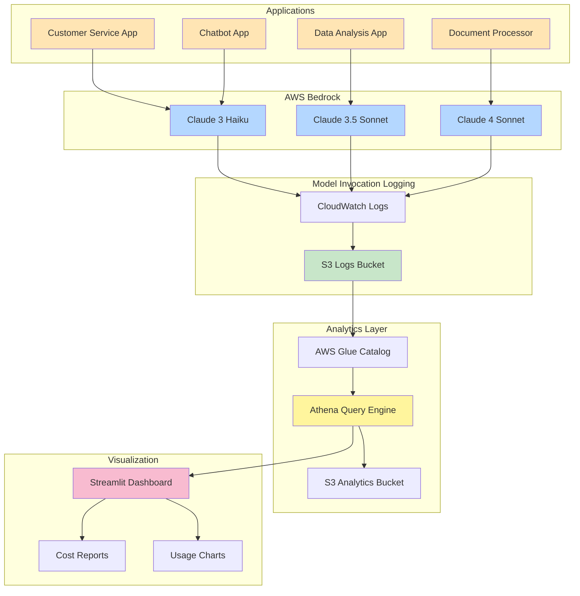

# AWS Bedrock Usage Analytics System

---

## Table of Contents
- [Application-level Bedrock Usage Tracking](#-application-level-bedrock-usage-tracking)
  - [Why is it needed?](#why-is-it-needed)
  - [Why this approach?](#why-this-approach)
  - [Prerequisites: IAM Role-based Application Identification](#prerequisites-iam-role-based-application-identification)
- [Amazon Q Developer (QCli) Usage Tracking and Limit Monitoring](#-amazon-q-developer-qcli-usage-tracking-and-limit-monitoring)
  - [Why is it needed?](#qcli-why-is-it-needed)
  - [Limit Tracking Features](#limit-tracking-features)
  - [Usage Guide](#qcli-usage-guide)
- [Application Overview](#application-overview)
- [Core Features](#core-features)
- [System Architecture](#system-architecture)
- [Requirements](#requirements)
- [Installation](#installation)
- [Usage](#usage)
- [Source Code Details](#source-code-details)
- [System Flow](#system-flow)
- [Demo](#demo)
- [Troubleshooting](#troubleshooting)

---

## 🎯 Application-level Bedrock Usage Tracking

### Why is it needed?

When multiple applications use Bedrock in the same AWS account, it's crucial to understand **which application is using how much**:

- **Cost Allocation**: Accurate billing for each team/project
- **Optimization**: Identify and optimize high-cost applications
- **Budget Management**: Allocate and monitor budgets per application
- **Governance**: Analyze usage patterns and establish policies

### Why this approach?

There are several ways to track Bedrock usage, but each has limitations:

| Method | Pros | Cons | Accuracy |
|--------|------|------|----------|
| **Direct Application Logging** | Customizable | Requires modifying all apps, maintenance burden | ⭐⭐⭐ |
| **CloudWatch Metrics Only** | Easy setup | Cannot distinguish by application | ⭐⭐ |
| **Manual CloudTrail Analysis** | Detailed information | Difficult real-time analysis, complex queries | ⭐⭐⭐⭐ |
| **Model Invocation Logging + Athena** ✅ | No code changes, automated, scalable | Requires initial setup | ⭐⭐⭐⭐⭐ |

* CloudTrail contains Bedrock API records showing call counts and model names, but not token usage. Even combining CloudTrail with CloudWatch metrics, it's difficult to find a clear connection between them. We tried dividing total token usage from CloudWatch metrics by the call count ratio from CloudTrail, but this resulted in significant discrepancies from actual token usage, making accurate estimation difficult.

**This System's Approach**:
- ✅ **No Application Code Changes** - Automatic tracking via Bedrock API calls
- ✅ **100% Accurate Token and Cost Calculation** - Extract actual data from Model Invocation Logging
- ✅ **Real-time SQL Analysis** - Execute complex analytical queries with Athena
- ✅ **Scalable** - Auto-track new applications by simply creating IAM Roles

### Prerequisites: IAM Role-based Application Identification

To track usage by application, **assign a dedicated IAM Role to each application**.

#### IAM Role Naming Convention
```
{ApplicationName}-BedrockRole
```

Examples:
- `CustomerServiceApp-BedrockRole`
- `DataAnalysisApp-BedrockRole`
- `ChatbotApp-BedrockRole`

#### IAM Role Creation Example (Terraform)

```hcl
# Create IAM Role per Application
resource "aws_iam_role" "customer_service_bedrock_role" {
  name = "CustomerServiceApp-BedrockRole"

  assume_role_policy = jsonencode({
    Version = "2012-10-17"
    Statement = [
      {
        Action = "sts:AssumeRole"
        Effect = "Allow"
        Principal = {
          Service = "ec2.amazonaws.com"  # or actual service
        }
      }
    ]
  })
}

# Grant Bedrock permissions
resource "aws_iam_role_policy" "customer_service_bedrock_policy" {
  name = "bedrock-invoke-policy"
  role = aws_iam_role.customer_service_bedrock_role.id

  policy = jsonencode({
    Version = "2012-10-17"
    Statement = [
      {
        Effect = "Allow"
        Action = [
          "bedrock:InvokeModel",
          "bedrock:InvokeModelWithResponseStream"
        ]
        Resource = [
          "arn:aws:bedrock:*::foundation-model/anthropic.claude-*"
        ]
      }
    ]
  })
}
```

#### Using IAM Role in Application

```python
# Assume Role in Application Code
import boto3

# Assume Role via STS
sts_client = boto3.client('sts')
assumed_role = sts_client.assume_role(
    RoleArn='arn:aws:iam::123456789012:role/CustomerServiceApp-BedrockRole',
    RoleSessionName='customer-service-session'
)

# Call Bedrock with Assumed Role
bedrock_client = boto3.client(
    'bedrock-runtime',
    aws_access_key_id=assumed_role['Credentials']['AccessKeyId'],
    aws_secret_access_key=assumed_role['Credentials']['SecretAccessKey'],
    aws_session_token=assumed_role['Credentials']['SessionToken']
)

# Bedrock API Call - Automatically tracked!
response = bedrock_client.invoke_model(
    modelId='anthropic.claude-3-5-sonnet-20241022-v2:0',
    body=json.dumps({...})
)
```

#### Tracking Mechanism

1. **Application calls Bedrock with IAM Role**
2. **Model Invocation Logging saves logs to S3**
   - IAM Role ARN included in logs
   - Actual token usage recorded
3. **Athena parses Role ARN from logs**
   - `assumed-role/CustomerServiceApp-BedrockRole/session` → `CustomerServiceApp`
4. **Usage and cost automatically aggregated by application**

#### Alternative: UserAgent-based Identification (Requires Code Changes)

If IAM Roles cannot be used, identification via UserAgent is possible:

```python
from botocore.config import Config

# Add application identifier to UserAgent
config = Config(user_agent_extra='CustomerServiceApp/1.0')

bedrock_client = boto3.client(
    'bedrock-runtime',
    config=config
)
```

However, **IAM Role approach is more recommended**:
- Security: Clear permission separation
- Reliability: Cannot be manipulated
- Management: Centralized administration

#### What is ARN Pattern Filtering?

Filter users whose `identity.arn` field contains specific keywords to check their usage.

**Example:**
- DataAnalysisApp Role: `arn:aws:iam::123456789012:role/assumed-role/DataAnalysisApp-BedrockRole`
- Pattern: `DataAnalysisApp-BedrockRole` or `DataAnalysis`

#### Using in Dashboard

1. Run Streamlit dashboard:
   ```bash
   streamlit run bedrock_tracker.py
   ```

2. Enter keyword in **"ARN Pattern Filter"** input field in left sidebar:
   ```
   DataAnalysis
   ```

3. Click **"Analyze Data"** button

4. Only users matching the pattern will be filtered and displayed.

#### Using in CLI

```bash
# Query only DataAnalysis usage
python bedrock_tracker_cli.py --days 7 --arn-pattern "DataAnalysis"

# Specific period + ARN pattern
python bedrock_tracker_cli.py \
  --start-date 2025-10-11 \
  --end-date 2025-10-18 \
  --arn-pattern "DataAnalysis" \
  --analysis all

# Save to CSV file
python bedrock_tracker_cli.py \
  --arn-pattern "DataAnalysis" \
  --format csv
```

#### Use Cases

**1. Cost analysis for DataAnalysis application:**
```bash
python bedrock_tracker_cli.py --arn-pattern "DataAnalysis" --analysis user
```

**2. Bedrock usage for specific team:**
```bash
python bedrock_tracker_cli.py --arn-pattern "DataTeam" --analysis all
```

**3. Comparing multiple applications:**
```bash
# App1 usage
python bedrock_tracker_cli.py --arn-pattern "App1" > app1_usage.txt

# App2 usage
python bedrock_tracker_cli.py --arn-pattern "App2" > app2_usage.txt
```

#### Notes

- ARN patterns are case-sensitive
- Empty string shows all usage
- Pattern is searched as `LIKE '%pattern%'` format

---

## 🚨 Amazon Q Developer (QCli) Usage Tracking and Limit Monitoring

### QCli Why is it needed?

Amazon Q Developer Pro is **$19/month flat rate**, but there are challenges with **usage tracking and hidden limits**:

#### 1. Context Window Usage Tracking
- ✅ **/usage command**: Shows 200,000 token Context Window limit
- ❌ **Usage check**: Cannot check how much has been used
- ❌ **Token calculation**: No method to measure actual token usage

#### 2. Hidden Usage Limits
- ❌ **Chat/Inline suggestions**: AWS doesn't disclose exact limits
- ✅ **/dev command**: 30 times/month (official documentation)
- ✅ **Code Transformation**: 4,000 lines/month (official documentation)

Users are unexpectedly receiving "Monthly limit reached" messages, and AWS:
- Provides no way to check current usage
- Cannot tell what % has been used
- Cannot predict when limit will be reached

**This System's Approach**:
- ✅ **Actual Token Usage Tracking** - Accurate token calculation via S3 prompt log analysis
- ✅ **Context Window Monitoring** - Track usage against 200,000 token limit
- ✅ **Official Limit Tracking** - Monitor documented /dev, Code Transformation limits
- ✅ **Anomaly Detection** - Detect sudden usage spikes
- ✅ **Warning System** - Alert when 80% of limit is reached

### Data Sources: S3 Prompt Logs vs Athena CSV

This system supports **two data sources**:

#### 1. S3 Prompt Logs (Recommended) ⭐⭐⭐⭐⭐

**Accuracy**: Very High (actual token calculation)

**Advantages**:
- ✅ Contains actual prompt text
- ✅ Accurate token calculation with tiktoken
- ✅ Precisely track Context Window usage
- ✅ Separate measurement of input/output tokens
- ✅ Detailed hourly/daily analysis

**Disadvantages**:
- ⚠️ Requires prompt logging enabled
- ⚠️ Needs S3 log file download and parsing (slightly slower)

**Data Structure**:
```
s3://amazonq-developer-reports-{account_id}/
  └── prompt_logging/AWSLogs/{account_id}/QDeveloperLogs/
      ├── GenerateAssistantResponse/  # Chat logs
      │   └── us-east-1/2025/11/12/*.json.gz
      └── GenerateCompletions/         # Inline suggestion logs
          └── us-east-1/2025/11/12/*.json.gz
```

Each log file contains actual prompt and response text, allowing accurate token count calculation with the tiktoken library.

#### 2. Athena CSV Reports (For Quick Analysis) ⭐⭐⭐

**Accuracy**: Low (uses hardcoded estimates)

**Advantages**:
- ✅ Fast analysis (direct CSV reading)
- ✅ Simple setup
- ✅ Can track official limits

**Disadvantages**:
- ❌ No token information (estimates only)
- ❌ Uses hardcoded averages
- ❌ Low Context Window accuracy

**Data Structure**:
```
s3://amazonq-developer-reports-{account-id}/user-activity-reports/
  └── AWSLogs/{account-id}/QDeveloperLogs/by_user_analytic/{region}/
      └── *.csv
```

CSV only contains request counts, no token counts, so estimation uses hardcoded averages.

### Token Calculation Method Comparison

| Method | Data Source | Token Calculation | Context Window | Accuracy |
|--------|------------|-------------------|----------------|----------|
| **S3 Logs** | Prompt logs | tiktoken (actual) | ✅ Accurate | ⭐⭐⭐⭐⭐ |
| **Athena CSV** | User activity reports | Hardcoded estimates | ⚠️ Estimated | ⭐⭐⭐ |

**Real Comparison Example** (Last 3 days):
```
S3 Log Analysis:
- Total requests: 42
- Actual tokens: 62,057 (tiktoken calculated)
- Chat average: 556 tokens/request
- Inline average: 2,492 tokens/request

Athena CSV Analysis:
- Total requests: 77
- Estimated tokens: 17,720 (hardcoded)
- Chat average: 650 tokens/request (fixed value)
- Inline average: 250 tokens/request (fixed value)

Difference: S3 logs calculate 3.5x more tokens
→ Because it reflects actual prompt length
```

### Limit Tracking Features

#### 1. Official Limit Monitoring

```
⚠️ Official Limit Monitoring
================================================================================
🔧 /dev Command:
   Current usage:    0 /  30 times
   Monthly estimate:      0 times (0.0%)
   ✅ Normal: 0.0% of monthly limit

🔄 Code Transformation:
   Current usage:      0 / 4,000 lines
   Monthly estimate:        0 lines (0.0%)
   ✅ Normal: 0.0% of monthly limit
```

#### 2. Usage Pattern Analysis

```
📈 Usage Pattern Analysis
================================================================================
  Daily average activity:        40.1 events
  Maximum activity day:          191 events
  Minimum activity day:            0 events

  🚨 Usage spike detected: 1 day exceeded
     3x the daily average(40.1)!
     High likelihood of reaching limit!
```

#### 3. Trend-based Prediction

The system predicts end-of-month usage based on current usage rate:
- Current 601 chat messages in 15 days
- Daily average: 40.1
- **End-of-month estimate**: ~1,200 (actual limit unknown)

### QCli Prompt Logging Setup (For S3 Log Analysis)

To use S3 log analysis, you must first enable Amazon Q Developer prompt logging.

#### 1. Setup via AWS Console

**Access Amazon Q Developer Console**:
1. AWS Management Console → Amazon Q Developer
2. Select **"Settings"** from left menu
3. Find **"Prompt logging"** section

**Enable Prompt Logging**:
1. Toggle **"Enable prompt logging"** ON
2. S3 bucket auto-created: `amazonq-developer-reports-{account-id}`
3. Log save path: `prompt_logging/AWSLogs/`

#### 2. Verify via AWS CLI

Check prompt logging configuration status:
```bash
aws q-developer get-user-activity-report-configuration --region us-east-1
```

Example output:
```json
{
  "userActivityReportConfiguration": {
    "enabled": true,
    "s3BucketName": "amazonq-developer-reports-181136804328",
    "promptLoggingEnabled": true
  }
}
```

#### 3. Check S3 Bucket

Verify log files are being saved:
```bash
aws s3 ls s3://amazonq-developer-reports-{account-id}/prompt_logging/ --recursive
```

Example output:
```
2025-11-12 11:23:45     12345 prompt_logging/AWSLogs/123456789012/QDeveloperLogs/GenerateAssistantResponse/us-east-1/2025/11/12/...json.gz
2025-11-12 11:24:10      8901 prompt_logging/AWSLogs/123456789012/QDeveloperLogs/GenerateCompletions/us-east-1/2025/11/12/...json.gz
```

#### 4. IAM Permission Setup

The IAM User/Role running the analysis tool needs these permissions:

```json
{
  "Version": "2012-10-17",
  "Statement": [
    {
      "Effect": "Allow",
      "Action": [
        "s3:GetObject",
        "s3:ListBucket"
      ],
      "Resource": [
        "arn:aws:s3:::amazonq-developer-reports-*",
        "arn:aws:s3:::amazonq-developer-reports-*/*"
      ]
    },
    {
      "Effect": "Allow",
      "Action": [
        "q-developer:GetUserActivityReportConfiguration"
      ],
      "Resource": "*"
    },
    {
      "Effect": "Allow",
      "Action": [
        "sts:GetCallerIdentity"
      ],
      "Resource": "*"
    }
  ]
}
```

#### 5. Python Package Installation

S3 log analysis requires the `tiktoken` library:

```bash
pip install tiktoken
```

If included in `requirements.txt`, it will be auto-installed:
```txt
boto3>=1.34.0
streamlit>=1.31.0
pandas>=2.0.0
plotly>=5.18.0
tiktoken>=0.5.0  # For S3 log token calculation
```

#### 6. Verify Logging is Working

After using Amazon Q in your IDE (Chat or Inline suggestions), log files are created in 5-10 minutes:

```bash
# Check logs created in last hour
aws s3 ls s3://amazonq-developer-reports-{account-id}/prompt_logging/ \
  --recursive | tail -10
```

If log files are visible, setup is complete!

#### 7. Troubleshooting

**If log files are not being created**:

1. **Verify prompt logging enabled**:
   ```bash
   aws q-developer get-user-activity-report-configuration --region us-east-1
   ```
   Confirm `promptLoggingEnabled: true`

2. **Verify S3 bucket exists**:
   ```bash
   aws s3 ls | grep amazonq-developer-reports
   ```

3. **Verify IAM permissions**:
   ```bash
   aws s3 ls s3://amazonq-developer-reports-{account-id}/
   ```
   If AccessDenied error occurs, add IAM permissions

4. **Verify Amazon Q usage**:
   - Confirm actually used Chat or Inline suggestions in IDE
   - Logs may be delayed 5-10 minutes

#### 8. Cost Information

S3 storage cost for prompt logging is **very low**:

```
Actual usage example (11 days):
- Log files: 339
- Total size: ~3.4 MB
- S3 storage cost: ~$0.0001/month
- PUT request cost: ~$0.0047/month
━━━━━━━━━━━━━━━━━━━━━━━━━━━━━
Total cost: ~$0.005/month (~7 KRW)

0.026% of Amazon Q Pro subscription ($19/month)
```

**Conclusion**: Prompt logging cost is virtually free!

---

### QCli Usage Guide

Now that prompt logging is enabled, you can analyze with Streamlit dashboard or CLI.

#### Streamlit Dashboard

1. Run dashboard:
```bash
streamlit run bedrock_tracker.py
```

2. Select **Amazon Q CLI** tab

3. **Select Data Source** (left sidebar):
   - **"S3 Logs (Actual Tokens)"** ← Recommended
   - "Athena CSV (Estimates)"

4. Select date range (default: last 30 days)

5. (Optional) Enter user ID pattern filter

6. Click **"🔍 Analyze Data"** button

7. View results:

**S3 Log Analysis Results**:
   - 📊 **Overall Summary**: Total requests, Chat/Inline request distribution
   - 🔢 **Actual Token Usage**: Input/Output tokens (tiktoken calculated)
   - 📈 **Context Window Analysis**: Usage against 200,000 token limit
   - 💬 **Chat Analysis**: Average input/output tokens
   - ⚡ **Inline Suggestion Analysis**: Average context size
   - 👥 **User Analysis**: Token usage per user
   - 📅 **Daily Usage Pattern**: Token trend charts by date
   - ⏰ **Hourly Pattern**: Request distribution by time (UTC/KST)
   - 💰 **Virtual Cost Analysis**: Cost comparison with Claude API

**Athena CSV Analysis Results**:
   - ⚠️ **Official Limit Monitoring**: /dev, Code Transformation usage
   - 📈 **Usage Pattern Analysis**: Daily average, max/min, anomaly detection
   - 📊 **Overall Summary**: Chat, inline, code line statistics
   - 🔢 **Token Estimates** (Reference): For ROI analysis

#### CLI Tool

```bash
# S3 log analysis (default, recommended)
python bedrock_tracker_cli.py --service qcli --days 7

# Specific period S3 log analysis
python bedrock_tracker_cli.py \
  --service qcli \
  --start-date 2025-11-01 \
  --end-date 2025-11-12 \
  --data-source s3

# Athena CSV analysis (for quick analysis)
python bedrock_tracker_cli.py \
  --service qcli \
  --days 30 \
  --data-source athena

# User filtering + S3 logs
python bedrock_tracker_cli.py \
  --service qcli \
  --days 7 \
  --user-pattern "user@example.com"

# Save JSON report (S3 logs)
python bedrock_tracker_cli.py \
  --service qcli \
  --days 30 \
  --data-source s3 \
  --format json
```

**CLI Options**:
- `--service qcli`: Amazon Q CLI analysis mode
- `--data-source {s3|athena}`: Data source selection (default: s3)
- `--days N`: Analyze last N days
- `--start-date / --end-date`: Specify date range
- `--user-pattern`: User ID filter
- `--format {terminal|csv|json}`: Output format
- `--analysis {all|summary}`: Analysis type (S3 only supports summary)

**Output Example**:
```
🚀 Amazon Q CLI Analytics (S3 Logs - Actual Tokens)
================================================================================
📅 Analysis Period: 2025-11-09 ~ 2025-11-12
🌍 Region: us-east-1 (US East (N. Virginia))
📋 Analysis Type: summary
📄 Output Format: terminal

📊 Analyzing Amazon Q CLI data...

================================================================================
                        📊 Amazon Q Developer S3 Log Analysis Results
================================================================================

📋 Basic Statistics:
  Analysis period:        4 days
  Total log files:                 132
  Total requests:                   42
  Chat requests:                    22 (52.4%)
  Inline suggestions:               20 (47.6%)

🔢 Actual Token Usage:
  Input tokens:                54,555
  Output tokens:                7,502
  Total tokens:                62,057

📈 Context Window Analysis:
  Context Window:           200,000 tokens/session
  Cumulative usage:               31.03% (62,057 tokens)
  Daily average tokens:            15,514
  Daily usage rate:                7.76%

  💡 Context Window is managed per session,
     so per-session usage rate is more important than cumulative.

📊 Detailed Analysis by Type:

  💬 Chat (Conversation):
     Request count:               22
     Average input:            215 tokens
     Average output:           341 tokens
     Average total:            556 tokens

  ⚡ Inline Suggestions (Code Completion):
     Request count:               20
     Average context:        2,492 tokens
     Average output:     Not in logs

💰 Virtual Cost Analysis (Reference):
   💡 Amazon Q Developer Pro is $19/month flat rate.
      Below is virtual cost if using Claude API directly.

  Input cost:       $          0.16
  Output cost:      $          0.11
  Total virtual cost:     $          0.28

  Subscription (prorated):    $          2.53
  Virtual usage cost:   $          0.28
  Loss:             $          2.26 (89.1% loss)

👥 User Analysis:
  Analyzed users:                  1

  Top users (by tokens):
    1. d-9067f33d3d.1458e458-7041-709b-8e32-f0a...
       Requests: 42, Tokens: 62,057
================================================================================

✅ Analysis complete!
```

### CSV Data Source

Amazon Q Developer saves daily user activity reports to S3 in CSV format:

**S3 Path**:
```
s3://amazonq-developer-reports-{account-id}/user-activity-reports/
  AWSLogs/{account-id}/QDeveloperLogs/by_user_analytic/{region}/
```

**CSV Columns (46 total)**:
- `Chat_MessagesSent`: Chat message count
- `Chat_AICodeLines`: Code lines generated via chat
- `Inline_SuggestionsCount`: Inline suggestion count
- `Inline_AcceptanceCount`: Accepted inline suggestions
- `Dev_GenerationEventCount`: /dev command usage count
- `TestGeneration_EventCount`: /test command usage count
- `Transformation_LinesGenerated`: Code transformation generated lines

**Important**: CSV has **no token count or limit information**. This system estimates indirectly by analyzing usage patterns.

### Key Limitations

#### What CSV can do
✅ Track official limits (documented items only)
✅ Daily/weekly usage trends
✅ Detect sudden usage spikes
✅ Calculate monthly cumulative usage

#### What CSV cannot do
❌ Measure accurate token count
❌ Actual remaining limit amount
❌ Detect throttling occurrence
❌ Chat/Inline suggestion limits (AWS undisclosed)

### Recommended Usage Strategy

1. **Weekly Monitoring**: Check dashboard usage weekly
2. **Anomaly Alert**: Moderate usage when exceeding 3x daily average
3. **80% Official Limit**: Restrain /dev, Code Transformation usage
4. **Near Month-end**: Avoid usage spikes

### Token Estimate Calculation Basis

#### Basic Assumptions
- English word: **1.4 tokens**
- Per 4 characters: **5 tokens**
- Code line average: 60-80 chars = **75-100 tokens**

#### Average Estimate Constants (bedrock_tracker.py:521-533)

| Item | Token Count | Basis |
|------|-------------|-------|
| **chat_message_input** | 150 | Chat question average (~20-30 words) |
| **chat_message_output** | 500 | Chat response average (~70-80 words) |
| **chat_code_line** | 75 | Code 1 line = 60-80 chars |
| **inline_suggestion** | 60 | Inline suggestion (~10 words) |
| **inline_code_line** | 75 | Inline code 1 line |
| **/dev_event_input** | 600 | /dev request (~80 words + context) |
| **/dev_event_output** | 1000 | /dev response (~130 words + code) |
| **/test_event** | 450/750 | Test generation request/response |
| **/doc_event** | 350/600 | Doc generation request/response |

#### Actual Calculation Example (15-day usage)

**Actual Usage**:
- Chat messages: 601
- Inline suggestions: 536
- Chat code lines: 2,573
- Inline code lines: 201

**Token Calculation**:
```
Input tokens  = (601 × 150) + (536 × 60)
            = 90,150 + 32,160
            = 122,310 tokens

Output tokens = (601 × 500) + (2,573 × 75) + (201 × 75) + (201 × 60)
            = 300,500 + 192,975 + 15,075 + 12,060
            = 520,610 tokens

Total tokens    = 642,920 tokens
```

#### ⚠️ Estimate Limitations

**Actual Verification Results** (AWS Cost Explorer):
- Actual cost: **$18.49** (30 days)
- Estimated cost (token-based): **$8.18**
- **Difference**: 2.26x underestimated

**Why the difference?**

1. **Includes Flat Subscription Fee**
   - $19/month subscription is most of actual cost
   - Not token usage-based billing

2. **Hidden Token Usage**
   - Project context loading
   - Codebase indexing
   - Cache management, metadata processing

3. **CSV Has No Token Information**
   - AWS doesn't provide accurate token counts
   - All values are pattern-based estimates

**Conclusion**:
- ✅ Useful for **relative usage understanding**
- ✅ Useful for **ROI analysis** (how much are we using)
- ❌ Inaccurate for **actual billing cost prediction**
- ❌ **Accurate token count measurement** impossible

**💡 Recommendation**: Use these estimates only as **reference** to judge "how much are we using relative to subscription fee"!

---

## Application Overview

### Purpose
Integrated analytics system to track AWS Bedrock model usage across **multiple regions** and analyze costs by **application/user**. Enables 100% accurate usage tracking **without code changes** using AWS Model Invocation Logging and Amazon Athena.

### Main Uses
- **Cost Monitoring**: Real-time cost analysis by user/application
- **Usage Pattern Analysis**: Identify hourly/daily usage patterns
- **Regional Analysis**: Unified management of usage across multiple regions (US, Asia, Europe)
- **Model Optimization**: Cost optimization through per-model usage statistics

---

## Core Features

### Automatic Logging and Tracking
- Automatic log collection via AWS Model Invocation Logging
- Logs automatically partitioned in JSON format to S3
- No application code changes required

### Multi-dimensional Analysis
- **Per-User Analysis**: Call count, token usage, cost by IAM User/Role
- **Per-Application Analysis**: Detailed cost analysis per app based on Role
- **Per-Model Analysis**: Average/total usage statistics per Claude model
- **Time Pattern Analysis**: Hourly/daily usage pattern visualization

### Real-time Dashboard
- Interactive web UI based on Streamlit
- Dynamic charts and graphs using Plotly
- Date range selection and regional filtering
- CSV data download support

### Cost Calculation
- Apply accurate token pricing per model
- Separate Input/Output token calculation
- Real-time cost aggregation in USD

---

## System Architecture



---

## Requirements

### AWS Permissions
Permissions required for the following AWS services:

```json
{
  "Version": "2012-10-17",
  "Statement": [
    {
      "Effect": "Allow",
      "Action": [
        "bedrock:InvokeModel",
        "bedrock:GetModelInvocationLoggingConfiguration",
        "bedrock:PutModelInvocationLoggingConfiguration",
        "bedrock:ListFoundationModels"
      ],
      "Resource": "*"
    },
    {
      "Effect": "Allow",
      "Action": [
        "s3:GetObject",
        "s3:ListBucket",
        "s3:PutObject",
        "s3:CreateBucket"
      ],
      "Resource": [
        "arn:aws:s3:::bedrock-analytics-*",
        "arn:aws:s3:::bedrock-analytics-*/*"
      ]
    },
    {
      "Effect": "Allow",
      "Action": [
        "athena:StartQueryExecution",
        "athena:GetQueryExecution",
        "athena:GetQueryResults"
      ],
      "Resource": "*"
    },
    {
      "Effect": "Allow",
      "Action": [
        "glue:CreateDatabase",
        "glue:CreateTable",
        "glue:GetDatabase",
        "glue:GetTable"
      ],
      "Resource": "*"
    }
  ]
}
```

### Python Environment
- **Python**: 3.8 or higher
- **AWS CLI**: 2.0 or higher (optional)

### Python Packages
```
boto3>=1.34.0
streamlit>=1.31.0
pandas>=2.0.0
plotly>=5.18.0
tiktoken>=0.5.0
```

---

## Installation

### 1. Clone Repository
```bash
git clone <repository-url>
cd bedrock_usage
```

### 2. Create Virtual Environment (Recommended)
```bash
python -m venv venv
source venv/bin/activate  # Linux/Mac
# or
venv\Scripts\activate     # Windows
```

### 3. Install Packages
```bash
pip install -r requirements.txt
```

### 4. Configure AWS Credentials
```bash
aws configure
# or set environment variables
export AWS_ACCESS_KEY_ID=your_key
export AWS_SECRET_ACCESS_KEY=your_secret
export AWS_DEFAULT_REGION=us-east-1
```

---

## Usage

### Complete Setup Flow

#### Step 1: Build Athena Analysis Environment
```bash
python setup_athena_bucket.py
```
This script automatically:
- Creates regional S3 Analytics buckets
- Creates Glue database and tables
- Auto-adds today's partition
- Tests data connection

#### Step 2: Check Bedrock Logging Configuration
```bash
python check_bedrock_logging.py
```
Checks current Model Invocation Logging configuration status.

```bash
python setup_bedrock_logging.py
```
Configures Bedrock Invocation Logging.

#### Step 3: Verify IAM Role Permissions
```bash
python verify_bedrock_permissions.py
```
Verifies IAM Role Bedrock access permissions in all regions.

#### Step 4: Generate Test Data
```bash
python generate_test_data.py
```
Generates sample Bedrock API calls from various applications and regions.

#### Step 5: Run Analysis Tools

**Option A: Streamlit Dashboard (Web UI)**
```bash
streamlit run bedrock_tracker.py
```
Web browser automatically opens to access interactive dashboard.

**Option B: CLI Tool (Terminal)**
```bash
# Basic usage (last 7 days, us-east-1, terminal output)
python bedrock_tracker_cli.py

# Specify region and period
python bedrock_tracker_cli.py --region ap-northeast-2 --days 30

# Specify date range directly
python bedrock_tracker_cli.py --start-date 2025-10-01 --end-date 2025-10-18

# Run specific analysis only
python bedrock_tracker_cli.py --analysis user        # User analysis only
python bedrock_tracker_cli.py --analysis model       # Model analysis only
python bedrock_tracker_cli.py --analysis daily       # Daily pattern only

# Save as CSV file
python bedrock_tracker_cli.py --format csv --region us-east-1

# Save as JSON file
python bedrock_tracker_cli.py --format json
```

---

## License

MIT License

Copyright (c) 2025

Permission is hereby granted, free of charge, to any person obtaining a copy of this software and associated documentation files (the "Software"), to deal in the Software without restriction, including without limitation the rights to use, copy, modify, merge, publish, distribute, sublicense, and/or sell copies of the Software, and to permit persons to whom the Software is furnished to do so, subject to the following conditions:

The above copyright notice and this permission notice shall be included in all copies or substantial portions of the Software.

THE SOFTWARE IS PROVIDED "AS IS", WITHOUT WARRANTY OF ANY KIND, EXPRESS OR IMPLIED, INCLUDING BUT NOT LIMITED TO THE WARRANTIES OF MERCHANTABILITY, FITNESS FOR A PARTICULAR PURPOSE AND NONINFRINGEMENT. IN NO EVENT SHALL THE AUTHORS OR COPYRIGHT HOLDERS BE LIABLE FOR ANY CLAIM, DAMAGES OR OTHER LIABILITY, WHETHER IN AN ACTION OF CONTRACT, TORT OR OTHERWISE, ARISING FROM, OUT OF OR IN CONNECTION WITH THE SOFTWARE OR THE USE OR OTHER DEALINGS IN THE SOFTWARE.

---

**Project Author**: AWS Solutions Architect
**Last Updated**: 2025-11-12
**Version**: 1.2.0

---

## Changelog

### v1.2.0 (2025-11-12)

**Amazon Q Developer S3 Log Analysis Feature Added**:

1. **qcli_s3_analyzer.py New Module**
   - Direct S3 prompt log analysis
   - Accurate token calculation based on tiktoken (cl100k_base encoder)
   - Parse Chat (GenerateAssistantResponse) and Inline (GenerateCompletions) logs
   - Date range filtering support
   - Per-user/type/date/hourly statistics aggregation
   - Large-scale log sampling (max 500 files)

2. **bedrock_tracker.py Dashboard Improvements**
   - Data source selection: "S3 Logs (Actual Tokens)" vs "Athena CSV (Estimates)"
   - Display actual token usage for S3 log analysis
   - Context Window (200,000 tokens) usage rate monitoring
   - Daily average token and usage rate calculation
   - Detailed analysis by type (Chat/Inline average tokens)
   - Hourly usage patterns (UTC → KST conversion)
   - Virtual cost analysis (Claude API comparison)

3. **bedrock_tracker_cli.py CLI Tool Improvements**
   - Added `--data-source {s3|athena}` option (default: s3)
   - Added S3 log analysis result terminal output function
   - JSON/CSV format output support
   - Detailed report via `print_s3_log_summary()` function

4. **Improved Accuracy**
   - Token calculation: Hardcoded estimates → tiktoken actual calculation
   - Context Window: Estimates → Accurate usage measurement
   - Chat average: 650 tokens (estimate) → 556 tokens (actual)
   - Inline average: 250 tokens (estimate) → 2,492 tokens (actual)

5. **New Features**
   - Real-time Context Window monitoring
   - Accurate token calculation based on prompt length
   - Hourly usage pattern analysis (peak time detection)
   - User token usage ranking

6. **Documentation Improvements**
   - Added S3 log analysis guide to README.md
   - Detailed prompt logging setup instructions
   - Added data source comparison table
   - Added Context Window explanation

**Major Improvements**:
- ✅ Actual token usage measurement (tiktoken-based)
- ✅ Accurate Context Window tracking
- ✅ Two data source options available
- ✅ Maintained existing Athena CSV analysis (backward compatibility)

### v1.1.0 (2025-10-19)

**bedrock_tracker_cli.py Major Improvements**:

1. **Regional Price Tables Added**
   - Price settings for all regions (us-east-1, us-west-2, eu-central-1, ap-northeast-1, ap-northeast-2, ap-southeast-1)
   - Auto-apply correct pricing by region
   - Added `region` parameter to `get_model_cost()` function
   - Added `region` parameter to `calculate_cost_for_dataframe()` function

2. **Enhanced ARN Pattern Filtering**
   - Added `arn_pattern` parameter to all analysis methods
   - CLI `--arn-pattern` option for filtering specific applications/users
   - Modified SQL queries for proper ARN filter application

3. **Improved Cost Calculation Accuracy**
   - Apply regional pricing in per-user analysis
   - Apply regional pricing in per-model analysis
   - Apply regional pricing in per-user per-app detailed analysis

4. **Improved CLI Usability**
   - Support composite filtering (region + ARN pattern)
   - Added script automation examples

**Major Feature Upgrades**:
- ✅ Applied same regional price structure as bedrock_tracker.py
- ✅ ARN pattern filtering support in all analysis queries
- ✅ Improved to full-featured analysis tool in terminal
- ✅ Extended automation script examples

### v1.0.0 (2025-10-18)
- Initial release
- Athena-based usage analysis system
- Streamlit dashboard and CLI tool
