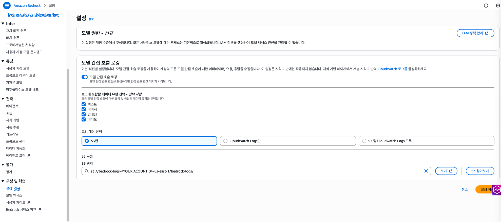

# Bedrock Application with RequestMetadata Tracking

AWS Bedrock의 `requestMetadata`를 활용하여 애플리케이션별 토큰 사용량을 추적하는 샘플 애플리케이션입니다.

## 📋 개요

이 프로젝트는 다음을 포함합니다:
- ✅ Bedrock Converse API를 사용하는 Python 애플리케이션
- ✅ `requestMetadata`를 통한 애플리케이션 식별
- ✅ CloudWatch Logs Insights 쿼리 모음
- ✅ 4가지 사용 예시

## 🎯 주요 내용

### 1. RequestMetadata를 통한 추적
각 Bedrock API 호출에 다음 정보를 포함:
- 애플리케이션 이름 및 ID
- 환경 (production/staging/development)
- 팀 및 비용 센터
- 테넌트 ID (멀티테넌트 SaaS용)
- 사용자 ID

### 2. 4가지 애플리케이션 사용예시 
1. **Customer Service App** - 고객 지원 챗봇
2. **Sales Assistant App** - 영업 지원 도구
3. **Developer Tools App** - 내부 개발자 도구
4. **Multi-Tenant SaaS** - 여러 고객사 서비스

### 3. CloudWatch 분석
- 애플리케이션별 토큰 사용량
- 테넌트별 비용 추적
- 비용 센터별 집계
- 시계열 트렌드 분석

---

## 🚀 빠른 시작

### 사전 요구사항

1. **AWS 계정 및 Credentials 설정**
   ```bash
   aws configure
   # 또는 환경 변수 설정
   export AWS_ACCESS_KEY_ID=your_key
   export AWS_SECRET_ACCESS_KEY=your_secret
   export AWS_DEFAULT_REGION=us-east-1
   ```

2. **Bedrock 모델 확인**
   - AWS Console → Bedrock → Model catalog 에서 모델확인
   - 예) Providers = anthropic 로 검색창에 필터링 하여 Anthropic Claude 모델 리스트 확인 

3. **Bedrock Model Invocation Logging 활성화**

   **AWS Console에서 설정:**

   

   1. AWS Console → Bedrock → 설정(Settings) → 모델 감사 호출 로깅
   2. "모델 감사 호출 로깅" 토글 활성화
   3. 로깅 대상 선택:
      - **S3만**: S3 버킷에만 로그 저장 (Athena 분석용)
      - **CloudWatch Logs만**: CloudWatch에만 로그 저장 (실시간 분석용)
      - **S3 및 CloudWatch Logs 모두**: 양쪽 모두 저장 (권장) 
   4. S3 구성 (선택한 경우):
      - S3 위치: `s3://<YourBucketName>/<YourFolderName/` 와 같이 미리 버킷명과 폴더를 생성하고 지정해주면 됩니다.
   5. 로그에 포함할 데이터 선택:
      - ✅ 텍스트: 프롬프트 및 응답 텍스트
      - ✅ 이미지: 이미지 데이터
      - ✅ 임베딩: 임베딩 벡터
      - ✅ 비디오: 비디오 데이터

   **또는 CLI로 설정:**
   ```bash
   aws bedrock put-model-invocation-logging-configuration \
     --logging-config '{
       "cloudWatchConfig": {
         "logGroupName": "/aws/bedrock/modelinvocations",
         "roleArn": "arn:aws:iam::YOUR_ACCOUNT:role/BedrockLoggingRole",
         "largeDataDeliveryS3Config": {
           "bucketName": "your-bucket-name"
         }
       },
       "textDataDeliveryEnabled": true,
       "imageDataDeliveryEnabled": false,
       "embeddingDataDeliveryEnabled": false
     }'
   ```

4. **필요한 IAM 권한**

   > 바로 위에서 언급한 **BedrockLoggingRole**은 [`create-bedrock-logging-role.sh`](./create-bedrock-logging-role.sh) 스크립트를 통해 자동 생성되며, 최소 권한만 포함됩니다:
   > 아래 "사전 준비: IAM Role 및 리소스 설정" 섹션에서 다시 설명합니다. 
   > - `logs:CreateLogStream`, `logs:PutLogEvents` (CloudWatch 쓰기)
   > - `s3:PutObject` (S3 쓰기)
   >
   > 아래 권한들은 사용자가 애플리케이션을 실행하고, 로그를 확인하고, 설정을 관리하기 위해 필요합니다.

   **4-1. Bedrock API 호출 권한 (애플리케이션 실행용 - 필수)**
   ```json
   {
     "Version": "2012-10-17",
     "Statement": [
       {
         "Effect": "Allow",
         "Action": [
           "bedrock:InvokeModel",
           "bedrock:InvokeModelWithResponseStream"
         ],
         "Resource": "arn:aws:bedrock:*::foundation-model/us.anthropic.claude-sonnet-4-5-*"
       }
     ]
   }
   ```

   **4-2. CloudWatch Logs 조회 권한 (사용자가 로그 확인용 - 선택사항)**
   ```json
   {
     "Version": "2012-10-17",
     "Statement": [
       {
         "Effect": "Allow",
         "Action": [
           "logs:DescribeLogGroups",
           "logs:DescribeLogStreams",
           "logs:GetLogEvents",
           "logs:FilterLogEvents",
           "logs:StartQuery",
           "logs:GetQueryResults"
         ],
         "Resource": "arn:aws:logs:*:*:log-group:/aws/bedrock/modelinvocations:*"
       }
     ]
   }
   ```

   **4-3. S3 권한 (사용자가 S3 버킷 생성 및 로그 조회용 - 선택사항)**
   ```json
   {
     "Version": "2012-10-17",
     "Statement": [
       {
         "Effect": "Allow",
         "Action": [
           "s3:CreateBucket",
           "s3:PutObject",
           "s3:GetObject",
           "s3:ListBucket",
           "s3:PutBucketPolicy",
           "s3:PutPublicAccessBlock",
           "s3:PutBucketOwnershipControls"
         ],
         "Resource": [
           "arn:aws:s3:::your-bedrock-logs-bucket",
           "arn:aws:s3:::your-bedrock-logs-bucket/*"
         ]
       }
     ]
   }
   ```

   **4-4. IAM 권한 (사용자가 BedrockLoggingRole 생성용 - 초기 설정 시에만 필요)**
   ```json
   {
     "Version": "2012-10-17",
     "Statement": [
       {
         "Effect": "Allow",
         "Action": [
           "iam:CreateRole",
           "iam:GetRole",
           "iam:PutRolePolicy",
           "iam:AttachRolePolicy",
           "iam:PassRole"
         ],
         "Resource": "arn:aws:iam::*:role/BedrockLoggingRole"
       }
     ]
   }
   ```

   **4-5. Bedrock 로깅 설정 권한 (사용자가 로깅 활성화/관리용 - 초기 설정 시에만 필요)**
   ```json
   {
     "Version": "2012-10-17",
     "Statement": [
       {
         "Effect": "Allow",
         "Action": [
           "bedrock:PutModelInvocationLoggingConfiguration",
           "bedrock:GetModelInvocationLoggingConfiguration",
           "bedrock:DeleteModelInvocationLoggingConfiguration"
         ],
         "Resource": "*"
       }
     ]
   }
   ```

---

### 사전 준비: IAM Role 및 리소스 설정

애플리케이션을 실행하기 전에 Bedrock 로깅을 위한 IAM Role과 리소스를 설정해야 합니다.

#### 1. Bedrock 로깅용 IAM Role 생성 (필수)

[`create-bedrock-logging-role.sh`](./create-bedrock-logging-role.sh) 스크립트를 사용하여 Bedrock이 CloudWatch Logs 및 S3에 로그를 쓸 수 있도록 IAM Role을 생성합니다.

```bash
# CloudWatch Logs만 사용하는 경우 (기본값)
./create-bedrock-logging-role.sh --type cloudwatch-only

# S3만 사용하는 경우 (비용 최적화, 장기 보관용)
./create-bedrock-logging-role.sh --type s3-only --bucket your-s3-bucket-name

# CloudWatch Logs와 S3 둘 다 사용하는 경우 (권장)
./create-bedrock-logging-role.sh --type both --bucket your-s3-bucket-name
```

**스크립트가 수행하는 작업:**
- ✅ `BedrockLoggingRole` IAM Role 생성
- ✅ Bedrock 서비스가 이 Role을 사용할 수 있도록 Trust Policy 설정
- ✅ 선택한 타입에 따라:
  - **cloudwatch-only**: CloudWatch Logs 쓰기 권한 부여 및 Log Group 생성
  - **s3-only**: S3 쓰기 권한만 부여 (CloudWatch 설정 없음)
  - **both**: CloudWatch와 S3 모두 설정

**생성되는 Role ARN 예시:**
```
arn:aws:iam::123456789012:role/BedrockLoggingRole
```

> 💡 이 Role ARN은 다음 단계에서 Bedrock 로깅 설정 시 필요합니다.

#### 2. S3 버킷 생성 (선택사항 - S3에 로그 저장 시)

대용량 로그 데이터를 S3에 저장하거나 Athena로 분석하려면 [`setup-s3-bucket-for-bedrock.sh`](./setup-s3-bucket-for-bedrock.sh) 스크립트를 사용하여 S3 버킷을 생성합니다.

```bash
# 스크립트 내부의 변수를 수정하여 실행
# S3_BUCKET_NAME과 REGION을 원하는 값으로 변경 후 실행
./setup-s3-bucket-for-bedrock.sh
```

**스크립트가 수행하는 작업:**
- ✅ S3 버킷 생성
- ✅ 퍼블릭 액세스 차단 설정
- ✅ Bucket ACL 비활성화
- ✅ Bedrock 서비스가 로그를 쓸 수 있도록 Bucket Policy 설정

> 📝 **참고:** [`setup-s3-bucket-for-bedrock.sh`](./setup-s3-bucket-for-bedrock.sh) 파일을 열어서 `S3_BUCKET_NAME` 변수를 원하는 버킷 이름으로 수정한 후 실행하세요.

#### 3. Bedrock 로깅 활성화 (필수)

위에서 생성한 IAM Role을 사용하여 [`enable-bedrock-logging.sh`](./enable-bedrock-logging.sh) 스크립트로 Bedrock 로깅을 활성화합니다.

```bash
# 스크립트 내부의 변수를 확인/수정 후 실행
./enable-bedrock-logging.sh
```

**스크립트가 수행하는 작업:**
- ✅ Bedrock Model Invocation Logging 활성화
- ✅ CloudWatch Logs 대상 설정
- ✅ S3 대상 설정 (스크립트에서 S3_BUCKET_NAME이 설정된 경우)
- ✅ 텍스트/이미지/임베딩 데이터 전송 활성화

> 📝 **참고:** [`enable-bedrock-logging.sh`](./enable-bedrock-logging.sh) 파일을 열어서 다음 변수를 확인하세요:
> - `ROLE_NAME`: 위에서 생성한 Role 이름 (기본값: BedrockLoggingRole)
> - `S3_BUCKET_NAME`: S3 사용 시 버킷 이름 (선택사항)

**또는 AWS CLI로 직접 설정:**

```bash
# Account ID 확인
ACCOUNT_ID=$(aws sts get-caller-identity --query Account --output text)

# CloudWatch Logs만 사용하는 경우
aws bedrock put-model-invocation-logging-configuration \
  --region us-east-1 \
  --logging-config '{
    "cloudWatchConfig": {
      "logGroupName": "/aws/bedrock/modelinvocations",
      "roleArn": "arn:aws:iam::'$ACCOUNT_ID':role/BedrockLoggingRole"
    },
    "textDataDeliveryEnabled": true,
    "imageDataDeliveryEnabled": true,
    "embeddingDataDeliveryEnabled": true
  }'

# S3만 사용하는 경우 (비용 최적화)
aws bedrock put-model-invocation-logging-configuration \
  --region us-east-1 \
  --logging-config '{
    "s3Config": {
      "bucketName": "your-s3-bucket-name"
    },
    "textDataDeliveryEnabled": true,
    "imageDataDeliveryEnabled": true,
    "embeddingDataDeliveryEnabled": true
  }'

# CloudWatch와 S3 둘 다 사용하는 경우 (권장)
aws bedrock put-model-invocation-logging-configuration \
  --region us-east-1 \
  --logging-config '{
    "cloudWatchConfig": {
      "logGroupName": "/aws/bedrock/modelinvocations",
      "roleArn": "arn:aws:iam::'$ACCOUNT_ID':role/BedrockLoggingRole"
    },
    "s3Config": {
      "bucketName": "your-s3-bucket-name"
    },
    "textDataDeliveryEnabled": true,
    "imageDataDeliveryEnabled": true,
    "embeddingDataDeliveryEnabled": true
  }'
```

#### 4. 설정 확인

로깅이 제대로 활성화되었는지 확인합니다:

```bash
# 로깅 설정 확인
aws bedrock get-model-invocation-logging-configuration --region us-east-1

# IAM Role 확인
aws iam get-role --role-name BedrockLoggingRole

# CloudWatch Log Group 확인
aws logs describe-log-groups --log-group-name-prefix /aws/bedrock/modelinvocations --region us-east-1
```

---

### 설치 및 실행

```bash
# 1. 저장소 클론
git clone https://github.com/heungh/bedrock_usage.git
cd bedrock_usage/basic

# 2. 의존성 설치
pip install -r requirements.txt

# 3. 애플리케이션 실행
python bedrock_app_with_metadata.py
```

### 실행 결과 예시

```
================================================================================
🚀 Starting Bedrock Application with RequestMetadata
================================================================================

This application will generate sample requests with different metadata
to demonstrate usage tracking in CloudWatch Logs.

⚠️  Prerequisites:
  1. Bedrock Model Invocation Logging must be enabled
  2. CloudWatch Logs destination configured
  3. Appropriate IAM permissions for Bedrock API calls

================================================================================
SCENARIO 1: Customer Service Application
================================================================================

================================================================================
[2024-12-03 10:30:15] Invoking Bedrock
Application: CustomerServiceApp (app-001)
Environment: production
Prompt: How do I reset my password?...
Metadata: {
  "application_name": "CustomerServiceApp",
  "application_id": "app-001",
  "environment": "production",
  "team": "customer-support",
  "cost_center": "CS-123",
  "timestamp": "2024-12-03T10:30:15.123456",
  "tenant_id": "tenant-101",
  "user_id": "user-201"
}

✅ Success!
Input Tokens: 25
Output Tokens: 150
Total Tokens: 175
Response (first 200 chars): To reset your password, follow these steps: 1. Go to the login page...
================================================================================
```

---

## 📊 CloudWatch Logs 확인

### 1. AWS Console에서 확인

```
AWS Console
→ CloudWatch
→ Logs
→ Log groups
→ /aws/bedrock/modelinvocations
```

### 2. 로그 형식 예시

```json
{
  "schemaType": "ModelInvocationLog",
  "schemaVersion": "1.0",
  "timestamp": "2024-12-03T10:30:15Z",
  "accountId": "123456789012",
  "identity": {
    "arn": "arn:aws:sts::123456789012:assumed-role/YourRole/session"
  },
  "region": "us-east-1",
  "requestId": "abc123-def456",
  "operation": "Converse",
  "modelId": "us.anthropic.claude-sonnet-4-5-20250929-v1:0",
  "requestMetadata": {
    "application_name": "CustomerServiceApp",
    "application_id": "app-001",
    "environment": "production",
    "team": "customer-support",
    "cost_center": "CS-123",
    "tenant_id": "tenant-101",
    "user_id": "user-201",
    "timestamp": "2024-12-03T10:30:15.123456"
  },
  "input": {
    "inputTokenCount": 25
  },
  "output": {
    "outputTokenCount": 150
  }
}
```

---

## 🔍 CloudWatch Logs Insights 쿼리

상세한 쿼리 모음은 [`cloudwatch_insights_queries.md`](./cloudwatch_insights_queries.md) 참고

### 빠른 예시: 애플리케이션별 토큰 사용량

```sql
fields @timestamp,
       requestMetadata.application_name as Application,
       input.inputTokenCount as InputTokens,
       output.outputTokenCount as OutputTokens
| stats sum(InputTokens) as TotalInput,
        sum(OutputTokens) as TotalOutput,
        sum(InputTokens + OutputTokens) as TotalTokens,
        count(*) as Requests
  by Application
| sort TotalTokens desc
```

**CloudWatch Console에서 실행:**
1. CloudWatch → Logs → Logs Insights
2. Log group 선택: `/aws/bedrock/modelinvocations`
3. 위 쿼리 붙여넣기
4. "Run query" 클릭

---

## 💰 비용 추적 예시

### 시나리오: 멀티테넌트 SaaS 비용 배분

```sql
fields requestMetadata.tenant_id as Tenant,
       input.inputTokenCount + output.outputTokenCount as Tokens
| stats sum(Tokens) as TotalTokens,
        count(*) as Requests,
        avg(Tokens) as AvgTokensPerRequest
  by Tenant
| sort TotalTokens desc
```

**결과:**
```
Tenant       | TotalTokens | Requests | AvgTokensPerRequest
-------------|-------------|----------|--------------------
acme-corp    | 15000       | 150      | 100
globex-inc   | 8000        | 90       | 88.9
initech-llc  | 5000        | 60       | 83.3
```

→ 각 테넌트에게 정확한 사용량 기반 청구 가능!

---

## 📈 실전 활용 사례

### 1. 비용 센터별 예산 관리

**시나리오:** IT 부서가 여러 팀의 Bedrock 사용량 모니터링

```python
# 각 팀별로 다른 cost_center 설정
teams = {
    "customer-support": "CS-001",
    "sales": "SALES-002",
    "engineering": "ENG-003"
}

for team, cost_center in teams.items():
    invoke_bedrock_with_metadata(
        prompt=prompt,
        app_name="InternalTools",
        cost_center=cost_center,
        team=team,
        ...
    )
```

**CloudWatch 쿼리:**
```sql
fields requestMetadata.cost_center as CostCenter,
       requestMetadata.team as Team,
       input.inputTokenCount + output.outputTokenCount as Tokens
| stats sum(Tokens) as TotalTokens
  by CostCenter, Team
```

### 2. 사용량 기반 청구 (Usage-Based Billing)

**시나리오:** SaaS 제공업체가 고객별 Bedrock 비용 차지백

```python
# 각 API 호출에 tenant_id 포함
response = client.converse(
    modelId='us.anthropic.claude-sonnet-4-5-20250929-v1:0',
    messages=messages,
    requestMetadata={
        "tenant_id": "customer-acme",
        "subscription_tier": "enterprise",
        "billing_id": "BILL-2024-12"
    }
)
```

**월말 청구 계산:**
```sql
fields requestMetadata.tenant_id as Tenant,
       input.inputTokenCount + output.outputTokenCount as Tokens
| filter @timestamp >= 1701388800000  -- 2024-12-01 00:00:00
  and @timestamp < 1704067200000      -- 2025-01-01 00:00:00
| stats sum(Tokens) as MonthlyTokens
  by Tenant
```

### 3. A/B 테스트 추적

**시나리오:** 프롬프트 버전별 성능 비교

```python
# Version A
invoke_bedrock_with_metadata(
    prompt="Version A prompt...",
    requestMetadata={
        "experiment_id": "prompt-test-001",
        "variant": "version-a",
        "application_name": "ChatBot"
    }
)

# Version B
invoke_bedrock_with_metadata(
    prompt="Version B prompt...",
    requestMetadata={
        "experiment_id": "prompt-test-001",
        "variant": "version-b",
        "application_name": "ChatBot"
    }
)
```

**성능 비교 쿼리:**
```sql
fields requestMetadata.variant as Variant,
       output.outputTokenCount as OutputTokens
| filter requestMetadata.experiment_id = "prompt-test-001"
| stats avg(OutputTokens) as AvgOutput,
        count(*) as Samples
  by Variant
```

---

## 🔧 커스터마이징

### 자신의 애플리케이션에 적용하기

1. **`bedrock_app_with_metadata.py` 수정:**

```python
# 기존 Bedrock 호출 코드:
response = client.converse(
    modelId='us.anthropic.claude-sonnet-4-5-20250929-v1:0',
    messages=messages
)

# requestMetadata 추가:
response = client.converse(
    modelId='us.anthropic.claude-sonnet-4-5-20250929-v1:0',
    messages=messages,
    requestMetadata={
        "application_name": "YourAppName",
        "application_id": "your-app-id",
        "environment": os.getenv("ENV", "development"),
        # 추가 필드...
    }
)
```

2. **환경 변수로 관리:**

```python
import os

METADATA_CONFIG = {
    "application_name": os.getenv("APP_NAME", "DefaultApp"),
    "application_id": os.getenv("APP_ID", "app-default"),
    "environment": os.getenv("ENVIRONMENT", "development"),
    "team": os.getenv("TEAM_NAME", "unknown"),
    "cost_center": os.getenv("COST_CENTER", "CC-000")
}

response = client.converse(
    modelId='us.anthropic.claude-sonnet-4-5-20250929-v1:0',
    messages=messages,
    requestMetadata=METADATA_CONFIG
)
```

3. **Docker/Kubernetes 환경:**

```yaml
# docker-compose.yml
environment:
  - APP_NAME=CustomerServiceApp
  - APP_ID=app-001
  - ENVIRONMENT=production
  - TEAM_NAME=customer-support
  - COST_CENTER=CS-123
```

```yaml
# kubernetes deployment
env:
  - name: APP_NAME
    value: "CustomerServiceApp"
  - name: APP_ID
    value: "app-001"
  - name: ENVIRONMENT
    value: "production"
```

---

## 🎯 모범 사례 (Best Practices)

### 1. Metadata 필드 표준화

팀 전체가 동일한 필드명 사용:
```python
# ✅ 좋은 예
STANDARD_FIELDS = [
    "application_name",
    "application_id",
    "environment",
    "team",
    "cost_center"
]

# ❌ 나쁜 예 (일관성 없음)
{"app": "...", "app_name": "...", "application": "..."}
```

### 2. 민감 정보 제외

```python
# ❌ 절대 포함하지 말 것
requestMetadata={
    "user_email": "user@example.com",  # PII
    "password": "...",                  # Credentials
    "api_key": "..."                    # Secrets
}

# ✅ 안전한 식별자 사용
requestMetadata={
    "user_id": "hashed_user_id_12345",
    "session_id": "sess_xyz789"
}
```

### 3. 환경별 분리

```python
ENV_CONFIG = {
    "development": {"cost_center": "DEV-999"},
    "staging": {"cost_center": "STG-888"},
    "production": {"cost_center": "PROD-001"}
}

current_env = os.getenv("ENVIRONMENT", "development")
metadata = ENV_CONFIG[current_env]
```

### 4. 로깅과 연계

```python
import logging

logger = logging.getLogger(__name__)

metadata = {
    "application_name": "MyApp",
    "request_id": str(uuid.uuid4())
}

logger.info(f"Invoking Bedrock with metadata: {metadata}")
response = client.converse(
    modelId='...',
    messages=messages,
    requestMetadata=metadata
)
logger.info(f"Request {metadata['request_id']} completed")
```

---

## 📊 CloudWatch Dashboard 구성

### 권장 위젯

1. **총 토큰 사용량 (Number Widget)**
2. **애플리케이션별 비교 (Pie Chart)**
3. **시간대별 트렌드 (Line Chart)**
4. **비용 센터별 집계 (Bar Chart)**
5. **최근 요청 로그 (Logs Widget)**

### Dashboard JSON 예시

AWS Console → CloudWatch → Dashboards → Create dashboard
→ JSON 소스 모드에서 아래 붙여넣기

```json
{
  "widgets": [
    {
      "type": "log",
      "properties": {
        "query": "SOURCE '/aws/bedrock/modelinvocations' | fields @timestamp, requestMetadata.application_name, input.inputTokenCount + output.outputTokenCount as Tokens | stats sum(Tokens) by requestMetadata.application_name",
        "region": "us-east-1",
        "title": "Token Usage by Application"
      }
    }
  ]
}
```

---

## 🚨 알람 설정

### 예시: 시간당 토큰 임계값 초과 알람

```bash
aws cloudwatch put-metric-alarm \
  --alarm-name bedrock-high-token-usage \
  --alarm-description "Alert when hourly token usage exceeds 10000" \
  --metric-name BedrockTokenUsage \
  --namespace CustomMetrics \
  --statistic Sum \
  --period 3600 \
  --threshold 10000 \
  --comparison-operator GreaterThanThreshold \
  --evaluation-periods 1 \
  --alarm-actions arn:aws:sns:us-east-1:123456789012:my-alerts
```

---

## 🔗 관련 자료

- [AWS Bedrock Documentation](https://docs.aws.amazon.com/bedrock/)
- [Converse API Reference](https://docs.aws.amazon.com/bedrock/latest/APIReference/API_runtime_Converse.html)
- [CloudWatch Logs Insights Query Syntax](https://docs.aws.amazon.com/AmazonCloudWatch/latest/logs/CWL_QuerySyntax.html)
- [Model Invocation Logging](https://docs.aws.amazon.com/bedrock/latest/userguide/model-invocation-logging.html)

---

## 📞 문제 해결

### 로그가 CloudWatch에 나타나지 않는 경우

1. **Logging 활성화 확인:**
   ```bash
   aws bedrock get-model-invocation-logging-configuration
   ```

2. **IAM Role 권한 확인:**
   - Bedrock이 CloudWatch Logs에 쓸 수 있는 권한 필요
   - Trust relationship 확인

3. **로그 전송 지연:**
   - 보통 2-5분 소요
   - 최대 15분까지 지연 가능

### "Parameter validation failed" 에러

```
botocore.exceptions.ParamValidationError: Parameter validation failed:
Invalid type for parameter requestMetadata
```

**해결:**
- `requestMetadata`는 string-to-string map이어야 함
- 모든 값이 문자열인지 확인

```python
# ❌ 잘못된 예
requestMetadata={"count": 123}  # int는 불가

# ✅ 올바른 예
requestMetadata={"count": "123"}  # string으로 변환
```

### "Access Denied" 에러

```
ClientError: An error occurred (AccessDeniedException) when calling the Converse operation
```

**해결:**
1. Bedrock 모델 액세스 활성화 확인
2. IAM 정책에 `bedrock:InvokeModel` 권한 추가

---

## 🎓 다음 단계

### 1. 장기 로그 저장
- S3로 로그 아카이빙
- Athena로 대용량 데이터 분석

### 2. 비용 최적화
- 토큰 사용 패턴 분석
- 캐싱 전략 수립
- 프롬프트 최적화

### 3. 고급 분석
- QuickSight 대시보드 구축
- 머신러닝 기반 이상 탐지
- 예측 모델링

---

## 📄 라이선스

이 프로젝트는 샘플 코드이며, 자유롭게 수정 및 배포 가능합니다.

## 💬 피드백

문제나 개선 사항이 있으면 이슈를 등록해주세요!
