# Amazon Bedrock Identity & Logging Flow (Horizontal)

요청하신 대로 다이어그램을 **가로 방향(Left-Right)**으로 넓게 배치하고, **CloudTrail을 제외**한 후 **S3/CloudWatch Logs**를 강조하여 수정했습니다.

```mermaid
graph LR
    %% 스타일 정의
    classDef container fill:#f9f9f9,stroke:#333,stroke-width:2px,color:#333;
    classDef role fill:#fff3cd,stroke:#ffc107,stroke-width:2px,color:#333;
    classDef code fill:#e3f2fd,stroke:#2196f3,stroke-width:2px,color:#333;
    classDef log fill:#e8f5e9,stroke:#4caf50,stroke-width:2px,color:#333;
    classDef record fill:#fff,stroke:#333,stroke-dasharray: 5 5,color:#555;

    %% 컴퓨팅 환경 서브그래프
    subgraph Compute["🖥️ EC2 / ECS Instance (Application Running)"]
        direction TB
        
        Role["🔑 IAM Instance Profile / Task Role<br/><b>arn:aws:iam::...:role/App-A-BedrockRole</b></br>"]
        
        Code["💻 Application Code (변경 없음)<br/><pre>bedrock_client = boto3.client('bedrock-runtime')<br/>bedrock_client.invoke_model(...)</pre>"]
        
        Role -.->|Credential 자동 주입| Code
    end

    %% 로그 및 결과
    Logs[("📂 Amazon Bedrock Invocation Logs<br/>(S3 / CloudWatch Logs)")]
    
    LogRecord["📝 Log Record Details<br/><b>identity.arn</b>: <br/>arn:aws:iam::123456789012:role/App-A-BedrockRole"]

    %% 흐름 연결
    Code ==>|자동으로 Role 사용하여 호출| Logs
    Logs --- LogRecord

    %% 클래스 적용
    class Compute container;
    class Role role;
    class Code code;
    class Logs log;
    class LogRecord record;
```

### 변경 사항
1. **레이아웃 변경**: `graph LR`을 사용하여 흐름이 왼쪽에서 오른쪽으로 진행되도록 변경했습니다.
2. **로그 저장소 변경**: CloudTrail 내용을 제거하고 **S3 및 CloudWatch Logs**를 명시했습니다.
