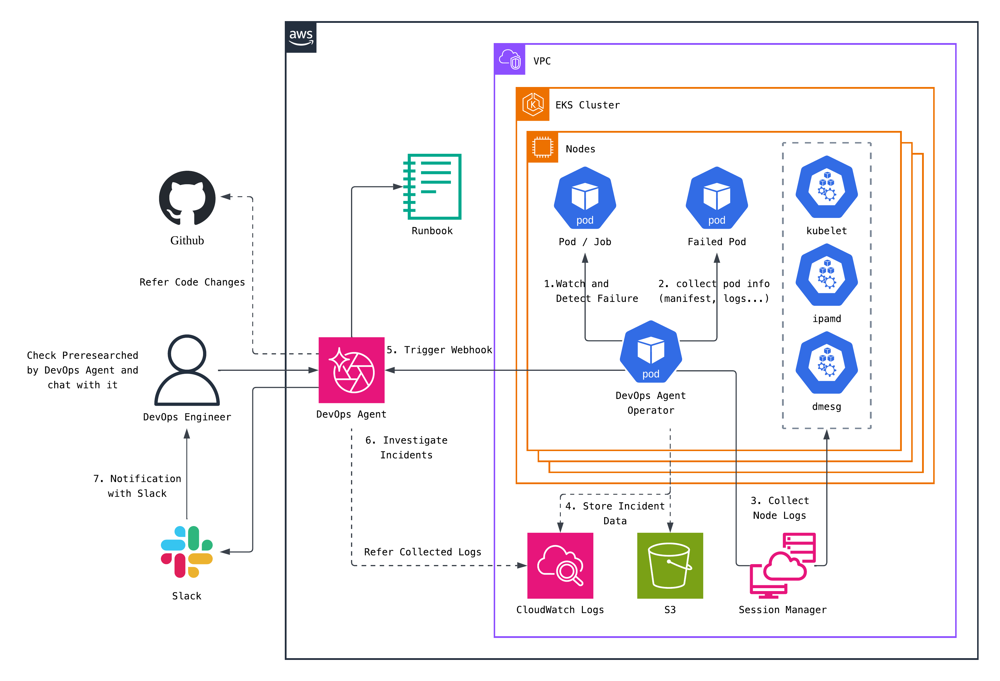

# DevOps Agent Operator

DevOps Agent Operator는 Amazon EKS에서 Pod 워크로드의 장애를 실시간으로 감지하고, 트러블슈팅에 필요한 정보를 자동 수집하여 [AWS DevOps Agent](https://aws.amazon.com/devops-agent/)의 조사를 트리거하는 Kubernetes Operator입니다.



## 동작 방식

DevOps Agent Operator는 Kubernetes Watch API를 통해 Pod 상태 변경을 실시간으로 수신하고, 장애가 감지되면 즉시 데이터를 수집하여 외부 시스템으로 전달합니다.

```
Pod 상태 변경 → EventFilter (장애 상태 변화만 통과)
    → detectPodFailure (5-레이어 감지)
    → 데이터 수집 (manifest, describe, logs, events, node logs)
    → 출력 (CloudWatch Logs / S3 / Webhook)
    → 처리 완료 마킹 (annotation 기반 중복 방지)
```

### 장애 감지

화이트리스트 기반으로 "정상이 아니면 이상"이라는 원칙으로 동작합니다. 5개 레이어를 우선순위 순으로 검사합니다:

| 레이어 | 감지 대상 | 예시 |
|--------|----------|------|
| 1. Pod Status Reason | 근본 원인 신호 | Evicted, DeadlineExceeded |
| 2. Container Waiting | 비정상 대기 상태 | CrashLoopBackOff, ImagePullBackOff, ErrImagePull |
| 3. Container Terminated | 비정상 종료 | OOMKilled, Error, NonZeroExit |
| 4. Pod Phase | Pod 레벨 상태 | PodFailed, PodUnknown |
| 5. Pod Conditions | 스케줄링 조건 | Unschedulable |

ContainerCreating, Unschedulable 같은 일시적 상태는 설정된 대기 시간(기본 3분) 이후에도 해결되지 않을 때만 장애로 승격합니다.

### 데이터 수집

장애 감지 시 다음 정보를 즉시 수집합니다:

- Pod manifest (전체 YAML)
- Pod describe (상태 상세 정보)
- Container logs (현재 + 이전 로그)
- Kubernetes Events (Pod 관련 이벤트 타임라인)
- Node logs via AWS SSM (kubelet/containerd/dmesg/ipamd/ipamd-introspection/networking/disk/inode/memory)

### 출력

설정에 따라 3개 출력을 독립적으로 사용할 수 있습니다:

- CloudWatch Logs: 구조화된 JSON 형식의 인시던트 이벤트
- S3: 계층 구조 파일 저장 (manifest, logs, node-logs 등)
- Webhook: HMAC-SHA256 서명이 포함된 인시던트 페이로드를 DevOps Agent로 전송


## 프로젝트 구조

```
├── cmd/main.go                     # 엔트리포인트
├── internal/
│   ├── controller/
│   │   ├── pod_controller.go       # Pod Watch, 장애 감지, 데이터 수집 오케스트레이션
│   │   └── detector.go             # 5-레이어 장애 감지 로직
│   ├── collector/
│   │   ├── types.go                # 데이터 구조 정의
│   │   ├── logs.go                 # 컨테이너 로그 수집
│   │   ├── ssm.go                  # AWS SSM 노드 로그 수집 (병렬 실행)
│   │   └── severity.go             # 장애 유형별 심각도 매핑
│   ├── output/
│   │   ├── webhook.go              # DevOps Agent 웹훅 (HMAC 서명, 우선순위 매핑)
│   │   ├── s3.go                   # S3 업로드
│   │   └── cloudwatch.go           # CloudWatch Logs 출력
│   └── config/
│       └── config.go               # 환경 변수 기반 설정 관리
├── config/                         # Kubernetes 매니페스트 (Kustomize)
├── test/                           # E2E 테스트
├── examples/                       # 배포 예제 (YAML, Terraform)
├── runbooks/                       # 운영 런북
├── Dockerfile
└── Makefile
```

## 환경 변수

### 클러스터 메타데이터

| 변수명 | 설명 | 기본값 |
|--------|------|--------|
| `EKS_CLUSTER_NAME` | EKS 클러스터 이름 | - |
| `AWS_REGION` | AWS 리전. SSM, S3, CloudWatch Logs 등 AWS SDK 클라이언트의 대상 리전으로 사용됩니다. 클러스터와 다른 리전의 S3 버킷이나 CloudWatch Logs 그룹을 사용하려면 해당 리전으로 지정하세요. Webhook 트리거시에는 페이로드 메타데이터에 정보성으로만 포함됩니다. | `us-east-1` |
| `AWS_ACCOUNT_ID` | AWS 계정 ID | - |

### 출력 설정

| 변수명 | 설명 | 기본값 |
|--------|------|--------|
| `DEVOPS_AGENT_WEBHOOK_URL` | DevOps Agent 웹훅 URL | - |
| `DEVOPS_AGENT_WEBHOOK_SECRET` | HMAC 서명 시크릿 | - |
| `WEBHOOK_TIMEOUT` | 웹훅 타임아웃 | `30s` |
| `CLOUDWATCH_LOG_GROUP` | CloudWatch Logs 그룹 | - |
| `S3_BUCKET` | S3 버킷 이름 | - |
| `S3_PREFIX` | S3 키 프리픽스 | - |

### 기능 설정

| 변수명 | 설명 | 기본값 |
|--------|------|--------|
| `ENABLE_SSM_COLLECTION` | SSM 노드 로그 수집 활성화 | `false` |
| `WATCH_NAMESPACES` | 감시 네임스페이스 (쉼표 구분) | 전체 |
| `EXCLUDE_NAMESPACES` | 제외 네임스페이스 | `kube-system,kube-public,kube-node-lease` |
| `LOG_SINCE_MINUTES` | 로그 수집 시간 범위 (분) | `15` |
| `PROCESSED_TTL` | 중복 처리 방지 기간 | `1h` |
| `FAILURE_GRACE_PERIOD` | 타임아웃 대기 기간 | `3m` |
| `FAILURE_RECHECK_INTERVAL` | 타임아웃 재확인 간격 | `1m` |

## IAM 권한

Operator Pod에 다음 IAM 권한이 필요합니다. 리소스 ARN은 환경에 맞게 수정하세요.

```json
{
  "Version": "2012-10-17",
  "Statement": [
    {
      "Sid": "SSMCommandExecution",
      "Effect": "Allow",
      "Action": [
        "ssm:SendCommand",
        "ssm:GetCommandInvocation"
      ],
      "Resource": [
        "arn:aws:ec2:<REGION>:<ACCOUNT_ID>:instance/*",
        "arn:aws:ssm:<REGION>:<ACCOUNT_ID>:*"
      ]
    },
    {
      "Sid": "S3LogStorage",
      "Effect": "Allow",
      "Action": [
        "s3:PutObject",
        "s3:PutObjectAcl"
      ],
      "Resource": "arn:aws:s3:::<S3_BUCKET>/*"
    },
    {
      "Sid": "S3BucketAccess",
      "Effect": "Allow",
      "Action": [
        "s3:ListBucket"
      ],
      "Resource": "arn:aws:s3:::<S3_BUCKET>"
    },
    {
      "Sid": "CloudWatchLogsIncidentStorage",
      "Effect": "Allow",
      "Action": [
        "logs:CreateLogStream",
        "logs:PutLogEvents"
      ],
      "Resource": "arn:aws:logs:<REGION>:<ACCOUNT_ID>:log-group:<LOG_GROUP>:*"
    }
  ]
}
```
